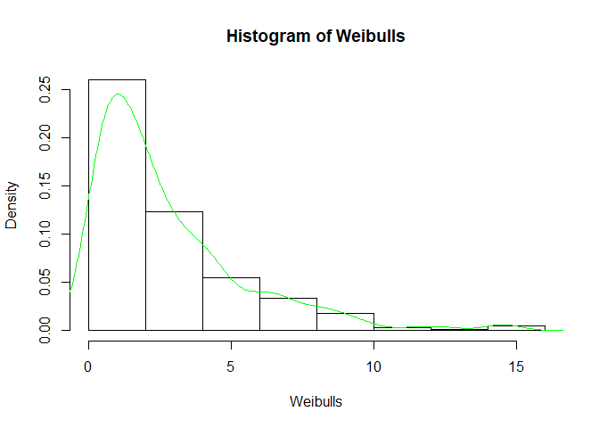
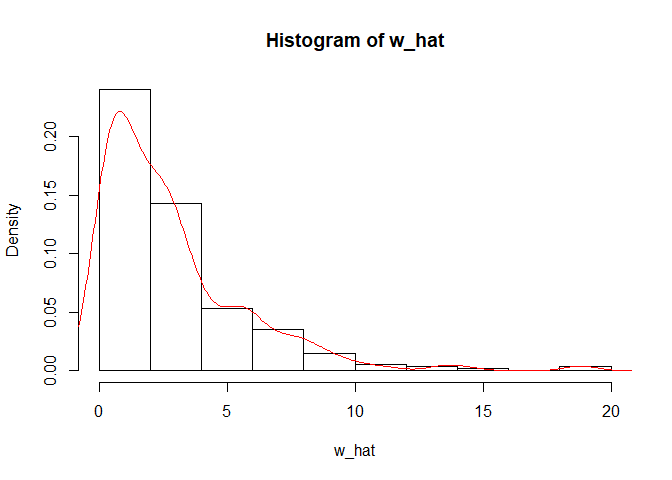
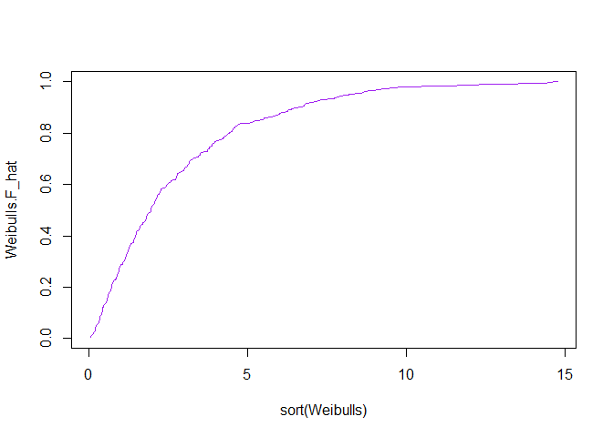
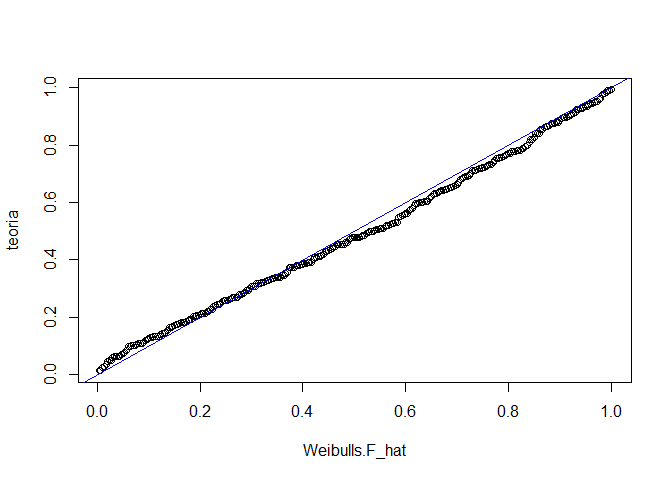
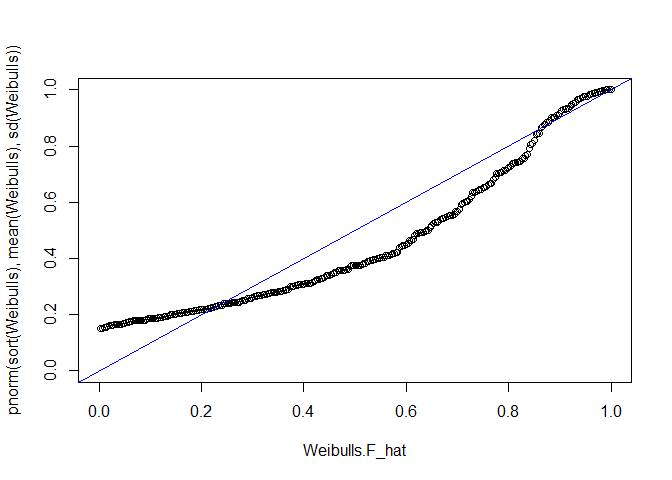

Uno de los ejercicios que se dejaron en clase, consistió en simular una
v.a. *X* ∼ *W**e**i**b**u**l**l*(*α*, *β*) . Simule una muestra de
tamaño 300 de observaciones *U**n**i**f**o**r**m*(0, 1) y con ellas y el
resultado 2.11 (de la segunda edición del texto que seguimos en clase)
genere la muestra con distribución *W**e**i**b**u**l**l*(*α*, *β*)

En la sección de código siguiente realizo lo que dije en el párrafo
anterior, dibujo la distribución de la muestra y la contrastó contra el
kernel estimado de una muestra aleatoria pero generada con la función
<code> rweibull </code> de R .

    #la primer parte es simularla desde la definicion y la comparo con la parametrización de R
    set.seed(0)
    alpha <- 1
    beta <- 3
    n <- 300
    u <- runif(n, 0, 1)
    Weibulls <- -beta * ( (log(1-u))^(1/alpha)  )
    hist(Weibulls, freq = FALSE)
    lines(density(Weibulls), col="green")

    w_hat <- rweibull(n, alpha, beta)
    hist(w_hat, freq = FALSE)
    lines(density(w_hat), col="red")

El centro del ejercicio consistió en realizar un gráfico cuantil-cuantil
de la muestra simulada y contrastarlo contra la distribución Weibull
teórica, para ello realice un gráfico de dispersión de los puntos de la
función de distribución empírica vs la teórica en cada uno de los puntos
de la muestra generada *x**i* , es decir los pares de puntos
$(\\hat{F}(x\_i),F(x\_i))$ y en la visualización dibujo al mismo tiempo
la recta identidad (para contrastarlo con el ajuste perfecto de la
muestra con lo teórico).

Primero se dibuja $\\hat{F}(x)$

    # QQ-plot
    Weibulls.F_hat <- sort(Weibulls)  
    Weibulls.F_hat <- (1:length(Weibulls.F_hat))/(length(Weibulls.F_hat))#cumsum(Weibulls.F_hat)/sum(Weibulls.F_hat)
    plot(sort(Weibulls), Weibulls.F_hat, type = 'l', col = 'purple') #solo la acumulada Weibull

    teoria <- pweibull(sort(Weibulls), alpha, beta)

Luego el QQ-plot comparando la muestra contra una Weibull, como
esperabamos el ajuste es muy alto

    plot(Weibulls.F_hat, teoria)
    abline(a = 0, b = 1, col = 'blue')

Y luego construimos el QQplot pero contrastando la muestra con una
distribución normal.

    plot(Weibulls.F_hat, pnorm(sort(Weibulls), mean(Weibulls), sd(Weibulls)), ylim = c(0,1), xlim = c(0,1))
    abline(a = 0, b = 1, col = 'blue')
    abline(a = 0, b = 1, col = 'blue')

La segunda parte del ejercicio consistió en estimar los parámetros de la
distribución Weibull en caso de no conocerlos, para ello decidí revisar
en la literatura los valores de la media, moda, mediana y varianza pero
después de darme cuenta que tanto la media como la varianza involucra
calcular la función gamma decidí optar por utilizar la moda
$\\beta(\\frac{k-1}{\\alpha})^(1/\\alpha)$ y la mediana
*β*(*I**n*(2))1/*α* analiticas y estimarlas por las
muestrales para resolver el sistema de ecuaciones no lineales:

\\begin{equation} (In(2))^{1/k} = a\_1 ()^(1/k) =a\_2 \\end{equiation}

Donde *a*1 y *a*2 son la mediana y la moda
muestrales. Resolviendo el sistema se lograron estimar los parámetros de
la distribución.

    mediana <- sort(Weibulls)[floor(length(Weibulls)/2)]
    Weibulls2 <- Weibulls
    names(Weibulls2) <- Weibulls
    moda <- dweibull(Weibulls, alpha, beta)[which.max(dweibull(Weibulls, alpha, beta))]
    fun <- function(x)
    {
      ((x[2] * (log(2))^(1/x[1])  - mediana)^2+ ( (x[2]*( (x[1]-1) / x[1] )^(1/x[1]) - moda   )^2) ) 
    }
    optim(par = c(3.,100), fn = fun)

    ## $par
    ## [1] 1.245384 2.473986
    ## 
    ## $value
    ## [1] 0.1278333
    ## 
    ## $counts
    ## function gradient 
    ##       97       NA 
    ## 
    ## $convergence
    ## [1] 0
    ## 
    ## $message
    ## NULL
