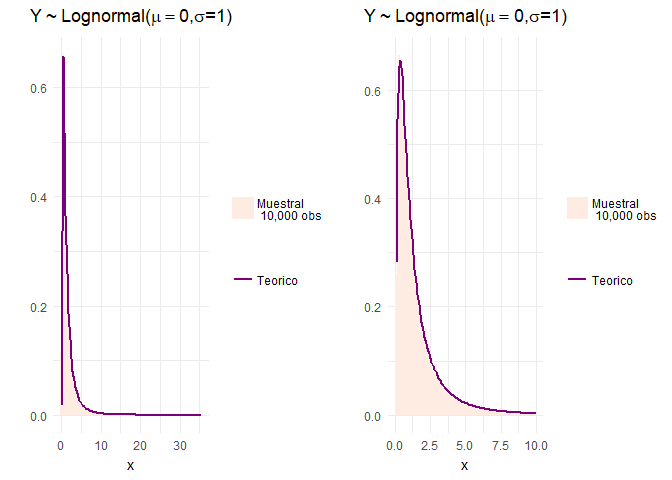
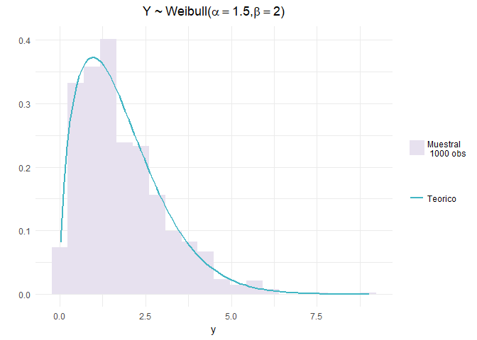
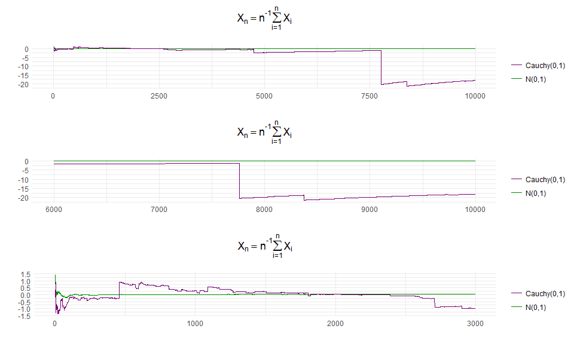
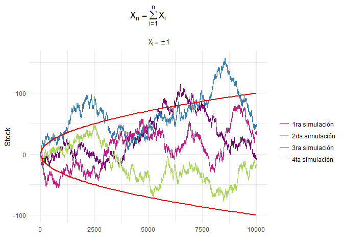
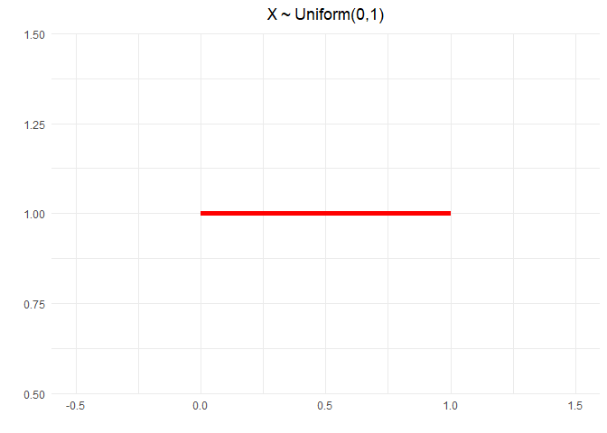
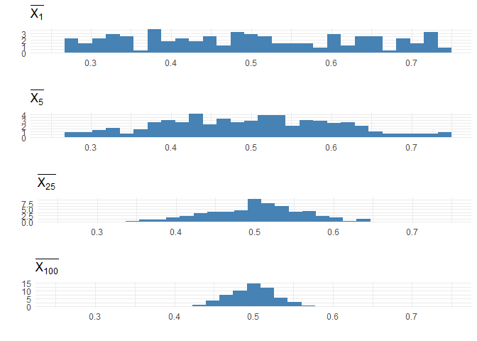

Ejercicio 2
-----------

Ej. 13, cap. 2, Wasserman. Sea *X* ∼ *N*(0, 1), y define
*Y* = *e**X*.

     b) Genera 10, 000 v.a. normales estandar y obten las
correspondientes 10, 000 *y*'s como se indica en el problema. Dibuja el
histograma de *Y*, y comparalo con la PDF que encontraste en el inciso
anterior.

Simulamos la muestra de tamaño 10, 000 de *X*, fijamos la semilla por
reproducibilidad

    set.seed(0)
    X <- rnorm(n = 10000, 0 , 1)        # Se generan los datos
    Y <- exp(X)

Procedemos a visualizar la distribución.

    Y.frame <- data.frame(x=Y)
    p <- ggplot(Y.frame) +              # se genera el histograma con soporte [0,35]
      geom_histogram(aes(x, ..density.., fill = I('Muestral \n 10,000 obs')), bins = 100) + 
      theme_minimal() + 
      stat_function(fun = function(x) {(1/x)*( 1/ sqrt(2 * pi))*exp(-( (log(x))^2 ) / 2 )},
                    aes(colour = I('Teorico')), size = 1 ) +
      scale_fill_manual(name='',values=I('#FEEBE2')) + 
      scale_colour_manual(name='',values=I('#7A0177') ) +
      ggtitle(TeX('$Y \\sim Lognormal( \\mu = 0, \\sigma =1  )$')) +
      theme(plot.title = element_text(hjust = 0.5)) + 
      ylab('') + ylim(0,.66)
    p1 <- ggplot(Y.frame) +             # se genera el histogrma haciendo zoom alrededor de la moda 
      geom_histogram(aes(x, ..density.., fill = I('Muestral \n 10,000 obs')), bins = 100) + 
      theme_minimal() + 
      stat_function(fun = function(x) {(1/x)*( 1/ sqrt(2 * pi))*exp(-( (log(x))^2 ) / 2 )},
                    aes(colour = I('Teorico')), size = 1 ) +
      scale_fill_manual(name='',values=I('#FEEBE2')) + 
      scale_colour_manual(name='',values=I('#7A0177') ) +
      ggtitle(TeX('$Y \\sim Lognormal( \\mu = 0, \\sigma =1  )$')) +
      theme(plot.title = element_text(hjust = 0.5)) + 
      ylab('') + xlim(0,10)
    p <- arrangeGrob(p, p1, ncol = 2)
    as_ggplot(p) #muestro dos imagenes de la distribución muestral solo cambia el soporte

                                          Figura 1

El histograma de los datos simulados (1, 000 observaciones de *Y* ) se
ajusta a la distribución teórica de *L**o**g**N**o**r**m**a**l*(0, 1).
La gráfica a la derecha de la figura 1 simplemente es un zoom en los
valores menores en los que está definida *Y* (con el fin de observar
mejor el ajuste).

Ejercicio 3
-----------

Simulamos 1, 000 observaciones de una v.a. $x\\simUniform(0,1)$ con la
cual empleando la transformación $\\frac{In(1-x)}{-\\beta}$ obtenemos la
muestra de observaciones con distribución *E**x**p*(*β*).

    set.seed(0)
    n <- 1000
    u <- runif(n, 0 ,1)            # se genera la muestra exponencial
    alpha <- 1.5
    beta <- 2
    exponenciales <- -(log(1-u)/ beta) #se grafica la muestra

Y en la figura 2, contrastamos la distribución de la muestra contra la
distribución teórica

    ggplot(data.frame(y=exponenciales)) + 
      geom_histogram(aes(y, ..density.., fill = I('Muestral \n 1000 obs'))) + 
      theme_minimal() + 
      stat_function(fun = function(x) {dexp(x, beta) },
                    aes(colour = I('Teorico')), size = 1 ) +
      scale_fill_manual(name='',values=I('#CEE4EB')) + 
      scale_colour_manual(name='',values=I('#7A0177') ) +
      ggtitle(TeX('$Y \\sim Exp( \\mu = 1.5 )$')) +
      theme(plot.title = element_text(hjust = 0.5)) + 
      ylab('')+xlim(c(0,2))

    ## `stat_bin()` using `bins = 30`. Pick better value with `binwidth`.

                                          Figura 2

De manera análoga con la muestra uniforme generada y la transformación
$\\theta(-In(1-U))^{\\frac{1}{\\beta}}$ se genera una muestra de la
distribución *W**e**i**b**u**l**l*(*θ*, *β*), la distribución teórica se
contrasta contra la muestral en la figura 3

    Weibulls <- beta * ( (-log(1-u) )^(1/alpha)  ) # se genera la muestra weibull
    ggplot(data.frame(y=Weibulls)) +           # se dibuja el histograma
      geom_histogram(aes(y, ..density.., fill = I('Muestral \n 1000 obs')), bins = 20) + 
      theme_minimal() + 
      stat_function(fun = function(x) {dweibull(x, alpha, beta) },
                    aes(colour = I('Teorico')), size = 1 ) +
      scale_fill_manual(name='',values=I('#E7E1EF')) + 
      scale_colour_manual(name='',values=I('#41B6C4') ) +
      ggtitle(TeX('$Y \\sim Weibull( \\alpha = 1.5, \\beta = 2 )$')) +
      theme(plot.title = element_text(hjust = 0.5)) + 
      ylab('')

                                          Figura 3

Ejercicio 18
------------

El libro de texto dice que:

> Let *X*1, ..,*X**n* ∼ *N*(0, 1) r.v. and let
> $\\bar{X\_n}=\\frac{\\sum\_{i=0}^{n} X\_i}{n}$. Plot $\\bar{X\_n}$
> versus *n* = 1, ..., 10000. Repeat for
> *X*1, ..., *X**n* ∼ *C**a**u**c**h**y*(0, 1).
> Explain why there is such a differenece.

Se simulan los datos con distribución y con distribución
*C**a**u**c**h**y*(0, 1)

    set.seed(240000)                       # fijamos la semilla por reproducibilidad
    X <- rnorm(10000, 0, 1)
    cum.mean <- function(i, x = X)
    {     # Funcion para calcular la media acumulada recibe un entero para indicar el indice hasta 
          # donde se considera tambien recibe el vector sobre el que se calcula la media
          return(mean(x[1:i]))
    }
    Cum.mean <- function(j) {unlist(lapply( 1:j, cum.mean)) }  
    medias.normal <-Cum.mean(length(X))
    data <- data.frame(x=medias.normal)
    data$origen <- 'N(0,1)'
    data$indice <- 1:dim(data)[1]
    X <- rcauchy(10000, location = 0, scale = 1)
    medias.cauchy <- Cum.mean(length(X))
    data2 <- data.frame(x=medias.cauchy)
    data2$origen <- 'Cauchy(0,1)'
    data2$indice <- 1:dim(data2)[1]
    data <- rbind(data, data2)

En la figura 4 podemos apreciar el comportamiento de
$X\_n =\\frac{\\sum\_{i=1}^{n}X\_i}{n}$ y
$Y\_n =\\frac{\\sum\_{i=1}^{n}Y\_i}{n}$ donde $X\_i\\simNorm(0,1)$ y
$Y\_i\\simCauchy(0,1)$.

En la parte superior de la gráfica podemos notar los 10, 000 promedios
obtenidos. En la parte central se encuentran las últimas 4, 000 y en la
parte inferior se encuentran las primeras 3, 000 simulaciones. En las
tres gráficas se aprecia fácilmente que el conjunto
(*n*, *X**n*) se aproxima a la recta constante en cero
(*μ**X**n*) mientras que el conjunto
(*n*, *Y**n*) (en color morado) no se aproxima a un valor
constante, esto se debe a que la distribución normal posee esperanza
finita mientras que la distribución Cauchy no posee esta propiedad por
lo que a largo plazo *X**n* ≃ *μ**X**n*
mientras que *Y**n* no lo hace (debido a las pesadas colas de
la distribución Cauchy) .

    p <- ggplot(data, aes(x=indice, y=x)) +geom_line(data =subset(data, indice > 1 & origen =='N(0,1)'), 
                                                     aes(colour=origen))  +
                geom_line(data =subset(data, indice > 1 & origen !='N(0,1)'), aes(colour=origen))  +        
                theme_minimal() + 
                ggtitle(TeX('$X_n = n^{-1}\\sum_{i=1}^nX_i}$' )) +
                theme(plot.title = element_text(hjust = 0.5)) +
                scale_colour_manual(name='', values=c(I('#7A0177'), I('green4') ) )  +
                ylab('') + xlab('') 
          # se repite la grafica anterior pero haciendo zoom en las ultimas 4000 ejecuciones
    p1 <- ggplot(data, aes(x=indice, y=x)) +geom_line(data =subset(data, indice > 6000 & origen =='N(0,1)'), 
                                                      aes(colour=origen))  +
      geom_line(data =subset(data, indice > 6000 & origen !='N(0,1)'), aes(colour=origen))  +        
      theme_minimal() +
      ggtitle(TeX('$X_n = n^{-1}\\sum_{i=1}^nX_i}$' )) +
      theme(plot.title = element_text(hjust = 0.5)) +
      scale_colour_manual(name='', values=c(I('#7A0177'), I('green4') ) )  +
      ylab('') + xlab('') + xlim( c(6000, 10000))
          # se repite la primer grafica haciendo zoom en las primeras 3000 ejecuciones
    p2 <- ggplot(data, aes(x=indice, y=x)) +geom_line(data =subset(data, indice < 3000 & origen =='N(0,1)'), 
                                                      aes(colour=origen))  +
      geom_line(data =subset(data, indice < 3000 & origen !='N(0,1)'), aes(colour=origen))  +        
      theme_minimal() +
      ggtitle(TeX('$X_n = n^{-1}\\sum_{i=1}^nX_i}$' )) +
      theme(plot.title = element_text(hjust = 0.5)) +
      scale_colour_manual(name='', values=c(I('#7A0177'), I('green4') ) )  +
      ylab('') + xlab('') + xlim( c(1, 3000))

    p <- arrangeGrob(p, p1, p2, ncol = 1)
    as_ggplot(p) #muestro tres imagenes de la distribución muestral solo cambia el soporte

                                          Figura 4

Ejercicio 19
------------

El ejrrcicio dice:

> Let *Y*1, ..,*Y**n* iid r.v. such that
> *P*(*Y**i* = 1)=*P*(*Y**i* = −1)=0.5. Let
> $\\bar{X\_n} =\\frac{ \\sum\_{i=0}^{n} X\_i}{n}$. Think of
> *Y**i* = 1 as 'the stock price increased by one dollar',
> *Y**i* = −1 as 'the stock price decreased by one dollar'
> and *X**n* as the value of the stock on day *n*.

>      b) Simulate *X**n* and plot *X**n* versus
> *n* = 1, ..., 10000. Repeat the whole simulation several times. Notice
> two things. First, it´s easy to 'see' patterns in the sequence even
> thought it is random. Second, you will find that the four runs look
> very different even thought they were generated the same way. How do
> the calculations in the previous item explain the second observation ?

Simulamos los datos

    set.seed(90000)             # fijamos la semilla por reproducibilidad
    n <- 10000
    x <- rbinom(n, size = 1, prob = 1/2)    #simulamos Bernoullis
    x <- ifelse(x==1, 1, -1)            
    stock <- cumsum(x)
    x1 <- as.data.frame(stock)
    x1$origen <- '1ra simulación'
    x <- rbinom(n, size = 1, prob = 1/2)    #simulamos Bernoullis
    x <- ifelse(x==1, 1, -1)            
    stock <- cumsum(x)
    x2 <- as.data.frame(stock)
    x2$origen <- '2da simulación'
    x <- rbinom(n, size = 1, prob = 1/2)    #simulamos Bernoullis
    x <- ifelse(x==1, 1, -1)            
    stock <- cumsum(x)
    x3 <- as.data.frame(stock)
    x3$origen <- '3ra simulación'
    x <- rbinom(n, size = 1, prob = 1/2)    #simulamos Bernoullis
    x <- ifelse(x==1, 1, -1)            
    stock <- cumsum(x)
    x4 <- as.data.frame(stock)
    x4$origen <- '4ta simulación'
    data <- rbind(x1, x2, x3, x4)
    data$indice <- 1:n

En la figura 5 podemos ver el resultado de la simulación, a pesar de los
‘patrones’ que se identifican en la grafica podemos decir que las líneas
de colores (que representan a cada una de las cuatro simulaciones) se
encuentran dentro de la banda de más/menos una desviación estándar es
decir las curvas $\\sqrt{n}$ y $-\\sqrt{n}$ con centro en la media de la
distribución (las curvas están marcadas en color rojo).

Notemos sin embargo que la banda en color rojo es puntual.

    ggplot(data, aes(x=indice, y=stock)) +geom_line( aes(colour=origen))  +
      theme_minimal() +
     labs(title=TeX('$X_n = \\sum_{i=1}^n  X_i}$' ), subtitle = TeX('$ X_i =\\pm 1$' )) +
      theme(plot.title = element_text(hjust = 0.5), plot.subtitle = element_text(hjust = 0.55) ) +
      scale_colour_manual(name='', values=c(I('#7A0177'), I('#A6D854'), I('#377EB8'), I('#C51B8A')) )  +
      ylab('Stock') + xlab('') + stat_function(fun = function(x) {sqrt(x)}, col = 'red', size = 1) + 
      stat_function(fun = function(x) {-sqrt(x)}, col = 'red', size = 1)

                                          Figura 5

Ejercicio 20
------------

> Let *X*1, ..., *X**n* be iid with mean *μ* and
> variance *σ*2. Let
> $\\bar{X\_n} = \\frac{\\sum\_{i=1}^nX\_i}{n}$. then $\\bar{X\_n}$ is a
> statistic, that is, a function of the data. Since $\\bar{X\_n}$ is a
> random variable, it has a distribution. This distribution is called
> the sampling distribution of the statistic. Don´t confuse the
> distribution of the data *f**x* and the distribution of the
> statistic $\\bar{x\_n}$. To make this clear, let
> *X*1, ..., *X**n* ∼ *U**n**i**f**o**r**m*(0, 1).
> Let *f**x* be the density of the
> *U**n**i**f**o**r**m*(0, 1). Plot *f**x*. Now let
> $\\bar{X\_n}$. Find $E(\\bar{X\_n})$ and $V(\\bar{x\_n})$. Plot them
> as a funciton of *n*, Interpret. Now simulated the distribution of
> $\\bar{X\_n}$ for *n* = 1, 5, 25, 100. Check that the simulated values
> $E(\\bar{X\_n})$ and $V(\\bar{x\_n})$ agree with your theorical
> calculations. What do you noticed about the sampling distribution of
> $\\bar{X\_n}$ as n increases?

En la figura 6 se dibuja la función de densidad de
*X* ∼ *U**n**i**f**o**r**m*(0, 1)

    ggplot(data.frame(x=c(0, 1)), aes(x=x)) +
      theme_minimal() +
      labs(title=TeX('$X\\sim Uniform(0,1)$')) +
      theme(plot.title = element_text(hjust = 0.5), plot.subtitle = element_text(hjust = 0.55) ) +
      ylab('') + xlab('') + stat_function( col='red', 
              fun = function(x) {1}, size = 2, xlim = c(0,1)) + xlim(c(-.5,1.5)) 

                                          Figura 6

Posteriormente simulamos los datos, en particular cada $\\bar{X\_n}$ con
*i* ∈ {1, 5, 25, 100} se simuló 300 veces.

    set.seed(0)
    sampling <- function(i)
    {
      x1 <- runif(i, 0, 1)
      if(i==1){
        z <- c(x1, x1)
        names(z) <- c('media', 'var')
        return(z)
      }
      else {
        z <- c(mean(x1), var(x1))
        names(z) <- c('media', 'var')
      return( z)
      }
    }

    m <- 300
    x_1 <- mapply( sampling, rep(1, m ))
    x_1 <- data.frame(t(x_1))
    x_1$indice <- rep(1,m)
    x_2 <- mapply( sampling, rep(5, m ))
    x_2 <- data.frame(t(x_2))
    x_2$indice <- rep(5,m)
    x_3 <- mapply( sampling, rep(25, m ))
    x_3 <- data.frame(t(x_3))
    x_3$indice <- rep(25, m)
    x_4 <- mapply( sampling, rep(100, m ))
    x_4 <- data.frame(t(x_4))
    x_4$indice <- rep(100, m)
    xx <- rbind(x_1, x_2, x_3, x_4)

Por otro lado en la figura 7 tenemos un gráfico de dispersión de los
puntos simulados $(n, \\bar{X\_n})$ (trescientos para cada *n*), en este
gráfico los puntos tiene transparencia por lo que al ‘’encimarse’’ los
puntos adquieren un color de mayor intensidad por ello los puntos sobre
la recta *n* = 1 los puntos están dispersos y por ende son más tenues
que los puntos simulados para *n* = 100 pues estos últimos están menos
dispersos y encimados. En el gráfico 7 se ha marcado la recta
$\\mu\_{\\bar{X\_n}}$ y las curvas determinadas por
$\\mu\_{\\bar{X\_n}} \\pm \\sigma\_{\\bar{X\_n}}$. Se nota que cuando
*n* crece los puntos se acercan más a la recta
*μ**X**n* pues la varianza tiende a cero.

    ggplot(xx, aes(x=indice, y=media)) + geom_point(alpha = 0.05) +
      theme_minimal() + labs(title=TeX('$\\bar{X_n}$ vs $n$')) +
      theme(plot.title = element_text(hjust = 0.5) ) +
      ylab('') + xlab('') + stat_function(   fun = function(x) {1/2 }, aes(colour ='media teórica'),size = 1 ) +
      stat_function( fun = function(x) {1/2 + sqrt(1/(12*x)) }, size = 1, aes(colour = 'media + desviacion estandar ')) +
      stat_function( fun = function(x) {1/2 - sqrt(1/(12*x)) }, size = 1, aes(colour = 'media - desviacion estandar ')) +  
     scale_colour_manual(name='', values=c(I('#FF7F00'), I('#984EA3'), I('#4DAF4A') ))  

                                          Figura 7

Finalmente en la gráfica 8 se muestra la distribución de $\\bar{X\_n}$
(los 300 que se simularon para cada valor de *n*), notemos que cuando
*n* se ‘’hace grande’’ $\\hat{f}\_{\\bar{X\_n}}$ se parece a una
distribución normal.

    p1 <- ggplot(data = x_1) + 
      geom_histogram(aes(media, ..density..,  fill=I('steelblue'))) +   # se construyen las barras
      labs(title=TeX('$\\bar{X_1}$') ) +theme_minimal() + xlab('') +ylab('') + xlim(c(0.25,.75))
    p5 <- ggplot(data = x_2) + 
      geom_histogram(aes(media, ..density..,  fill=I('steelblue'))) +   # se construyen las barras
      labs(title=TeX('$\\bar{X_5}$') ) +theme_minimal() + xlab('') +ylab('') + xlim(c(0.25,.75))
    p25 <- ggplot(data = x_3) + 
      geom_histogram(aes(media, ..density..,  fill=I('steelblue'))) +   # se construyen las barras
      labs(title=TeX('$\\bar{X_{25}$') ) +theme_minimal() + xlab('') +ylab('') + xlim(c(0.25,.75))
    p100 <- ggplot(data = x_4) + 
      geom_histogram(aes(media, ..density..,  fill=I('steelblue'))) +   # se construyen las barras
      labs(title=TeX('$\\bar{X_{100}$') ) +theme_minimal() + xlab('') +ylab('') + xlim(c(0.25,.75))
    p <- arrangeGrob(p1, p5, p25, p100, ncol = 1)
    as_ggplot(p) #muestro tres imagenes de la distribución muestral solo cambia el soporte

                                          Figura 8

