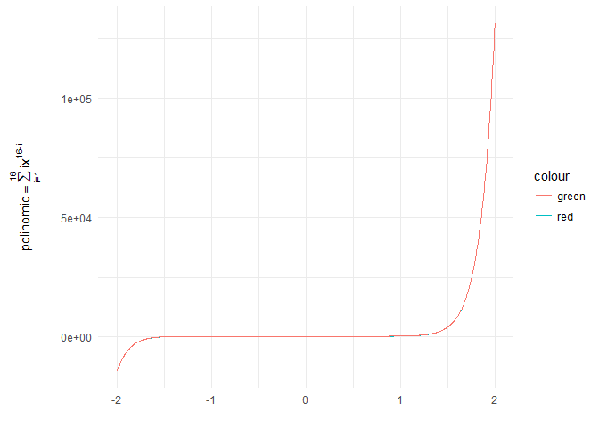

#### Ejercicio 1.2. Sistema IEEE-754

*Para el sistema IEEE-754 visto en clase, determine el valor de los
siguientes números*:

1.  *El penúltimo número representable, y*
2.  *El segundo número positivo más pequeño representable.*

*¿Qué consecuencias buenas o malas habrá en la diferencia de
espaciamiento entre los números del sistema?*

Para el inciso 1:

Como vimos en clase, el número más grande (positivo) representable en la
norma IEEE-754 tienen mantisa: *m* = 1 1…1 donde la unidad se repite 52
veces aparte de la inicial, además su exponente es 1023 por lo que este
número (el de mayor tamaño representable) es de la forma:

$$ x\_{max}= \\sum\_{i=970}^{1022}2^i \\approx 1.8 \\times 10^{308}$$

Para obtener el penúltimo número (positivo porque el caso negativo es
análogo y solo requiere cambiar el signo de positivo a negativo) solo se
requiere apagar (igualar a cero) el último bit de la mantisa (con lo que
se le resta a *x**m**a**x* solo un término, el más pequeño)
quedando esta de la forma *m* = 1 1…10 donde la unidad (aparte de la
inicial fija) se repite 51 veces, así si llamamos *x*\* al
número que pide el ejercicio éste es de la forma:

$$  x^\*= \\left(\\sum\_{i=1}^{52} 2^{-i}\\right) 2^{1023} =\\sum\_{i=971}^{1022} \\approx 8.99 \\times 10^{307} $$

Para el inciso 2:

También por lo visto en clase sabemos que el menor número representable
tiene como mantisa *m* = 10…0 (donde el cero se repite 52 veces) y
exponente −1023, éste número está dado por:

*x**m**i**n* = 2−1024

Por lo que para obtener el segundo número positivo más pequeño solo
requerimos prender el ultimo bit de la mantisa de
*x**m**i**n*, quedando *m* = 1 0…01 (donde el cero se repite
51 veces. Así el número buscado es de la forma:
*x*\*\* = (2−1 + 2−53)2−1023 = 2−1024 + 2−1076

Sobre las consecuencias buenas respecto al espaciamiento entre los
números del sistema es que el permite cubrir un rango “bastante grande”
pues como vimos en clase los números más grandes son del orden de
10308, otro aspecto bueno es que la precisión alrededor del
cero (es decir números pequeños) es grande y en la vecindad del cero (y
la unidad) la densidad de los números del sistema se incrementa. En
contrapunto lo malo del espaciamiento de los números en este sistema es
que el redondeo absoluto en números alrededor del máximo representable
en verdad es muy grande (rebasa el orden de 106) y como
argumento final entre el cero y el mínimo número (positivo y su
respectivo inverso aditivo) hay un vacío.

### Ejercicio 1.3. Leyes asociativa y distributiva

*Muestre un ejemplo en el que las leyes asociativa y distributiva no se
cumplen, acorde a las expresiones (1.24) y (1.25).*

*Encuentre además las cotas para los números de punto flotante* *y*
*tales que se cumpla* *x* ⊕ *y* = *x*

Para la primer parte basta considerar un numero que afecte el redondeo.
Tomemos los números *x*, *y* y *z* como sigue, para mostrar que no se
cumple la asociatividad:

    z <- -2^{1023}        #numero muy grande en la aritmpetica de punto flotante
    z

    ## [1] -8.988466e+307

    x <- 1.8*10^{307}     #otro numero muy grande rayando en el maximo
    y <- x*9              # un numero mayor al anterior rayando en el maximo de la aritmetica 
    ( (x+y)+z == x+(y+z) )          #checamos si la asociatividad se cumple

    ## [1] FALSE

Y para mostrar que la distributividad tampoco se cumple consideremos:

    z <- 2^{-1023}      #un numero muy pequeño 
    z

    ## [1] 1.112537e-308

    x <- 1.8*10^{307}   #x,y como en el apartado anterior 
    y <- x*9
    ( (x+y)*z == (x*z)+(y*z) )        #checamos que la distributividad no se cumple 

    ## [1] FALSE

                                      #(sin caer en el overflow)

Para la ultima parte del ejercicio basta tomar *y* = *e**p**s* con la
definición de *e**p**s* dada en clase, así tenemos que :

    y <- .Machine$double.eps   #el eps del entorno R, es una porpiedad de la lista .Machine
    x <- 10
    (x+y == x)

    ## [1] TRUE

Esta cifra `.Machine$double.eps` es la cota máxima que pide el ejercicio
pues cualquier numero menor que él satisface lo que se requiere,
consideremos el siguiente ejemplo (del calculo explicito de esta cota de
*e**p**s* nos ocupamos en el siguiente ejercicio).

    y <- .Machine$double.eps
    y 

    ## [1] 2.220446e-16

    y <- 2.22e-17       #un numero 10 veces menor al anterior valor de y
    y

    ## [1] 2.22e-17

    x <- 10
    (x+y == x)

    ## [1] TRUE

### Ejercicio 1.7. Precisión de una computadora

*El nivel de precisión de una computadora está definido como el número*
$$eps = min\_{x\\in D, x \\ne0} |\\frac{ rd(x)-x }{ x }|$$
 *en donde*
*D* = \[*x**m**i**n*, *x**n**e**g**m**a**x*\]∪{0}∪\[*x**p**o**s**m**i**n*, *x**m**a**x*\]
y *r**d*(.) *denota la función de redondeo.*

*¿Cómo cree que podría determinarse esta constante experimentalmente?*
*Defina un algoritmo para ello, impleméntelo y determine así el número
eps de su computadora*

Para facilitar el calculo fijemos *x* a la unidad y comencemos con un
*e**p**s* igual a la unidad, probemos cuando la suma de estas dos
cantidades es mayor a la unidad y dividamos *e**p**s* entre dos para
obtenerlo.

    eps <- 1            #conjetura inicial
    x <- 1              #fijamos un valor, la unidad facilita el calculo 
    while( (x+(eps/2) > 1 ) ) #checamos cuando la conjetura deja de ser importante
    {
     eps <- eps / 2           #si el aporte de eps es importante lo dividimos entre dos 
    }
    eps                       #nuestro eps despues de las iteraciones necesarias

    ## [1] 2.220446e-16

El cual coincide con la constante
.*M**a**c**h**i**n**e*$*d**o**u**b**l**e*.*e**p**s* del lenguaje (y
arquitectura de 64 bits) de R

    .Machine$double.eps

    ## [1] 2.220446e-16

### Ejercicio 1.4. Generando una APF

*Invente su propio sistema de números de punto flotante utilizando base
binaria y espacio de 2 Bytes (16 bits). Defina una longitud de mantisa y
encuentre los números positivos de mayor y menor tamaño para este
sistema. ¿Cuántos números distintos puede representar su sistema?*

Consideremos un sistema en donde los números son “densos” en el rango
que alcanzan, es decir que tengamos una gran cantidad de números del
sistema en la recta (aunque el sistema sea de corto alcance es decir que
su máximo y mínimo sean pequeños). Para la cual ocuparemos más lugares o
una cantidad parecida para la mantisa (en proporción al estándar
IEEE-754). Primero ocupemos el primer bit para guardar el signo (para
que los números del sistema tengan inversos aditivos y se pueda restar).
Definamos un tamaño de mantisa de 13, por ende, el exponente puede
ocupar solo 2 posiciones más. Considerando estos dos bits (del
exponente) tenemos el rango {0, 1, 2, 3} consideremos un traslado
*T* = 1 así el exponente se mueve en { − 1, 0, 1, 2} podemos ocupar el
valor 2 del exponente para representar los casos especiales de infinito.
Así el numero mayor que puede representar el sistema tienen una mantisa
*m* = 1…1 donde la unidad se repite 14 veces (contando la primera que es
fija) y un exponente de 1. Así el número máximo positivo representable
es:

*x**m**a**x* = (2−1+2−2+…+2−14)21 = 20 + 2−1 + … + 2−13 ≈ 1.99878
 La aproximación la calculamos a continuación

    potencias <- -13:0
    terminos <- 2^potencias     #aprovechamos la vectorizacion de las operaciones en R
    x.max <- sum(terminos)
    x.max

    ## [1] 1.999878

En cuanto al numero positivo de menor tamaño representable es el que
tiene mantisa *m* = 10…0 donde el cero se repite 13 veces y un exponente
de -1, con lo cual el número es de la forma:

*x**m**i**n* = (2−1)2−1 = 2−2 ≈ 0.25

En cuanto a la cantidad de números representables en el sistema tenemos
que la mantisa proporciona 213 posibilidades y el exponente
22 posibilidades con lo que se tienen 215 posibles
números positivos y al considerar los negativos el sistema permite
216 = 65, 536 números posibles.

### Ejercicio 1.5. Sistema decimal

*Escriba ahora un sistema decimal (b=10) con una mantisa de 4 cifras y
un exponente de 3 cifras. Esto aunado al signo en la representación da
un total de 8 ‘trozos’ de información a ser guardados para los elementos
de la aritmética.* *De esta manera, la construcción es más intuitiva que
en los sistemas binarios. ¿Por qué cree entonces que no se usa el
sistema decimal en los sistemas de cómputo?*

A pesar de que al aumentar la base (en este caso tomar 10 como base)
aumenta el número de posibles números en el sistema, pudiendo con ello
incrementar el rango del sistema es decir incrementar el número máximo
representable además de que la mantisa puede generar más posibilidades
de números (en este caso en particular 104). Sin embargo al
tomar una base de 10 se requiere representar a los elementos
{0, 1, 2, 3, 4, 5, 6, 7, 8, 9} que ocupan los lugares (bits) de memoria
del número en el sistema. El sistema decimal requiere de la distinción
de los elementos {0, 1, 2, 3, 4, 5, 6, 7, 8, 9} lo cual se podría
identificar con intervalos de intensidad o duración del impulso
eléctrico sin embargo en la práctica eso presentaría problemas de
interpretación debido a factores físicos y si esto es implementable
provocaría errores tan solo en la codificación de los números por ello
no se utiliza el sistema decimal en los sistemas de cómputo prefiriendo
al binario que solo requiere codificar {0, 1} lo cual es posible con la
presencia o ausencia de cualquier impulso eléctrico .

### Ejercicio 1.8. Aproximación de Taylor

*Considere la aproximación a la función exponencial dada por la suma de
Taylor*
$$
T\_n = \\sum\_{k=0}^{n} \\frac{x^k}{k!}
$$
 *Escriba un pequeño programa que calcule esta suma utilizando una
cantidad diferente de términos en la aproximación para*
*n* ∈ {1, 2, …, 20} *y considere los cálculos para valores de*
*x* ∈ { − 10, −1, 1, 10}:

1.  *Compare en una tabla la calidad de los resultados con el resultado
    de la función* <code>‘exp(x)’</code> *de MATLAB (en mi caso
    utilice R) para los 20 niveles de aproximación.*
2.  *Explique los malos resultados para valores negativos de* *x* *y
    modifique su algoritmo de cálculo para que la calidad de los
    resultados no dependa del signo de* *x*. *Repita la comparación del
    inciso (a) con el algoritmo modificado.*

Para la parte 1:

En las siguientes líneas implementé el programa que se requiere. No se
encontró lo que comenta el ejercicio, malas aproximaciones para valores
negativos.

    exp.Taylor <- function(n, x)
    {
      #n (int):     nivel de aproximación 
      #x (double):  punto sobre el cual se aproxima en la recta real
      indices <- 0:n                                #generamos los indices sobre los que 
                                                    #se genera la suma
      factoriales <- mapply(FUN = factorial, indices) #obtenemos el factorial de cada 
                                                      #termino de la suma 
      resul <- (x^indices)/factoriales              #evaluamos cada termino de la suma
      return(sum(resul))                      # se regresa la suma de los 'n' termminos
    }
    tabla <- data.frame(n = 1:20)           #generamos los 20 niveles y en las lineas
                                         #siguientes evaluamos la funcion que implementamos
                                          #en los puntos y sus respectivos valores 'exactos'
                                          #en los puntos -10, -1, ,1 y 10
    tabla$alrededor_neg10 <- mapply(exp.Taylor, tabla$n, rep(-10, dim(tabla)[1])) 
    tabla$exacto_neg10 <- exp(-10)          #comparamos contra el valor 'exacto' 
    tabla$alrededor_neg1 <- mapply(exp.Taylor, tabla$n, rep(-1, dim(tabla)[1])) 
    tabla$exacto_neg1 <- exp(-1)
    tabla$alrededor_1 <- mapply(exp.Taylor, tabla$n, rep(1, dim(tabla)[1])) 
    tabla$exacto_1 <- exp(1)
    tabla$alrededor_10 <- mapply(exp.Taylor, tabla$n, rep(10, dim(tabla)[1])) 
    tabla$exacto_10 <- exp(10)
                                        #calculamos el error como la diferencia entre 
                                        #lo calculado por la funcion exp.Taylor() y la
                                        #la implementacion exp() de R
    tabla$error_neg10 <-tabla$alrededor_neg10 - tabla$exacto_neg10
    tabla$error_neg1 <-tabla$alrededor_neg1 - tabla$exacto_neg1
    tabla$error_1 <-tabla$alrededor_1 - tabla$exacto_1
    tabla$error_10 <-tabla$alrededor_10 - tabla$exacto_10
    library(xtable)                   #package para generar las tablas en latex desde R
    row.names(tabla) <- NULL
    tabla.error <- xtable(tabla[,c("n", "error_neg10", "error_neg1", "error_1", "error_10"  )])
    #print(tabla.error, type="latex")

\begin{table}[ht]
\centering
\begin{tabular}{rrrrr}
  \hline
 n & error\_neg10 & error\_neg1 & error\_1 & error\_10 \\ 
  \hline
   1 & -9.00 & -0.37 & -0.72 & -22015.47 \\ 
   2 & 41.00 & 0.13 & -0.22 & -21965.47 \\ 
   3 & -125.67 & -0.03 & -0.05 & -21798.80 \\ 
   4 & 291.00 & 0.01 & -0.01 & -21382.13 \\ 
   5 & -542.33 & -0.00 & -0.00 & -20548.80 \\ 
   6 & 846.56 & 0.00 & -0.00 & -19159.91 \\ 
   7 & -1137.57 & -0.00 & -0.00 & -17175.78 \\ 
   8 & 1342.59 & 0.00 & -0.00 & -14695.62 \\ 
   9 & -1413.14 & -0.00 & -0.00 & -11939.89 \\ 
  10 & 1342.59 & 0.00 & -0.00 & -9184.16 \\ 
  11 & -1162.62 & -0.00 & -0.00 & -6678.95 \\ 
  12 & 925.05 & 0.00 & -0.00 & -4591.27 \\ 
  13 & -680.85 & -0.00 & -0.00 & -2985.37 \\ 
  14 & 466.22 & 0.00 & -0.00 & -1838.30 \\ 
15 & -298.49 & -0.00 & -0.00 & -1073.58 \\ 
  16 & 179.45 & 0.00 & -0.00 & -595.63 \\ 
   17 & -101.69 & -0.00 & 0.00 & -314.49 \\ 
    18 & 54.50 & 0.00 & 0.00 & -158.29 \\ 
   19 & -27.71 & 0.00 & 0.00 & -76.09 \\ 
     20 & 13.40 & 0.00 & 0.00 & -34.98 \\ 
   \hline
\end{tabular}
\end{table}
Sin embargo, sí se encontró que en general el error es mayor cuando nos
alejamos del cero, como es de esperarse en vista de que en la aritmética
de punto flotante tiene mayor precisión para números pequeños. También
de la tabla anterior podemos notar que el error al evaluar la función
alrededor de { − 10, 10} sí se incrementa. Para la parte 2:

Al analizar la siguiente sección de los resultados

    tabla.error.redondeo <- xtable(tabla[,c("n", "alrededor_neg10", "exacto_neg10",
                                            "error_neg10", "alrededor_10",
                                            "exacto_10", "error_10"  )])

    #print(tabla.error.redondeo, type="latex")

\begin{table}[ht]
\centering
\begin{tabular}{rrrrrrr}
  \hline
n & alrededor\_neg10 & exacto\_neg10 & error\_neg10 & alrededor\_10 & exacto\_10 & error\_10 \\ 
  \hline
1 & -9.00 & 0.00 & -9.00 & 11.00 & 22026.47 & -22015.47 \\ 
  2 & 41.00 & 0.00 & 41.00 & 61.00 & 22026.47 & -21965.47 \\ 
  3 & -125.67 & 0.00 & -125.67 & 227.67 & 22026.47 & -21798.80 \\ 
  4 & 291.00 & 0.00 & 291.00 & 644.33 & 22026.47 & -21382.13 \\ 
  5 & -542.33 & 0.00 & -542.33 & 1477.67 & 22026.47 & -20548.80 \\ 
  6 & 846.56 & 0.00 & 846.56 & 2866.56 & 22026.47 & -19159.91 \\ 
  7 & -1137.57 & 0.00 & -1137.57 & 4850.68 & 22026.47 & -17175.78 \\ 
  8 & 1342.59 & 0.00 & 1342.59 & 7330.84 & 22026.47 & -14695.62 \\ 
  9 & -1413.14 & 0.00 & -1413.14 & 10086.57 & 22026.47 & -11939.89 \\ 
  10 & 1342.59 & 0.00 & 1342.59 & 12842.31 & 22026.47 & -9184.16 \\ 
    11 & -1162.62 & 0.00 & -1162.62 & 15347.52 & 22026.47 & -6678.95 \\ 
    12 & 925.05 & 0.00 & 925.05 & 17435.19 & 22026.47 & -4591.27 \\ 
    13 & -680.85 & 0.00 & -680.85 & 19041.10 & 22026.47 & -2985.37 \\ 
    14 & 466.22 & 0.00 & 466.22 & 20188.17 & 22026.47 & -1838.30 \\ 
    15 & -298.49 & 0.00 & -298.49 & 20952.89 & 22026.47 & -1073.58 \\ 
    16 & 179.45 & 0.00 & 179.45 & 21430.83 & 22026.47 & -595.63 \\ 
    17 & -101.69 & 0.00 & -101.69 & 21711.98 & 22026.47 & -314.49 \\ 
    18 & 54.50 & 0.00 & 54.50 & 21868.17 & 22026.47 & -158.29 \\ 
    19 & -27.71 & 0.00 & -27.71 & 21950.38 & 22026.47 & -76.09 \\ 
    20 & 13.40 & 0.00 & 13.40 & 21991.48 & 22026.47 & -34.98 \\ 
   \hline
\end{tabular}
\end{table}
Notamos que el error de aproximación sí disminuye al aumentar el número
de términos en el caso de evaluar la función alrededor del 10, mientras
que para −10 el error también disminuye en valor absoluto, pero como
aproximación el error oscila entre negativo y positivo por lo que se
induce que al reducir el orden del error de la aproximación se obtengan
mejores resultados, es decir que nuestro dominio este más cerca del
cero. Para lo cual consideramos evaluar la función 1/*e**x**p*(*x*) así
se cumplen dos cosas: primero distinguir los casos negativos y en
segundo lugar hacer más pequeño el dominio. La serie de Taylor de la
función para los casos negativos es $\\sum\_{i=0}^{n}(-1)^{i}x^i$

    exp.recorte.Taylor <- function(n, x)
    {
      #n (int):     nivel de aproximación 
      #x (double):  punto sobre el cual se aproxima en la recta real
      indices <- 0:n                                #generamos los indices sobre los que 
                                                    #se genera la suma
      factoriales <- mapply(FUN = factorial, indices) #obtenemos el factorial de cada 
                                                      #termino de la suma 
      if(x >= 0)
      {
        resul <- (x^indices)/factoriales              #evaluamos cada termino de la suma
        return(sum(resul))                      # se regresa la suma de los 'n' termminos
      } else{                               #usamos la nueva parametrizacion exp(1/x)
                                            #usamos el vector 'mascara' para evaluar la
                                            #serie donde se alternan valores positivos con
                                            #negativos
        #mascara <- rep(c(1,-1), round(length(indices)/2))
        resul <- (((-1*x)^indices)/factoriales)
        resul <- 1/sum(resul)  #se regresa el reciprocuo 
        return(resul)#para regresar a la parametrizacion inicial
      }
        
    }

    tabla <- data.frame(n = 1:20)           #generamos los 20 niveles y en las lineas
    tabla$alrededor_neg10 <- mapply(exp.recorte.Taylor, tabla$n, rep(-10, dim(tabla)[1])) 
    tabla$exacto_neg10 <- exp(-10)
    tabla$alrededor_neg1 <- mapply(exp.recorte.Taylor, tabla$n, rep(-1, dim(tabla)[1])) 
    tabla$exacto_neg1 <- exp(-1)
    tabla$alrededor_neg5 <- mapply(exp.recorte.Taylor, tabla$n, rep(-5, dim(tabla)[1])) 
    tabla$exacto_neg5 <- exp(-5)
    ####
    tabla$error_neg10 <-tabla$alrededor_neg10 - tabla$exacto_neg10
    tabla$error_neg1 <-tabla$alrededor_neg1 - tabla$exacto_neg1
    tabla$error_neg1 <-tabla$alrededor_neg1 - tabla$exacto_neg1
    tabla$error_neg5 <-tabla$alrededor_neg5 - tabla$exacto_neg5
    row.names(tabla) <- NULL
    tabla.error <- xtable(tabla[,c("n", "error_neg10", "error_neg1", "error_neg5"   )])
    #print(tabla.error, type="latex")

Con lo que obtenemos los siguientes resultados:

\begin{table}[ht]
\centering
\begin{tabular}{rrrr}
  \hline
  n & error\_neg10 & error\_neg1 & error\_neg5 \\ 
  \hline
   1 & 0.09 & 0.13 & 0.16 \\ 
    2 & 0.02 & 0.03 & 0.05 \\ 
      3 & 0.00 & 0.01 & 0.02 \\ 
      4 & 0.00 & 0.00 & 0.01 \\ 
      5 & 0.00 & 0.00 & 0.00 \\ 
      6 & 0.00 & 0.00 & 0.00 \\ 
      7 & 0.00 & 0.00 & 0.00 \\ 
      8 & 0.00 & 0.00 & 0.00 \\ 
      9 & 0.00 & 0.00 & 0.00 \\ 
     10 & 0.00 & 0.00 & 0.00 \\ 
    11 & 0.00 & 0.00 & 0.00 \\ 
     12 & 0.00 & 0.00 & 0.00 \\ 
     13 & 0.00 & 0.00 & 0.00 \\ 
     14 & 0.00 & 0.00 & 0.00 \\ 
     15 & 0.00 & 0.00 & 0.00 \\ 
     16 & 0.00 & 0.00 & 0.00 \\ 
     17 & 0.00 & 0.00 & 0.00 \\ 
     18 & 0.00 & 0.00 & 0.00 \\ 
     19 & 0.00 & 0.00 & 0.00 \\ 
     20 & 0.00 & 0.00 & 0.00 \\ 
   \hline
\end{tabular}
\end{table}
Por lo que al utilizar el mismo algoritmo pero con una serie de Taylor
diferente para los números negativos, se obtiene una mejor precisión en
comparación de la estimación anterior (en los casos nagativos).

### Ejercicio 1.6. Número de condición

*Use nuevamente el número de condición*
$k\_i = \\frac{\\partial f}{x\_i}\\frac{x\_i}{f}$ *para mostrar que la
división* *x*1/*x*2 *está bien condicionada para*
*i* = 1, 2.

Sabemos que los números de condición *k**i* son idénticos a
la unidad (o a su inverso aditivo) pues si definimos la función
$f(x\_1,x\_2)=\\frac{x\_1}{x\_2}$, tenemos que:

$$ k\_1 = \\frac{\\partial f}{\\partial x\_1}\\frac{x\_1}{f}=\\frac{1}{x\_2}\\frac{x\_1}{\\frac{x\_1}{x\_2}} = \\frac{1}{x\_2}\\frac{x\_1x\_2}{x\_1} = 1 $$

Por otro lado tenemos que:

$$ k\_2 = \\frac{\\partial f}{\\partial x\_2}\\frac{x\_2}{f}=\\frac{-x\_1}{x\_2^2}\\frac{x\_2}{\\frac{x\_1}{x\_2}} = \\frac{-x\_1}{x\_2^2}\\frac{x\_2^2}{x\_1} = -1 $$

Es decir que la división (al igual que la multiplicación estan bien
condicionadas, como vimos en clase).O dicho de otra manera la
multiplicación no tiene problemas en la asociatividad tomemos el ejemplo
*x*/*y* = (*x* \* (1/*y*)) y $\\frac{y}{x}=\\frac{1}{\\frac{x}{y}}$ con
*x* y *y* como siguen:

    x <- .Machine$double.xmax
    x

    ## [1] 1.797693e+308

    y <- x/10
    all.equal( (x/y) ,(x*(1/y)) )

    ## [1] TRUE

    all.equal((y/x) , (1/(x/y)) )

    ## [1] TRUE

### Ejercicio 1.9. Evaluación de polinomios

*Considere un polinomio expresado en las dos formas equivalentes*
*p*(*x*)=*a*0 + *x**a*1 + *a*2*x*2 + *a*3*x*3 + … + *a**n**x**n*

*p*(*x*)=*a*0 + *x*(*a*1 + *x*(*a*2 + … + *x*(*a**n* − 1 + *x**a**n*)…)

*Ahora realice*:

1.  *Suponga que los coeficientes *a**i* estan dados y
    determine el número de operaciones de punto flotante para evaluar
    ambas representaciones del polinomio en un punto* *x*.

2.  *Defina 16 números enteros para ser usados como coeficientes de un
    polinomio de grado 15. Implemente ambas representaciones de la
    evaluación y realice un número grande de evaluaciones para graficar
    su polinomio para* *x* ∈ \[ − 2, 2\]. *Observe y comente sobre la
    cantidad de evaluaciones necesarias para que las diferencias se
    hagan notar en los tiempos de cálculo al usar una u otra
    representación*

*Algunas funciones que pueden ser útiles: linspace, tic, toc, plot, for,
function.*

Para la parte 1:

Tenemos que la cantidad de operaciones de punto flotante en la siguiente
expresión:
*p*(*x*)=*a*0 + *x**a*1 + *a*2*x*2 + *a*3*x*3 + … + *a**n**x**n*

De entrada, tiene *n* sumas (intermedias entre cada uno de los *n* + 1
términos de la expresión). Por otra parte cada uno de los terminos
requiere de una numero diferente de multiplicaciones, el primer término
*a*0 no requiere de multiplicación (solo de acceso a
memoria), el primer termino que contempla multiplicaciones entre puntos
flotantes es *a*1*x* el cual requiere de una sola
multiplicación, el siguiente termino *a*2*x*2
requiere de 2 multiplicaciones, el siguiente termino
*a*3*x*3 requiere de 3 multiplicaciones y de
manera análoga llegamos a que el termino
*a**n**x**n* requiere de *n* multiplicaciones. Por
lo anterior el número de multiplicaciones de punto flotante requeridas
esta dado por:
∑1 + 2 + 3 + 4 + 5 + … + *n*
 Es decir que es la suma de los primeros *n* números naturales menos dos
(ya que el dos no aparece en nuestra secuencia por lo que se requiere de
$\\frac{(n)(n+1)}{2}$ multiplicaciones de punto flotante.

Ahora si a lo anterior sumamos las *n* adiciones de punto flotante
obtenemos que el total de operaciones de punto flotante, en esta
evaluación, es de
$\\frac{(n)(n+1)}{2} + n = \\frac{(n^2+n) +2n }{2} = \\frac{n^2+3n }{2}$

Ahora calculemos la cantidad de operaciones de punto flotante en la
expresión:
*p*(*x*)=*a*0 + *x*(*a*1 + *x*(*a*2 + … + *x*(*a**n* − 1 + *x**a**n*)…)
 Prestemos atención a las constantes *a**i*. Para cada uno de
estos coeficientes desde el subíndice cero hasta el {n-1} notemos que en
la expresión tenemos inmediatamente después de ellos una suma (es decir
si lo leemos de izquierda a derecha después del coeficiente en cuestión
a la derecha tenemos una suma), por lo que se requieren de *n* sumas de
números flotantes para esta evaluación. Por otro lado inmediatamente
después de los símbolos de suma (‘+’) tenemos indicada una
multiplicación (esto es más claro si leemos la expresión que queremos
evaluar de derecha a izquierda, pues es más fácil ver que desde el
termino +*a**n**x* ya se realizó una multiplicación, y
continuando de esta manera vemos que después de cada símbolo ‘+’ tenemos
una expresión del tipo *x*(*a**i* + …) Entonces las
multiplicaciones están en biyección con las sumas requeridas teniendo
así que el numero de operaciones de punto flotante para esta evaluación
es de solo 2*n*, *n* sumas y *n* multiplicaciones.

Lo siguiente es una implementación en el ambiente **R** que no hace uso
de sus capacidades innatas de vectorización para evaluar las dos formas
diferentes que hemos visto de evaluar el polinomio donde los
coeficientes son
*a*0 = 16, *a*1 = 15, …, *a*15 = 1.

    coeficientes <- 16:1
    pol.naive <- function(x)
    {
      # x (double):punto a evaluar
      eval <- coeficientes[1]           #de la manera sencilla inicializamos con el 
                                        #valor del termino constante
      for (j in 2:length(coeficientes))
        {                               #para cada uno de los coeficientes restantes
          eval <- eval + coeficientes[j]*x^{j-1}  #realizamos la potencia y
                                                #multiplicamos por el coeficiente
      }
      return(eval)                    #se regresa la evaluacion 
    }

    pol.no.naive <- function(x)
    {
      #x (double): punto a evaluar
      eval <- 0.
      eval <- x*coeficientes[16]      #inicializamos al valor del ultimo coeficiente 
                                      #multiplicado por el punto en donde se evalua el
                                      #polinomio
      for(j in (length(coeficientes) - 1):2)
      {
                                      #para los demas (excepto el ultimo coeficiente)
                                      #evaluamos utilizando el metodo de Horner
        eval <- eval + coeficientes[j]
        eval <- eval*x
      }
      eval + coeficientes[1]
      return(eval)
    }

Y como vimos anteriormente la diferencia entre las complejidades de las
dos formas de evaluar el polinomio difieren en un orden lineal (pues la
primera es cuadrática mientras que la segunda es lineal) por lo que para
cualquier valor (inclusive para un valor de 3) al evaluar la velocidad
de las implementaciones obtenemos lo siguiente:

    n <- 3
    library(microbenchmark)   #paquete para medir tiempos
    microbenchmark(Naive = mapply(pol.naive, seq(-2, 2, length = n)) , 
    No.Naive = mapply(pol.no.naive, seq(-2, 2, length = n)), times = 10000)

    ## Unit: microseconds
    ##      expr    min     lq     mean median     uq       max neval
    ##     Naive 24.434 26.986 41.16061 27.716 31.727 38497.754 10000
    ##  No.Naive 22.245 24.433 34.07553 25.163 28.446  6340.563 10000

          #en las lineas anteriores ejecutamos 10000 las dos implementaciones con n=3

En este caso *n* = 3 observamos que la segunda implementación es hasta
25% menos lenta que la primera. Ahora solo por diversión veamos que pasa
para *n* = 1000

    n <- 1000
    microbenchmark(Naive = mapply(pol.naive, seq(-2, 2, length = n)) , 
    No.Naive = mapply(pol.no.naive, seq(-2, 2, length = n)), times = 10000)

    ## Unit: milliseconds
    ##      expr      min       lq     mean   median       uq      max neval
    ##     Naive 3.164994 3.444698 4.086550 3.766521 4.425849 25.92895 10000
    ##  No.Naive 2.201893 2.407204 2.958498 2.608686 3.209484 45.57605 10000

      #en las dos lineas anteriores ejecutamos 10000 las dos implementaciones con n=1000
    polinomio.naive <- mapply(pol.naive, seq(-2, 2, length = n)) #evaluacion para
                                                              #graficar
    polinomio.no.naive <- mapply(pol.no.naive, seq(-2, 2, length = n))

En este caso observamos que la segunda implementación es hasta 43% menos
lenta que la primera.

Finalmente visualizamos los resultados los cuales son tan tarecidos que
se enciman en la gráfica

    library(ggplot2)   #package para graficar
    library(latex2exp)  #package para usar latex en las leyendas de los graficos
    data <- data.frame(x = seq(-2, 2, length = n), polinomio.naive, polinomio.no.naive)
    ggplot(data, aes(x = x, y=x)) + geom_line(aes(y=polinomio.no.naive, colour = 'red' )) +
      geom_line(aes(y = polinomio.naive, colour = 'green')) + theme_minimal() +xlab('')+
      ylab(TeX('$ polinomio = \\sum_{i=1}^{16}ix^{16-i} $')) 

