### Ejercicio 1.6. Número de condición

*Use nuevamente el número de condición*
$k\_i = \\frac{\\partial f}{x\_i}\\frac{x\_i}{f}$ *para mostrar que la
división* *x*1/*x*2 *está bien condicionada para*
*i* = 1, 2.

Sabemos que los números de condición *k**i* son idénticos a
la unidad (o a su inverso aditivo) pues si definimos la función
$f(x\_1,x\_2)=\\frac{x\_1}{x\_2}$, tenemos que:

$$ k\_1 = \\frac{\\partial f}{\\partial x\_1}\\frac{x\_1}{f}=\\frac{1}{x\_2}\\frac{x\_1}{\\frac{x\_1}{x\_2}} = \\frac{1}{x\_2}\\frac{x\_1x\_2}{x\_1} = 1 $$

Por otro lado tenemos que:

$$ k\_2 = \\frac{\\partial f}{\\partial x\_2}\\frac{x\_2}{f}=\\frac{-x\_1}{x\_2^2}\\frac{x\_2}{\\frac{x\_1}{x\_2}} = \\frac{-x\_1}{x\_2^2}\\frac{x\_2^2}{x\_1} = -1 $$

Es decir que la división (al igual que la multiplicación estan bien
condicionadas, como vimos en clase pues estas constantes son pequeñas).O
dicho de otra manera la multiplicación no tiene problemas en la
asociatividad tomemos los ejemplos *x*/*y* = (*x* \* (1/*y*)) y
$\\frac{y}{x}=\\frac{1}{\\frac{x}{y}}$ con *x* y *y* como siguen:

    x <- .Machine$double.xmax
    x

    ## [1] 1.797693e+308

    y <- x/10
    all.equal( (x/y) ,(x*(1/y)) )

    ## [1] TRUE

    all.equal((y/x) , (1/(x/y)) )

    ## [1] TRUE

### Ejercicio 1.9. Evaluación de polinomios

*Considere un polinomio expresado en las dos formas equivalentes*
*p*(*x*)=*a*0 + *x**a*1 + *a*2*x*2 + *a*3*x*3 + … + *a**n**x**n*

*p*(*x*)=*a*0 + *x*(*a*1 + *x*(*a*2 + … + *x*(*a**n* − 1 + *x**a**n*)…)

*Ahora realice*:

1.  *Suponga que los coeficientes *a**i* estan dados y
    determine el número de operaciones de punto flotante para evaluar
    ambas representaciones del polinomio en un punto* *x*.

2.  *Defina 16 números enteros para ser usados como coeficientes de un
    polinomio de grado 15. Implemente ambas representaciones de la
    evaluación y realice un número grande de evaluaciones para graficar
    su polinomio para* *x* ∈ \[ − 2, 2\]. *Observe y comente sobre la
    cantidad de evaluaciones necesarias para que las diferencias se
    hagan notar en los tiempos de cálculo al usar una u otra
    representación*

Para la parte 1:

Tenemos que la cantidad de operaciones de punto flotante en la siguiente
expresión:
*p*(*x*)=*a*0 + *x**a*1 + *a*2*x*2 + *a*3*x*3 + … + *a**n**x**n*

De entrada, tiene *n* sumas (intermedias entre cada uno de los *n* + 1
términos de la expresión). Por otra parte cada uno de los terminos
requiere de un número diferente de multiplicaciones, el primer término
*a*0 no requiere de multiplicación (solo de acceso a
memoria), el primer termino que contempla multiplicaciones entre puntos
flotantes es *a*1*x* el cual requiere de una sola
multiplicación, el siguiente termino *a*2*x*2
requiere de 2 multiplicaciones, el siguiente termino
*a*3*x*3 requiere de 3 multiplicaciones y de
manera análoga llegamos a que el termino
*a**n**x**n* requiere de *n* multiplicaciones. Por
lo anterior el número de multiplicaciones de punto flotante requeridas
esta dado por:
∑1 + 2 + 3 + 4 + 5 + … + *n*
 Es decir que es la suma de los primeros *n* números naturales, por lo
que se requiere de $\\frac{(n)(n+1)}{2}$ multiplicaciones de punto
flotante.

Ahora, si a lo anterior sumamos las *n* adiciones de punto flotante
obtenemos que el total de operaciones de punto flotante, en esta
evaluación, es de
$\\frac{(n)(n+1)}{2} + n = \\frac{(n^2+n) +2n }{2} = \\frac{n^2+3n }{2}$

Ahora calculemos la cantidad de operaciones de punto flotante en la
expresión:
*p*(*x*)=*a*0 + *x*(*a*1 + *x*(*a*2 + … + *x*(*a**n* − 1 + *x**a**n*)…)
 Prestemos atención a las constantes *a**i*. Para cada uno de
estos coeficientes desde el subíndice cero hasta el {n-1} notemos que en
la expresión tenemos inmediatamente después de ellos una suma (es decir
si lo leemos de izquierda a derecha después del coeficiente en cuestión
a la derecha tenemos una suma), por lo que se requieren de *n* sumas de
números flotantes para esta evaluación. Por otro lado inmediatamente
después de los símbolos de suma (‘+’) tenemos indicada una
multiplicación (esto es más claro si leemos la expresión que queremos
evaluar de derecha a izquierda, pues es más fácil ver que desde el
termino +*a**n**x* ya se realizó una multiplicación, y
continuando de esta manera vemos que después de cada símbolo ‘+’ tenemos
una expresión del tipo *x*(*a**i* + …) Entonces las
multiplicaciones están en biyección con las sumas requeridas teniendo
así que el numero de operaciones de punto flotante para esta evaluación
es de solo 2*n*, *n* sumas y *n* multiplicaciones.

Lo siguiente es una implementación en el ambiente **R** que no hace uso
de sus capacidades innatas de vectorización para evaluar las dos formas
diferentes que hemos visto de evaluar el polinomio donde los
coeficientes son
*a*0 = 16, *a*1 = 15, …, *a*15 = 1.

    coeficientes <- 16:1
    pol.naive <- function(x, coeficientes)
    {
      # x (double):punto a evaluar
      eval <- coeficientes[1]           #de la manera sencilla inicializamos con el 
                                        #valor del termino constante
      for (j in 2:length(coeficientes))
        {                               #para cada uno de los coeficientes restantes
          eval <- eval + coeficientes[j]*x^{j-1}  #realizamos la potencia y
                                                #multiplicamos por el coeficiente
      }
      return(eval)                    #se regresa la evaluacion 
    }

    pol.no.naive <- function(x, coeficientes)
    {
      #x (double): punto a evaluar
      eval <- 0.
      eval <- x*coeficientes[length(coeficientes)]      #inicializamos al valor del ultimo coeficiente 
                                      #multiplicado por el punto en donde se evalua el
                                      #polinomio
      for(j in (length(coeficientes) - 1):2)
      {
                                      #para los demas (excepto el ultimo coeficiente)
                                      #evaluamos utilizando el metodo de Horner
        eval <- eval + coeficientes[j]
        eval <- eval*x
      }
      eval <- eval + coeficientes[1]
      return(eval)
    }

Y como vimos anteriormente la diferencia entre las complejidades de las
dos formas de evaluar el polinomio difieren en un orden lineal (pues la
primera es cuadrática mientras que la segunda es lineal) por lo que para
cualquier valor (inclusive para un valor de 3) al evaluar la velocidad
de las implementaciones obtenemos lo siguiente:

    n <- 3
    library(microbenchmark)   #paquete para medir tiempos
    microbenchmark(Naive = mapply(pol.naive, seq(-2, 2, length = n), rep(coeficientes,n)) , 
    No.Naive = mapply(FUN = pol.no.naive, seq(-2, 2, length = n), rep(coeficientes, n)), times = 10000)#en las lineas anteriores ejecutamos 10000 las dos implementaciones con n=3

    ## Unit: microseconds
    ##      expr     min      lq     mean  median      uq       max neval
    ##     Naive  89.345  94.451 114.4258  98.098 102.474 52771.038 10000
    ##  No.Naive 112.319 118.884 141.1148 123.989 130.189  5487.594 10000

En este caso *n* = 3 observamos que la primera implementación "compite
en tiempo con la segunda". Ahora solo por diversión veamos que pasa para
*n* = 1000

    n <- 100
    microbenchmark(Naive = mapply(pol.naive, seq(-2, 2, length = n), rep(coeficientes,n)) , 
    No.Naive = mapply(pol.no.naive, seq(-2, 2, length = n), rep(coeficientes,n)), times = 10000)

    ## Unit: milliseconds
    ##      expr      min       lq     mean   median       uq      max neval
    ##     Naive 2.421791 2.660834 3.231549 2.837518 3.218783 40.97206 10000
    ##  No.Naive 3.215319 3.542430 4.388842 3.798430 4.624231 45.55234 10000

      #en las dos lineas anteriores ejecutamos 10000 las dos implementaciones con n=1000
    polinomio.naive <- vector(mode='numeric', length=n)
    polinomio.no.naive <- vector(mode='numeric', length=n)
    soporte <- seq(-2, 2, length = n)
    for(i in 1:length(soporte))
    {
      polinomio.naive[i] <- pol.naive(soporte[i], coeficientes)
      polinomio.no.naive[i] <- pol.naive(soporte[i], coeficientes)
    }

En este caso observamos que la segunda implementación es hasta 45% menos
lenta en promedio que la primera.

Finalmente visualizamos los resultados los cuales son tan parecidos que
se enciman en la gráfica

    library(ggplot2)   #package para graficar
    library(latex2exp)  #package para usar latex en las leyendas de los graficos

    ## Warning: package 'latex2exp' was built under R version 3.4.3

    data <- data.frame(x = seq(-2, 2, length = n), polinomio.naive, polinomio.no.naive)
    library(reshape)      #package para hacer largo el dataset

    ## Warning: package 'reshape' was built under R version 3.4.3

    data <- melt(data, id = "x")
    ggplot(data, aes(x = x, y=value)) + geom_line(aes(colour = variable)) +
    facet_wrap(~variable,  nrow = 1, strip.position = "bottom") +  ylab(TeX('$ polinomio = \\sum_{i=1}^{16}ix^{16-i} $'))+theme_minimal() + scale_color_manual(values=c("#5AB4AB", "#5D3C9A"))

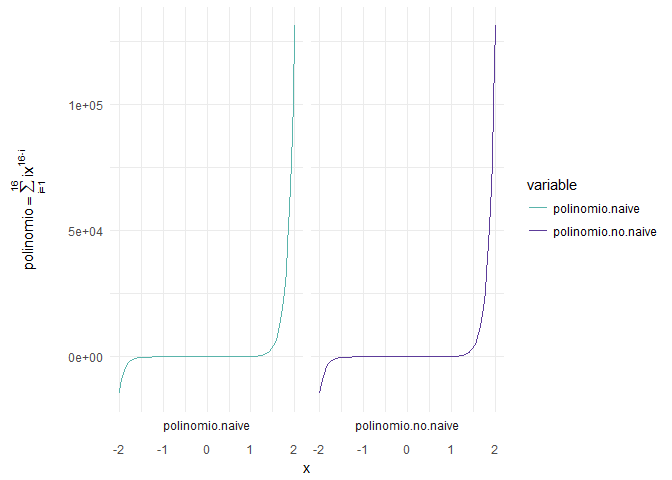

Como comentario final, la segunda implementación requiere de menos
operaciones lo que la hace más confiable en términos numéricos pues se
realizan menos operaciones y en una implementación rigurosa en la líneas
dentro de los <code> for() </code> (donde se evalúan los polinomios) se
podría checar por under u overflow (en este ejercicio no fue
implementado en vista de la manera en que se eligieron los
coeficientes).

### Ejercicio 2.4. Interpolando Temperaturas

*Asuma que las predicciones diarias de temperatura son conocidas para
dos horas representativas (por ejemplo al amanecer y después del
mediodía) en un conjunto de varios días. Diseñe un pseudo-código por
escrito en el que describa cómo pueden ser calculadas las predicciones
en intervalos de 1 hora, incluyendo la información sobre los datos de
entrada y salida de cada parte del pseudo-código*

*En su diseño no es necesario que describa el pseudo-código para
calcular la interpolación. Asuma que existe la función:*

<code> \[evaly,execTime\] = Interpolate(dataX,dataY,evalx) </code>

*que acepta los datos a interpolar y un vector de puntos a evaluar, y
retorna un vector (evaly) de valores evaluados y la cantidad de segundos
utilizada para calcular la interpolación (execTime).*

El pseudo código que presento es el siguiente:

    dataX                 #vector con las horas observadas
    dataY                 #vector con las predicciones de temperatura
    n = len(dataX)        #se obtienen las longitudes de los vectores
    n2 = len(dataY)
    if( n == n2)        #se checa si ambos vectores son de la misma longitud
    {
      ordenar_en_X(dataX, dataY) #se ordenan las observaciones pareadas en 
                                 #considerando el orden de dataX
                                 # en R seria dataX <- dataX[order(dataX)];
                                 # dataY <- dataY[order(dataX)]
      checar_duplicados(dataX,dataY)  #se checa si hay observaciones                                          #repetivas (aunque dataX debe ser de                                    #un tipo de dato que lo permita, como                                   #lo es cualquier tipo de fecha )
                                      #en caso de se encuentre                                                #valores duplicados o que para el                                       #mismo punto dataX se tienen dos
                                      #valores de dataY se eliminan 
      n = len(dataX)    #se obtienen las longitudes de los vectores checados
      n2 = len(dataY)
      mini = min(dataX) #se obtiene el rango de interpolacion
      max = max(dataX)
      evalx = sequencia(desde =mini, hasta = max, incremento = 1) #se construye el vector 
                                                                  #sobre el que se va a 
                                                                  #evaluar desde el minimo,
                                                                  #hasta el maximo de las
                                                                  #horas incrementando 
                                                                  #en cada posicion una hora
      if(n ==n2)
      [evaly,execTime] = Interpolate(dataX,dataY,evalx) #se realiza la interpolacion

    }

Como comentario adicional, en vista de que la temperatura ambiental
suele ser una función con estacionalidad (es decir que tiene ciclos) con
variaciones, la implementación que hace la función <code> Interpolate()
</code> debe de cuidar tanto que la cuncion sí es continua, y que se
repite con variaciones, como que la derivada es bien portada (en el caso
general a menos que aparezcan fenómenos naturales que la alteren
demasiado) y finalmente el espaciado en tre las observaciones digamos
entre la segunda y la tercera son casi 18 hrs mientras la diferencia
entre la primera y la segunda es de 6 hrs. Valdría la pena checar de los
métodos vistos en clase cual logra un mejor desempeño para este
particular espaciamiento de los *x**i*

### Ejercicio 2.5. Interpolación de Hermite Generalizada

*La generalización del método de interpolación de Hermite puede ser
determinada a través de requerir que el polinomio interpolante* *p*
*cumpla con las condiciones*:

$$
\\begin{array}{cr}
p(x\_i)=f(x\_i)  & \\\\
p'(x\_i)=f'(x\_i) & \\\\
p''(x\_i)=f''(x\_i) & i =1,\\dots, n\\\\
\\vdots \\\\
p^{(m)}(x\_i)= f^{(m)}(x\_i) \\\\
\\end{array} 
$$

*Revise el método de solución de la Sección 2.2 y transforme el problema
generalizado de Hermite en un problema de resolver un sistema lineal de
ecuaciones. ¿Qué grado deberá tener el polinomio considerado?, ¿Cómo se
puede atacar la problematica de no conocer las derivadas?*

En cuanto a el grado del polinomio tenemos que debe de cumplir las
siguientes condiciones :

$$
\\begin{array}{ccc}
p(x\_1)=f(x\_1)  & \\dots & p(x\_n)=f(x\_n) \\\\
p'(x\_1)=f'(x\_1) & \\dots & p'(x\_n)=f'(x\_n)\\\\
\\vdots & \\ddots & \\vdots \\\\
p^{(m)}(x\_1)= f^{(m)}(x\_1) & \\dots & p^{(m)}(x\_n)= f^{(m)}(x\_n) \\\\
\\end{array} 
$$

Es decir que requiere satisfacer *n**m* condiciones por lo que el grado
del polinomio sería *n**m* − 1.

En cuanto a la problemática de no conocer las derivadas
*f*(*i*)(*x*), de manera analoga a como lo hacemos con el
método de Hermite podemos considerar las diferencias divididas para
aproximarlas.

Usando la notación del libro que aprece en el pie de página podemos
escribir:

Al usar la notación *f*\[*x*1\]=*f*(*x**i*) como
la diferencia dividida de orden cero, podemos definir recursivamente la
primer diferencia dividida de *f* con respecto a *x**i* y
*x**j* denotada como
*f*\[*x**i*, *x**j*\] como
$$
f\[x\_i,x\_{i+1}\]=\\frac{f\[x\_{i+1}\] - f\[x\_i\]}{x\_{i+1}-x\_i}
$$

La segunda diferencia dividida queda como:
$$
f\[x\_i,x\_{i+1}, x\_{i+2}\]=\\frac{f\[x\_{i+1},x\_{i+2}\] - f\[x\_i, x\_{i+1}\]}{x\_{i+2}-x\_i}
$$

Y similarmente la (*k* − 1)-ésima diferencia finita se define como:
$$
f\[x\_i,x\_{i+1}, x\_{i+2}, \\dots, x\_{i+k}\]=\\frac{f\[x\_{i+1},x\_{i+2}, \\dots , x\_{i+k}\] - f\[x\_i, x\_{i+1}, \\dots, x\_{i+k-1}\]}{x\_{i+k}-x\_i}
$$

Podemos entonces atacar la problemática de no conocer las derivadas
considerando lo siguiente:
$$
\\begin{matrix}
p(x\_1)=f\[x\_1\]  & \\dots & p(x\_n)=f\[x\_n\] \\\\
p'(x\_1)=f'\[x\_1, x\_2\] & \\dots & p'(x\_{n-1})=f'\[x\_{n-1},x\_n\]\\\\
p''(x\_1)=f'\[x\_1, x\_2, x\_3\] & \\dots & p''(x\_{n-2})=f'\[x\_{n-2},x\_{n-1},x\_n\]\\\\
\\vdots & & \\\\
p^{(m-1)}(x\_1)= f^{(m)}\[x\_1, \\dots, x\_{n-1}\] & p^{(m-1)}(x\_2) =f\[x\_2, \\dots, x\_{n}\]  & \\\\
p^{(m)}(x\_1)= f^{(m)}\[x\_1, \\dots, x\_{n}\] & & 
\\end{matrix}
$$

Al igual que en el caso visto en clase, la aproximación de
*p*(*m*)(*x*) por diferencias divididas tiene problemas en
los puntos extremos pues mientras la diferencia dividida sube de orden
deja de estar definida para los puntos extremos (pues se definieron las
diferencias finitas hacia adelante) de manera análoga se pueden definir
las diferencias hacia atrás y las centrales. Como comentario final los
denominadores de las diferencias finitas pueden ser expresados en sumas
y restas de los términos de
*f*\[*x**i*\],*i* ∈ {1, 2, …, *n*}, sin embargo al sustituir
estos valores los coeficientes para cada *f*\[*x**i*\]
cambian y en casos particulares siguen sucesiones conocidas.

### Ejercicio 2.1. Interpolación de Lagrange

*Defina una función (en MATLAB, R, etc) para interpolar por el método de
Lagrange y úsela para aproximar a la función*
*f* : \[0, 8\]←*R*, *f*(*x*)=*s**e**n*(*x*) *utilizando* *n* *puntos
igualmente espaciados. Repita este ejercicio para* *n* = 2, 4, 7, 11, 16
*y haga observaciones sobre la calidad en las aproximaciones.*

La implementación que hice para interpolar usando el método de Lagrande
es la siguiente:

    f <- function(x)
    {               #declaramos un objeto de tipo 'closure' (una funcion
                    #que regresa una funcion) para poder reutilizar el codigo
                    #y de paso la vectorizamos
      #x (vector-double): punto en el cual evaluar la funcion 
      mapply(sin, x)  #regresamos el valor de la funcion en el vector 
    }
    oneLagrange_pol <- function(dataX, index, x)
    {
      #dataX (vector-double): puntos donde se conoce la funcion
      #index (int): numero que indica que termino estamos calculando
      #x (double): punto en el que se evalua el polinomio
      L_i <- 1.                   #inicializamos el coeficiente del i-esimo termino
      for(i in 1:length(dataX))
      {
        if(i != index)
        {
                                  #evaluamos el coeficiente de 
          L_i <- L_i*( (x - dataX[i] )/(dataX[index] - dataX[i]) )
        }
      }
      return(L_i)  #regresamos el coeficiente index-esimo 
    }
    Eval_pLagrange <- function(dataX, dataY, x)
    {
      #dataX (vector-double): puntos donde se conoce la funcion
      #dataY (vector-double): puntos donde se conoce el valor de la funcion
      #x (double): punto en el que se evalua el polinomio
      f_aprox <- 0.         #inicializamos el polinomio
      for(i in 1:length(dataX))
      {
                        #calculamos iterativamente el polinomio de Laprange
        f_aprox <- f_aprox + dataY[i]*oneLagrange_pol(dataX, i, x)
      }
      return(f_aprox)  #regresamos el valor del polinomio en el punto
    }  
    Lagrange <- function(dataX, dataY, m, a, b )
    {
      #dataX (vector): puntos a evaluar donde se conoce la funcion
      #dataY (vector): valor de la funcion conocida en los puntos dataX
      #m (int):       numero de valores a evaluar
      #a,b (double): limite inferior y superior del dominio a interpolar

      soporte <- seq(a, b, length = m)   #construimos puntos para probar la                                                                 #interpolacion
      f_soporte <- soporte*0             #reservamos memoria para guardar los                                                               #valores interpolados 
      for(i in 1:length(soporte))
      {
                              #para cada punto en el soporte se evalua el polinomio
        f_soporte[i] <- Eval_pLagrange(dataX, dataY , soporte[i]  )
        
      }
      return(f_soporte)      #regresamos el vector con los valores interpolados
    }

La siguiente sección de código evalúa en el dominio que se pide para los
polinomios de diferentes grados y manipula los datos para construir la
gráfica.

    m <- 100                        #Numero de puntos en el dominio
    ns <- c(2,4,7,11,16)            #grados de los polinomios
                            #guardamos los puntos x, y f(x) con los que se construyen los polinomios para plasmarlos en la grafica
    puntos <- lapply(ns, FUN = function(x){
      jj <-data.frame(x=seq(0,8, length = x),f =f(seq(0,8, length = x)))
      return(jj)}) 
    puntos[[1]]$variable <- 'Lagrange_con2pt'
    puntos[[2]]$variable <- 'Lagrange_con4pt'
    puntos[[3]]$variable <- 'Lagrange_con7pt'
    puntos[[4]]$variable <- 'Lagrange_con11pt'
    puntos[[5]]$variable <- 'Lagrange_con16pt'
    puntos <- do.call("rbind", puntos)
    contraste <- data.frame(n = seq(0,8, length = m))
                              #se evaluan los polinomios de todos los grados en el dominio dado
    a <- list()               #cada interpolación la guardamos en un indece de una lista 
    for(i in 1:length(ns))
    {
      a[i] <- lapply(FUN = Lagrange, dataX=seq(0, 8, length=ns[i]) ,
                     dataY=f(seq(0, 8, length=ns[i])), m, a=0, b=8)  
    }
        #juntamos los resultados para poder construir la grafica que los compare
    contraste$Lagrange_con2pt <- a[[1]]
    contraste$Lagrange_con4pt <- a[[2]]
    contraste$Lagrange_con7pt <- a[[3]]
    contraste$Lagrange_con11pt <- a[[4]]
    contraste$Lagrange_con16pt <- a[[5]]
    library(reshape)
    a <- melt(contraste, id = 'n')
    ggplot(a, aes(x = n , y = value)) + stat_function(fun =sin,  colour = 'lightblue')+
      geom_line(aes(colour = variable)) +
      stat_function(fun =sin,  colour = 'lightblue')+ 
      facet_wrap(~variable,  ncol = 2, strip.position = "bottom") +
      theme_minimal() +
      scale_color_manual(values=c(rep('pink', 5), 'red'), guide=FALSE) +
      ylab("Polinomio de Lagrange de sin(x)") + 
      geom_point(data = puntos, aes(x = x, y = f, colour = 'puntos conocidos')) +
      xlab('')

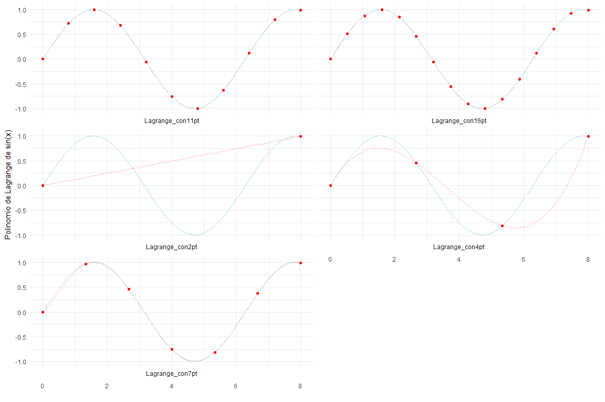

Como se observa en la gráfica anterior al evaluar el polinomio en *n*
puntos igualmente espaciados en \[0, 8\] podemos ver que a partir del
polinomio de grado 7 (que requiere de siete puntos para interpolar) la
diferencia entre la interpolación (color rosa) y la función <code>
sin(x) </code> (dibujada con color azul claro) ya es pequeña. Para 11 y
16 puntos ambas gráficas se sobreponen.

La siguiente porción de código reutiliza los cálculos hechos para
dibujar la tabla con el fin de obtener los máximos de los valores
absolutos de la diferencia entre el valor interpolado y el ‘exacto’ (el
que realiza la función <code> sin(x) </code> implementada en *R*) para
cada uno de los puntos del dominio en donde se evaluó.

    contraste$exacto <- f(contraste$n) 
                            #en la siguiente linea calculamos el error maximo
                            # para cada interpolacion 
    r <- apply(contraste[, 2:6], 2, function(x)
      {
        x-contraste$exacto
    }) 
    r <- as.data.frame(r)
    names(r) <- paste0('error_',names(contraste[, 2:6]))
    contraste<- cbind(contraste, r)
    library(xtable)       #package para generar tablas .tex 
    errores.maximos <- apply(contraste[, 8:12], 2, function(x){max(abs(x))} )
    #xtable(as.data.frame(errores.maximos))

\begin{table}[ht]
\centering
\begin{tabular}{rr}
  \hline
 & errores.maximos \\ 
  \hline
error\_interpolacion\_con2pt & 1.59 \\ 
  error\_interpolacion\_con4pt & 1.01 \\ 
  error\_interpolacion\_con7pt & 0.09 \\ 
  error\_interpolacion\_con11pt & 0.00 \\ 
  error\_interpolacion\_con16pt & 0.00 \\ 
   \hline
\end{tabular}
\end{table}
En la tabla siguiente vemos que la calidad de las estimaciones es
aceptable a partir la interpolación con 11 puntos.

### Ejercicio 2.2. Interpolación de Newton y función de Runge

*Considere la función de Runge* $f(x) = \\frac{1}{1+25x^2}$ con
*x* ∈ \[ − 1, 1\] *y use una implementación de la interpolación de
Newton (en MATLAB, R, etc.) para aproximar a esta función en*
\[ − 1, 1\] *utilizando* 5, 9, 13, 17 *y* 21 *puntos igualmente
espaciados. Observe como el grado polinomial afecta la calidad de la
aproximación.*

*Realice una aproximación similar usando el programa de interpolación de
Lagrange del ejercicio anterior. ¿Son los resultados mejores, peores o
equivalentes?*

La implementación del método de Newton para interpolar que hicé es la
siguiente, los coeficientes se obtienen al resolver un sistema de
ecuaciones con la función <code> solve() </code> de *R* la cual es una
interfase para la implementación en Fortran del famoso paquete LAPACK,
en particular las *rutinas
[DGESV](http://www.netlib.org/lapack/explore-html/d8/d72/dgesv_8f.html)
y
[ZGESV](http://www.netlib.org/lapack/explore-html/d1/ddc/zgesv_8f_source.html)*
las cuales efectuan una descomposición PLU para resolver sistemas
lineales.

    Runge <- function(x)
    {               #declaramos una funcion para poder reutilizar el codigo
      #x (vector-double): punto en el cual evaluar la funcion 
      return(1/(1+25*x^2))
    }
    Newton.one<- function(x, index, dataX)
    {
      #dataX (vector-double): puntos donde se conoce la funcion
      #index (int): numero que indica que termino estamos calculando
      #x (double): punto en el que se evalua el polinomio
      val <- x-dataX[1:(index-1)] #evaluamos el coeficiente de Newton dorrespondiente al indice
      return(cumprod(val)[index-1]) #regresamos el coeficiente index-esimo
    }
    Newton.interpola <- function( n, dataX, dataY, x)
    {
      #n (int) grado del polinomio
      #dataX (vector-double): puntos donde se conoce la funcion
      #dataY (vector-double): puntos donde se conoce el valor de la funcion
      #x (double): punto en el que se evalua el polinomio
              #Construimos la matriz para el metodo de Newton
      if(n < 2)
      {
        return('error') #un pequeño chequeo para ver que tenemos mas de un punto 
      }
      
      M <- matrix(rep(0,n*n), byrow = FALSE, nrow = n)
      M[,1] <- 1 
      for (i in 2:(n))
      {
        for(k in 2:i)
        {
          M[i,k] <- Newton.one(x = dataX[i], k , dataX) 
        }
      }
      coeficientes <- solve(M, b = dataY) #obtenemos los coeficientes
      base <- (x - dataX[1:(n-1)])       #generamos la base de polinomios
      base.comp <- cumprod(base)
      resul <- coeficientes*c(1,base.comp) #construimos el polinomio interpolante
      return(sum(resul))      #regresamos la evaluacion del polinomio
    }
    Newton <- function(dataX, dataY, m, n, a, b)
    {
      #dataX (vector-double): puntos donde se conoce la funcion
      #dataY (vector-double): puntos donde se conoce el valor de la funcion
      #m (int):       numero de valores a evaluar
      #n (int) grado del polinomio
      #a, b(double): limite inferior y superior respectivamente, en donde se interpola 
      soporte <- seq(a, b, length = m)   #construimos puntos para probar la                                             #interpolacion
      f_soporte <- soporte*0             #reservamos memoria para guardar los                                           #valores interpolados 
      for(i in 1:length(soporte))
      {
                              #para cada punto en el soporte se evalua el polinomio
        f_soporte[i] <- Newton.interpola( n, dataX, dataY , soporte[i]  )
      }
      return(f_soporte)      #regresamos el vector con los valores interpolados
    }

Análogamente la siguiente sección de código evalúa en el dominio que se
pide para los polinomios de diferentes grados y manipula los datos para
construir la gráfica.

    m <- 100
    ns <- c(5, 9, 13, 17, 21)
                  #en las siguientes lineas se guardan todos los puntos donde se conoce la funcion para plasmarlos en la grafica
    puntos2 <- lapply(ns, FUN = function(x){
      jj <-data.frame(x=seq(-1,1, length = x),f =Runge(seq(-1,1, length = x)))
      return(jj)}) 
    puntos2[[1]]$variable <- 'Newton_con5pt'
    puntos2[[2]]$variable <- 'Newton_con9pt'
    puntos2[[3]]$variable <- 'Newton_con13pt'
    puntos2[[4]]$variable <- 'Newton_con17pt'
    puntos2[[5]]$variable <- 'Newton_con21pt'
    puntos2 <- do.call("rbind", puntos2)
                #creamos una lista para guardar las evaluaciones de todos los polinomios con diferentes 'n's
    contraste2 <- data.frame(n = seq(-1,1, length = m))
    a2 <- list()
    for(i in 1:length(ns))
    {
                  #evaluamos todos los puntos para cada polinomio de grado ns[i]
      dataX <- seq(-1,1,length=ns[i])
      dataY <- Runge(dataX)
      a2[[i]] <- Newton(dataX, dataY , m = m, n = ns[i] , a=-1, b=1  )
    }
    contraste2$Newton_con5pt <- a2[[1]]
    contraste2$Newton_con9pt <- a2[[2]]
    contraste2$Newton_con13pt <- a2[[3]]
    contraste2$Newton_con17pt <- a2[[4]]
    contraste2$Newton_con21pt <- a2[[5]]
    library(reshape)   #package para manipulacion de data.frame
    a3 <- melt(contraste2, id = 'n')
    ggplot(a3, aes(x = n , y = value)) + geom_line(aes(colour = variable))+
      facet_wrap(~variable,  ncol = 2, strip.position = "bottom") + theme_minimal() + 
      scale_color_manual(values=c(rep('pink2',5), 'red'), guide=FALSE) +
      ylab("Polinomio de Newton para la funcion de Runge")+ 
    geom_point(data = puntos2, aes(x = x, y = f, colour = 'puntos conocidos'))+ 
      ylim(c(-1,5)) +xlim(c(-1.1,1.1))+
      stat_function(fun =Runge,  colour = 'lightblue') + xlab('')

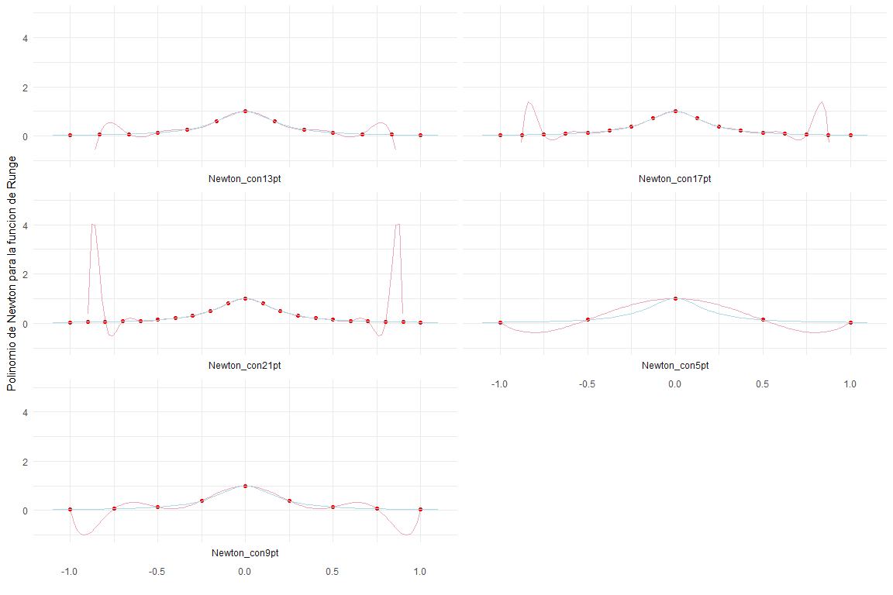

En la gráfica anterior al evaluar el polinomio en m = 100 puntos
igualmente espaciados en \[ − 1, 1\] podemos ver que a partir del
polinomio de grado 13 (que requiere de trece puntos para interpolar) la
diferencia entre la interpolación y la función de Runge (dibujada con
color azul claro) ya no es pequeña en el vecindario de los puntos fijos
(en rojo) por lo que podríamos pensar que se está sobre ajustando la
interpolación al emplear más puntos (o bien que la calidad de las
estimaciones decaerá en los puntos ‘lejanos’ al cero. En la siguiente
tabla se muestran los máximos de los valores absolutos de la diferencia
entre el valor interpolado y el ‘exacto’ (el que se obtiene con la
función de Runge y comparandolo con la implementación anterior que
interpola usando el método de Lagrange).

    contraste2$exacto <- Runge(contraste2$n) 
                            #en la siguiente linea calculamos el error maximo
                            # para cada interpolacion 
    r2 <- apply(contraste2[, 2:6], 2, function(x)
      {
        x-contraste2$exacto
    }) 
    r2 <- as.data.frame(r2)
    names(r2) <- paste0('error_',names(contraste2[, 2:6]))
    contraste2<- cbind(contraste2, r2)
                            #evaluamos la interpolacion usando Lagrange
    contraste <- data.frame(n = seq(-1,1, length = m))
    a4 <- list()
    for( i in 1:length(ns))
    {
      dataX <- seq(-1, 1, length= ns[i] )
      dataY <- Runge(dataX)
      a4[[i]] <- Lagrange(dataX, dataY, m, a=-1, b=1 )  #evaluamos todos los
                                                 #puntos para el polinomio de grado ns[i]
    }
    contraste$Lagrange_con5pt <- a4[[1]]
    contraste$Lagrange_con9pt <- a4[[2]]
    contraste$Lagrange_con13pt <- a4[[3]]
    contraste$Lagrange_con17pt <- a4[[4]]
    contraste$Lagrange_con21pt <- a4[[5]]
    contraste$exacto <- Runge(contraste$n)
    r <- apply(contraste[, 2:6], 2, function(x)
      {
        x-contraste$exacto
    }) 
    r <- as.data.frame(r)
    names(r) <- paste0('error_',names(contraste[, 2:6]))
                            #en la siguiente linea calculamos el error maximo
                            # para cada interpolacion 
    contraste <- cbind(contraste, r)
    referencia <- cbind(contraste, contraste2)
    j <- referencia[, c(8:12, 20:24)]
    errores.maximos <- apply(j, 2, function(x){max(abs(x))} )
    errores.maximos <- as.data.frame(errores.maximos)
    #xtable(errores.maximos)

\begin{table}[ht]
\centering
\begin{tabular}{rr}
  \hline
 & errores.maximos \\ 
  \hline
error\_Lagrange\_con5pt & 0.44 \\ 
  error\_Lagrange\_con9pt & 1.05 \\ 
  error\_Lagrange\_con13pt & 3.61 \\ 
  error\_Lagrange\_con17pt & 14.01 \\ 
  error\_Lagrange\_con21pt & 58.41 \\ 
  error\_Newton\_con5pt & 0.44 \\ 
  error\_Newton\_con9pt & 1.05 \\ 
  error\_Newton\_con13pt & 3.61 \\ 
  error\_Newton\_con17pt & 14.01 \\ 
  error\_Newton\_con21pt & 58.41 \\ 
   \hline
\end{tabular}
\end{table}
En la tabla anterior observamos que los errores máximos son los mismos,
queriendo decir que son aproximaciones semejantes.

La siguiente sección manipula los datos para construir la gráfica.

    puntos3 <- puntos2
    puntos3$variable <- gsub('Newton', 'Lagrange',puntos3$variable)
    puntos4 <- rbind(puntos2, puntos3) 
    a3 <- melt(referencia, id = 'n')
    a3$variable <- factor(a3$variable,levels(a3$variable)[c(1:5,12:16,6:11,17:21)] )
    suba3 <- subset(a3, variable %in% c('Lagrange_con5pt', 'Lagrange_con9pt', 'Lagrange_con13pt',
                                      'Lagrange_con17pt', 'Lagrange_con21pt', 'Newton_con5pt',
                                      'Newton_con9pt', 'Newton_con13pt',
                                      'Newton_con17pt', 'Newton_con21pt'))
    suba3$numero_puntos <- as.factor(rep(ns, each = 100))
    ggplot(data = suba3,aes(x = n , y = value)) + geom_line(aes(colour = numero_puntos))+
      facet_wrap(~variable,  ncol = 2, strip.position = "bottom") + theme_minimal() + 
      scale_color_manual(values=c(rep('navy', 5), rep('green', 5),'red'),  guide=FALSE) +
      ylab("Polinomio de Newton y Lagrange para la funcion de Runge")+ 
    geom_point(data = puntos4, aes(x = x, y = f, colour = 'puntos conocidos'))+
      ylim(c(-1,5)) +xlim(c(-1.1,1.1))+stat_function(fun =Runge,  colour = 'lightblue') + xlab('')

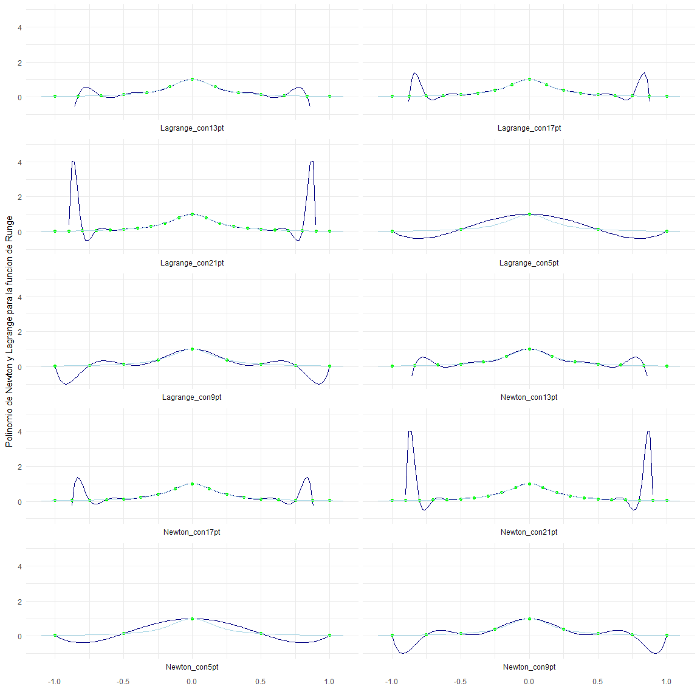

Nuevamente comprobamos que los polinomios de Lagrange y de Newton son
muy parecidos en el intervalo de interpolación.

### Ejercicio 2.3. Comparando interpolaciones

*Defina dos siluetas simples que puedan representarse como un conjunto
de 2 a 5 funciones en* *R*2, *use al menos una silueta con
solo 3 puntos y otra con al menos 10 puntos. Implemente un programa que
utilice interpolación de Lagrange y de Newton y compare los resultados
de ambas aproximaciones en términos de 'calidad visual' (subjetivo),
eficiencia en tiempo de calculo y complejidad de la implementación.*

La primera silueta con la trabajé fue la siguiente, la realicé con dos
funciones, los 3 puntos que elegí para interpolar son
*x* = 2, 8.38, 14.75, para cada función los marco con color rojo.

El código para realizar la silueta 1 es el siguiente:

    #primeras funciones para la silueta
    f1 <- function(x)      #funcion en color azul en la grafica
    {
      y <- mapply(FUN = function(x){exp(sin(x**(2/3)))*x},x )
      return(y)
    }
    f2 <- function(x)   #funcion en color azul en la grafica
    {
      y <- mapply(FUN = function(x){11.435814 + (-24/x**2)},x )
      return(y)
      
    }

Esta es la primer silueta con la que trabajé

    # en la siguiente lineas aproxime la interseccion de las funciones para generar 
    #contornos cerrados, el mismo procedimiento se siguió en la segunda silueta.
    x1 <- uniroot(function(x){ f2(x)-f1(x)}, interval = c(14,15))$root
    x <- round(seq(2, x1, length = 3), 2)
    puntos2 <-  puntos1 <- as.data.frame(x = x)
    puntos1$f <- f1(puntos1$x)
    puntos2$f <- f2(puntos2$x)
    puntos <- rbind(puntos2, puntos1)
                #se dibuja
    ggplot(data = data.frame(x = c(0, x1)), aes(x)) +stat_function(fun = f1, colour ='#A6CEE3',
    xlim = c(2,x1) ) + stat_function(fun = f2, colour = '#FDC086',xlim = c(2,x1)) +
      theme_minimal() + ggtitle("Silueta 1") + xlim(c(2,x1)) +
      geom_point(data = puntos, aes(x = x, y = f, colour = 'red')) +
      xlab('') + scale_color_manual(values=c('red'))

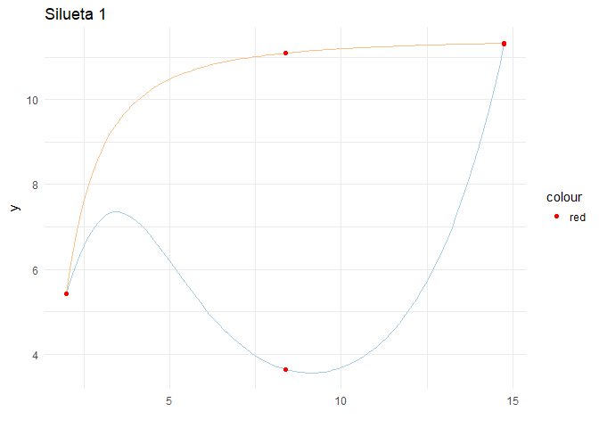

La siguiente gráfica muestra la interpolación del contorno y los tres
puntos elegidos usando el método de Lagrange y el de Newton.

    m <- 100
    tiempo.lagrange <- Sys.time()       #medimos el tiempo de ejecución
    contraste1 <- data.frame(n = seq(2,x1, length = m))   #al igual que en ocaciones anteriores
                                    #guardamos las evaluaciones para poder grafica posteriormente 
          #generamos los 3 puntos en base para interpolar 
    dataX <- seq(2, x1, length = 3)
    dataY <- f1(dataX)
            #evaluamos todos los puntos
    contraste1$Lagrange_f1_con3pt <- Lagrange(dataX, dataY, m, a=2, b=x1 )  
    contraste1$origen <- 'Lagrange' 
    contraste2 <- data.frame(n = seq(2,x1, length = m))
    contraste2$Lagrange_f2_con3pt <- Lagrange(dataX, f2(dataX), m, a=2, b=x1 ) 
             #evaluamos todos los puntos
    contraste2$origen <- 'Lagrange'
    tiempo.lagrange <- Sys.time() - tiempo.lagrange
    tiempo.lagrange <- as.numeric(round(tiempo.lagrange, 7))
    ############## Repetimos lo anterior para el metodo de newton 
    tiempo.newton <- Sys.time()
    contraste3 <- data.frame(n = seq(2,x1, length = m))
            #evaluamos todos los puntos
    contraste3$Newton_f1_con3pt <- Newton(seq(2,x1, length = 3), f1(seq(2,x1, length = 3)), 
    m, 3, a=2, b=x1)  
    contraste3$origen <- 'Newton'
    contraste4 <- data.frame(n = seq(2,x1, length = m))
    contraste4$Newton_f2_con3pt <- Newton(seq(2,x1, length = 3), f2(seq(2,x1, length = 3)), m,
    3, a=2, b=x1)
    contraste4$origen <- 'Newton'
    tiempo.newton <- Sys.time() - tiempo.newton
    tiempo.newton <- as.numeric(round(tiempo.newton, 7))
      #manipulamos los datos para construir la grafica
    a1 <- melt(contraste1, id = c('n', 'origen'))
    a2 <- melt(contraste2, id = c('n', 'origen'))
    a3 <- melt(contraste3, id = c('n', 'origen'))
    a4 <- melt(contraste4, id = c('n', 'origen'))
    a <- rbind(a1, a2, a3, a4)
    ggplot(a, aes(x = n , y = value)) + geom_line(aes(colour = variable))+
      theme_minimal() +  geom_point(data = puntos, aes(x = x, y = f, colour = 'puntos conocidos') ) +
      stat_function(fun = f1, colour ='lightblue', xlim = c(2,x1), show.legend = 'f1(x)' ) +
      stat_function(fun = f2, colour = 'lightblue', xlim = c(2,x1), show.legend = 'f2(x)')+
    scale_color_manual(values=c(rep('springgreen1',2), rep('navy',2), 'red'))+
      ggtitle("Polinomio de Lagrange y Newton con tres puntos conocidos") +
      xlab('') +
      facet_wrap(~origen,  nrow =1 , strip.position = "bottom")

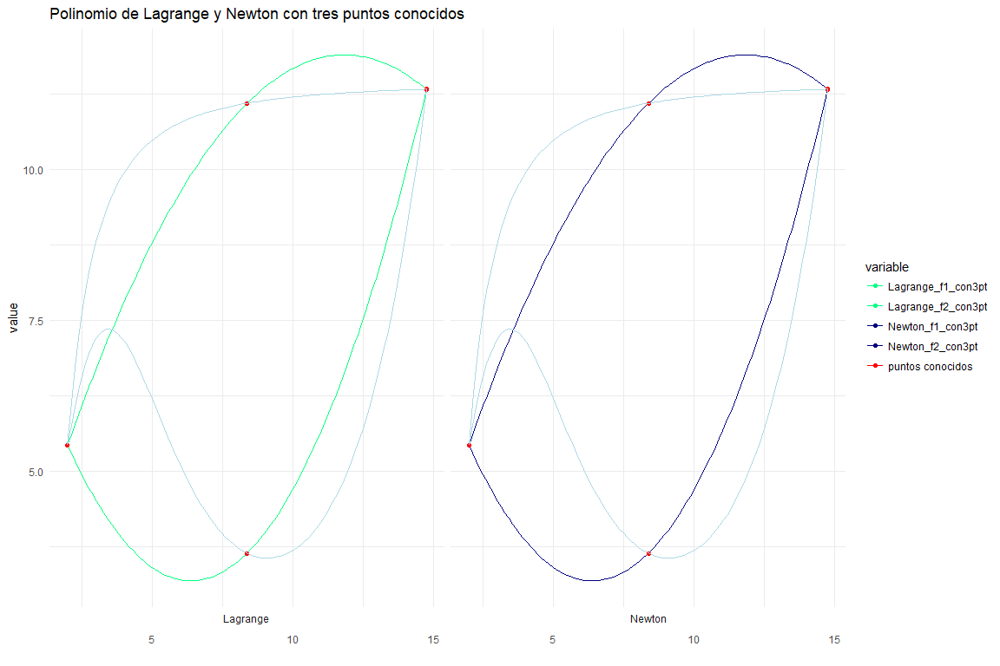

    t <- tiempo.lagrange/tiempo.newton

Visualmente ambas aproximaciones son pésimas, pues existen puntos donde
los puntos interpolados distan mucho de su valor real como por ejemplo
alrededor del 5.

En cuanto tiempo de ejecución tenemos que la interpolación usando
Lagrange tardó 0.0079 mientras que el cálculo usando el método de Newton
requirió de 0.0100269, es decir que el método de Lagrange es 0.7878806
veces más rápido (en este caso) que el de Newton.

La segunda silueta con la trabajé fue la siguiente, la realicé con tres
funciones, los 10 puntos que elegí para interpolar son 16 puntos
equidistantes comenzando en *x* = 1.04505 y terminando en 7.460007, para
cada función los marco con color rojo.

El código para realizar la silueta 2 es el siguiente:

    f3 <- function(x)
    {
      y <- mapply(FUN= function(x){.5*exp(sin(x**2))*x}, x)
      return(y)
    }
    f4 <- function(x)
    {
      return(asin(2-x))
    }
    f5 <- function(x)
    {
      return(4*sin(x)-1.843606)
    }

Esta es la segunda silueta con la que trabajé, el código es un poco
extenso pues se define por trozos la silueta.

    # en la siguiente lineas aproxime la interseccion de las funciones para generar 
    #contornos cerrados pero las comento porque son puntos poco comodos
    x <- seq(1, 7.460007, length = 100)
    x2 <- uniroot(function(x){ f3(x)-f4(x)}, interval = c(1, 2))$root
    x3 <- tail(x[!is.na(f4(x))],1)
    x4 <- uniroot(function(x){ -f3(x)+f5(x)}, interval = c(3, 7.460007))$root
    n <- 16 ###queremos 16 puntos equidistantes
    xx <- seq( x2, 7.460007 , length=n )
    index <- seq(1,n,2)
    x <- xx[index]
    ##########################
            #guardo los puntos base para interpolar 
    puntos1 <- as.data.frame(x = x)
    puntos1$f <- f3(puntos1$x)
    x <-  xx[seq(2,n,2)][ (xx[seq(2,n,2)]) <= x3] 
    puntos2 <- as.data.frame(x = x) 
    puntos2$f <- f4(puntos2$x)  #aseguro dos en puntos cuando menos en cada funcion que
                                #define la curva
    x <- xx[seq(2,n,2)][ (xx[seq(2,n,2)]) > x3]
    puntos3 <- as.data.frame(x = x)
    puntos3$f <- f5(puntos3$x)
    puntos <- rbind(puntos2, puntos1, puntos3)
    ggplot(data = data.frame(x = c(0, x2)), aes(x)) +
      stat_function(fun = f4, colour ='#A6CEE3', xlim = c(x2, x3) ) +
      stat_function(fun = f5, colour = 'pink', xlim = c(x3, 7.460007)) +
      stat_function(fun = f3, colour = 'purple',xlim = c(x2, 7.460007)) + 
      theme_minimal() + ggtitle("Silueta 2") + xlim(c(x2,7.460007)) +
      geom_point(data = puntos, aes(x = x, y = f, colour = 'red')) +
      xlab('') + scale_color_manual(values=c('red'))

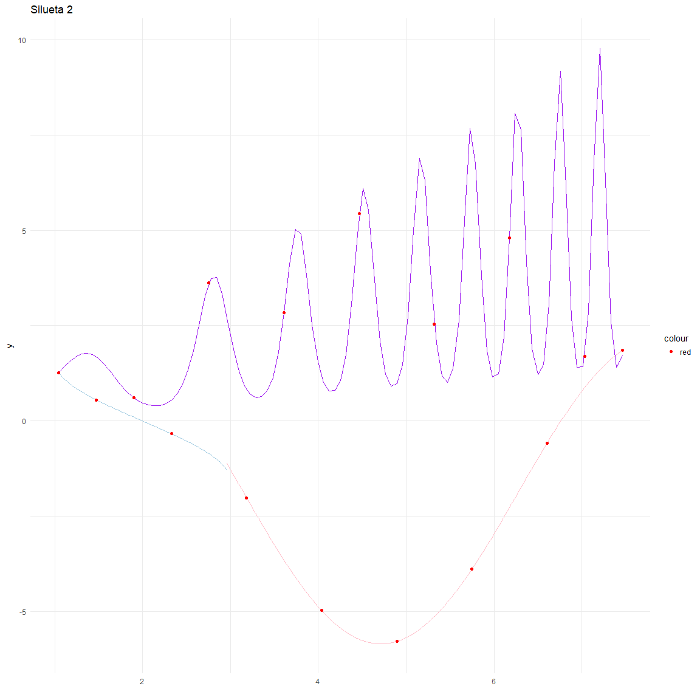

La siguiente gráfica muestra la interpolación del contorno (ligeramente
más complicado que la silueta 1) y los diez puntos elegidos usando el
método de Lagrange y el de Newton.

    m <- 100
    n <- 16
    epsilon <- 10e-3
    ##################### evaluo con lagrange
    tiempo.lagrange <- Sys.time()  #mido el tiempo de ejecución
                #guardo las evaluaciones en el intervalo a interpolar pero dividido en tres regiones
    contraste1 <- data.frame(n = seq(x2, 7.460007, length = m))
    contraste1$Lagrange_f3_con16pt <-  Lagrange(puntos1$x, f3(puntos1$x), m, a=x2, b=7.460007 )
    contraste1$origen <- 'Lagrange' 
    contraste2 <- data.frame(n = seq(x2, x3, length = m))
                          #evaluamos todos los puntos,
    contraste2$Lagrange_f4_con16pt <- Lagrange(puntos2$x, f4(puntos$x), m, a=x2, b=x3)   
    contraste2$origen <- 'Lagrange'
    contraste3 <- data.frame(n = seq(x3, 7.460007, length = m))
    contraste3$Lagrange_f5_con16pt <- Lagrange(puntos3$x, f5(puntos3$x) , m, a=x3, b=7.460007)
    contraste3$origen <- 'Lagrange'
    tiempo.lagrange <- Sys.time() - tiempo.lagrange
    tiempo.lagrange <- as.numeric(round(tiempo.lagrange, 7))
    ############## evaluo con newton 
    tiempo.newton <- Sys.time()
    contraste4 <- data.frame(n = seq(x2, 7.460007, length = m))
    contraste4$Newton_f3_con16pt <- Newton(puntos1$x, f3(puntos1$x),
                                          m, n/2, a=x2, b=7.460007)
    contraste4$origen <- 'Newton'
    contraste5 <- data.frame(n = seq(x2, x3, length = m))
    contraste5$Newton_f4_con16pt <- Newton(puntos2$x, f4(puntos2$x),
                                           m, dim(puntos2)[1],  a=x2, b=x3)
    contraste5$origen <- 'Newton'
    contraste6 <- data.frame(n = seq(x3, 7.460007, length = m))
    contraste6$Newton_f5_con16pt <- Newton( puntos3$x, f5(puntos3$x), m, dim(puntos3)[1], a=x3, b=7.460007)
    contraste6$origen <- 'Newton'
    tiempo.newton <- Sys.time() - tiempo.newton
    tiempo.newton <- as.numeric(round(tiempo.newton, 7))
    #####manipulacion de datos y construccion de grafica 
    a1 <- melt(contraste1, id = c('n', 'origen'))
    a2 <- melt(contraste2, id = c('n', 'origen'))
    a3 <- melt(contraste3, id = c('n', 'origen'))
    a4 <- melt(contraste4, id = c('n', 'origen'))
    a5 <- melt(contraste5, id = c('n', 'origen'))
    a6 <- melt(contraste6, id = c('n', 'origen'))
    a <- rbind(a1, a2, a3, a4, a5, a6)
    ggplot(a, aes(x = n , y = value)) + geom_line(aes(colour = variable))+
      theme_minimal() +  geom_point(data = puntos, aes(x = x, y = f, colour = 'puntos conocidos')) +
      stat_function(fun = f3, colour ='lightblue', xlim = c(x2,7.460007), show.legend = 'f3(x)') +
      stat_function(fun = f4, colour = 'lightblue', xlim = c(x2,x3), show.legend = 'f4(x)') +
      stat_function(fun = f5, colour = 'lightblue', xlim = c(x3,7.460007), show.legend = 'f5(x)') + 
      scale_color_manual(values=c( rep(c('navyblue', 'green', 'orange'),3),'red'), guide=FALSE) +
      ggtitle("Polinomio de Lagrange y Newton con 16 puntos conocidos") +  xlab('') + ylim(c(-12,12))+
      facet_wrap(~origen,  nrow =1 , strip.position = "bottom")

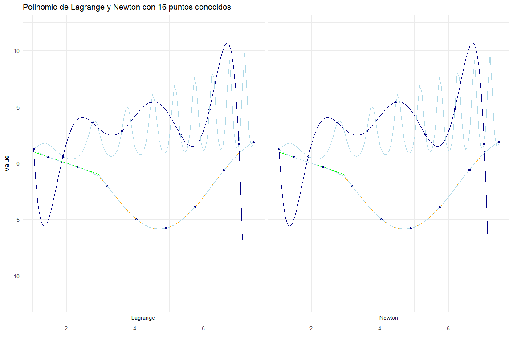

    t <- tiempo.lagrange/tiempo.newton

Visualmente ambas aproximaciones también son pésimas, pues existen
puntos donde los puntos interpolados distan mucho de su valor real como
por ejemplo alrededor del 6.5 de la parte superior de la silueta.

En cuanto tiempo de ejecución tenemos que la interpolación usando
Lagrange tardó 0.0041909 mientras que el cálculo usando el método de
Newton requirió de 0.0156591, es decir que el método de Lagrange es
0.2676335 veces más rápido (en este caso) que el de Newton.

Concluimos que la interpolación de Newton es cuando menos más rápida,
pero hay que tener en cuenta que ello depende en gran medida de la
función <code >solve() </code> y de que si tuviéramos que realizar una
interpolación sin una implementación de resolución sistemas lineales
podríamos usar el método de Lagrange, lo que lo hace menos complejo de
implementar.

### Interpolación de Hermite

*Implemente rutinas en MATLAB/R para una función de interpolación
utilizando el método de Hermite. Utilice la aproximación a las derivadas
por diferencias hacia adelante*
$\\frac{dy}{dx} \\approx \\frac{y\_{i+1}-y\_i}{ x\_{i+1}-x\_i }$ *para
todos los puntos* *x**i*, *i* = 1, …, *n* − 1. *Consulte las
predicciones diarias de temperatura en un servicio de Internet para los
siguientes días y a dos horas representativas. Pruebe su código de
interpolación de Hermite realizando las predicciones de la temperatura
en intervalos de 1 hora. Construya los resultados y represéntelos de
forma gráfica en el espacio tiempo-temperatura.*

*Use comandos para lograr un gráfico que muestre los bloques de 24
horas, y que incluya la descripción y unidades en los ejes. Además, use
las opciones que ofrece para graficar como asteriscos los datos
originales tomados de Internet.*

El servicio web que utilice es el de la página de [The Wheater
Channel](https://weather.com/es-MX/tiempo/horario/l/MXNL0068:1:MX)
(anexo los datos consultados en el apéndice). Obtuve pronósticos para
cada hora desde las 3am del 5 de febrero hasta las 2am del miércoles
ambos para 2018. Para interpolar decidí trabajar con los puntos
correspondientes a las 5pm y 7am (horas importantes en mi día a día).

La siguiente es una gráfica de los datos que me proporcionó la pagina
web, los puntos fijos con los que voy a interpolar están en rojo:

    data <- read.csv('C:\\Users\\fou-f\\Desktop\\MCE\\Second\\AnalisisNumericoYOptimizacion\\clima.csv')   #lectura local de los datos 
    library(lubridate)  #package para manejar horas
    inicio <- ymd_hms('2018-02-05 03:00:00') #fijo la primer observacion que tengo como punto inicial 
    datos.clima <- data.frame(fecha=inicio + hours(0:47)) #genero las dateTime
    datos.clima$temp <- data$temp                         #copio los valores conocidos
    datos.clima$index <- 2:49                   #reparametrizo por
    #estabilidad numerica
    puntos <- datos.clima[ c(5,15,29,39) ,]         #selecciono los puntos a fijar
    ggplot(datos.clima, aes(fecha, temp)) + geom_line(aes(colour = I('#1D91C0'))) +
       geom_point(aes(fecha, temp, colour=I('purple')), shape = "*", size = 7)+ 
      theme_light()+ ggtitle('Datos de The Wheater Channel' )+
      xlab('dia : hora') +ylab('grados Centigrados') +
      geom_point(data= puntos,aes(fecha, temp, colour=I('red')), size = 4) +
      scale_y_continuous(breaks = seq(12, 28, by = 1)) +
      scale_x_datetime(date_breaks = '2 hour', date_labels = "%d : %H" )

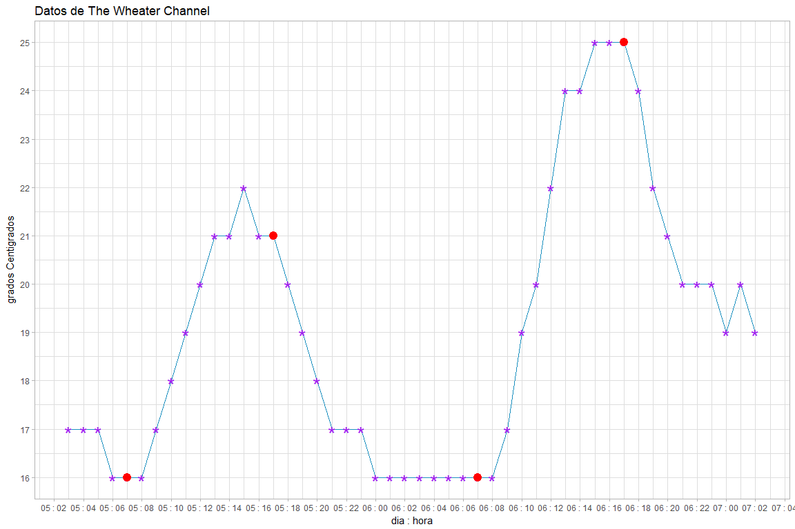

La siguiente es mi implementación del Método de Hermite que hace uso de
un objeto de tipo
[closure](http://adv-r.had.co.nz/Functional-programming.html) (que dudo
que exista en MATLAB) para evitar usar ciclos <code> for </code>

    diferencias.adelante <- function(dataX, dataY)
    {
      #dataX : puntos fijos para construir el polinomio
      #dataY : valores conocidos para dataX
      n <- length(dataX)
      diferencias <- diff(dataY)/diff(dataX)  #diferencias hacia adelante
      ultimo <- diferencias[n-1] #la ultima diferencia la evaluamos hacia atras
      return(c(diferencias, ultimo)) #regresamos el vector con las diferencias
    }
    HermiteNo <- function(dataX, dataY, x)
    {
      #dataX (vector) : puntos fijos para construir el polinomio
      #dataY (vector) : valores conocidos para dataX
      #x: punto a interpolar
        n <- length(dataX)
        M1 <- matrix(rep(0, 2*n*n ), nrow = n)  #construimos una matriz que iguale a la funcion 
        M1[,1] <- 1
        for(i in 2:(n*2)) #hay que tener cuidado con los subindices
        {
          M1[,i] <- dataX**(i-1)
        }
        M2 <- matrix(rep(0, 2*n*n ), nrow = n)#construimos una matriz que iguale a la primer                                                #derivada 
        M2[,1] <- 0
        M2[,2] <- 1
        for(i in 3:(n*2))
        {
          M2[,i] <- (i-1)*dataX**(i-2)#hay que tener cuidado con los subindices
        }
                #construimos el vector b, con la dataY y las primeras diferencias 
        b1 <- dataY
        b2 <- diferencias.adelante(dataX, dataY)
        b <- c(b1, b2)
                #pegamos las matrices 
        M <- rbind(M1, M2)
        coeficientes <- solve(M, b) #obtenemos los coeficientes
        res <- pol.no.naive(x, coeficientes)
      return(res)
    }
    Hermite.closure <- function(dataX, dataY) #objeto de tipo closure para fijar parametros 
    {
      #dataX (vector) : puntos fijos para construir el polinomio
      #dataY (vector) : valores conocidos para dataX
      #ESTE OBJETO REGRESA UNA FUNCION CON PARAMETROS FIJOS
      function( x  )
      {
        HermiteNo(dataX, dataY , x)
      }
    }

En la siguiente porción de código uso mi objeto de tipo closure y evaluó
el polinomio en el dominio, al final construyo una grafica para
contrastar el polinomio de interpolación y el pronóstico del clima.

    dataX <- puntos$index
    dataY <- puntos$temp
    Hermite <- Hermite.closure(dataX, dataY)  #fijamos los parametros de la funcion 
                                              #con el bonito objeto tipo 'closure'
    dominio <- seq(min(datos.clima$index), max(datos.clima$index), by= 1)
    dominio <- as.data.frame(dominio)
    dominio$Hermite <- mapply(FUN = Hermite, dominio) #evaluamos en el dominio
                          #construimos la grafica
    tiempo <- range(datos.clima$fecha)
    dominio$tiempo <- seq(tiempo[1], tiempo[2], length = dim(dominio)[1]) #evaluamos el                                           #polinomio solo en horas como pide el ejercicio
                        #graficamos
    ggplot(data = datos.clima, aes(fecha, temp)) +geom_line(data = datos.clima,
                                                  aes(colour = I('mediumpurple'))) +
      geom_point(aes(fecha, temp, colour=I('purple')), shape = "*", size = 7) +
      theme_minimal() + 
      ggtitle('Polinomio de Hermite de grado 8 para los datos de The Wheater Channel') +
      xlab('dia : hora') + ylab('grados Centigrados') +
      geom_point(data= puntos,aes(fecha, temp, colour=I('red')), size = 4) +
      geom_line(data= subset(dominio, Hermite < 33),aes(tiempo, Hermite,
                                                        colour=I('lightblue1'))) +
      geom_point(data= subset(dominio, Hermite < 33),aes(tiempo, Hermite, 
                                                         colour=I('green'))) +
      scale_y_continuous(breaks = seq(12, 33, by = 1)) +
      scale_x_datetime(date_breaks = '2 hour', date_labels = "%d : %H" ) +
      geom_vline(xintercept = c(datos.clima$fecha[1], datos.clima$fecha[25]),
                 color = I('orange') )

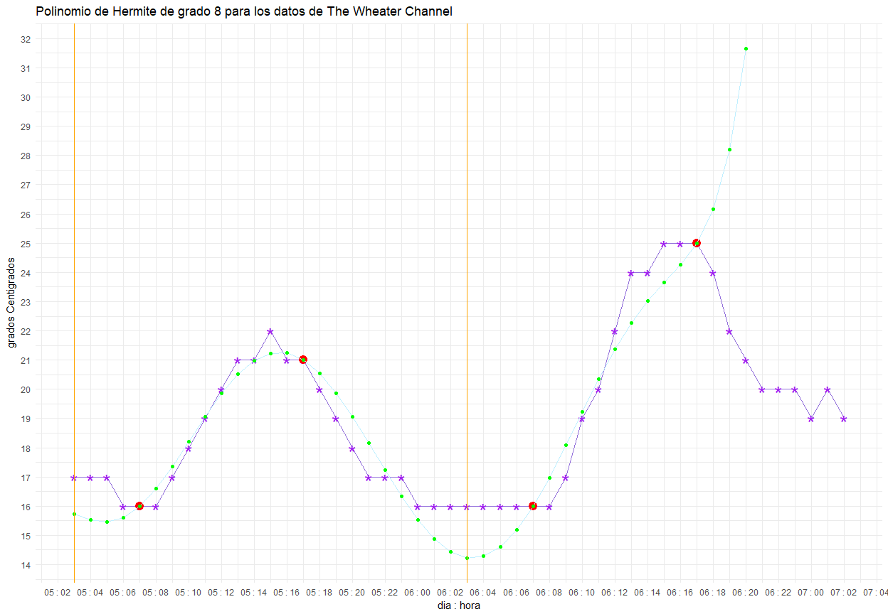

Como podemos observar en la última grafica la condición de aproximar la
primer derivada en el ultimo punto con la derivada del penúltimo afecta
gravemente la forma del polinomio con el que interpolamos en el exterior
del intervalo de interés. Las líneas amarillas indican el lunes 5 (3 am)
y el martes 6 (3am).

A manera de conclusión podría decir que este tipo de polinomios son
prácticos (sin caer en ser buenos) porque el clima tiene estacionalidad
y no suela tener bruscos cambios en su derivada que es justamente lo que
los polinomios de interpolación de Permite cuidan.

Como dato curioso concluyo que el día lunes 5 a las 11pm hubo una
temperatura de 15 grados (lo curioso es que el polinomio interpolo mejor
que el pronóstico).

Como comentario final intenté incrementar el número de puntos en la
interpolación, pero <code> solve </code> no lo resolvía por lo que
después de muchos intentos con mi actual implementación no pude
incrementar en número de puntos la interpolación solo cambiarlos
trasladándolos una hora hacia la derecha. Solo muestro la gráfica,
oculto el código.

    print(intento_final)

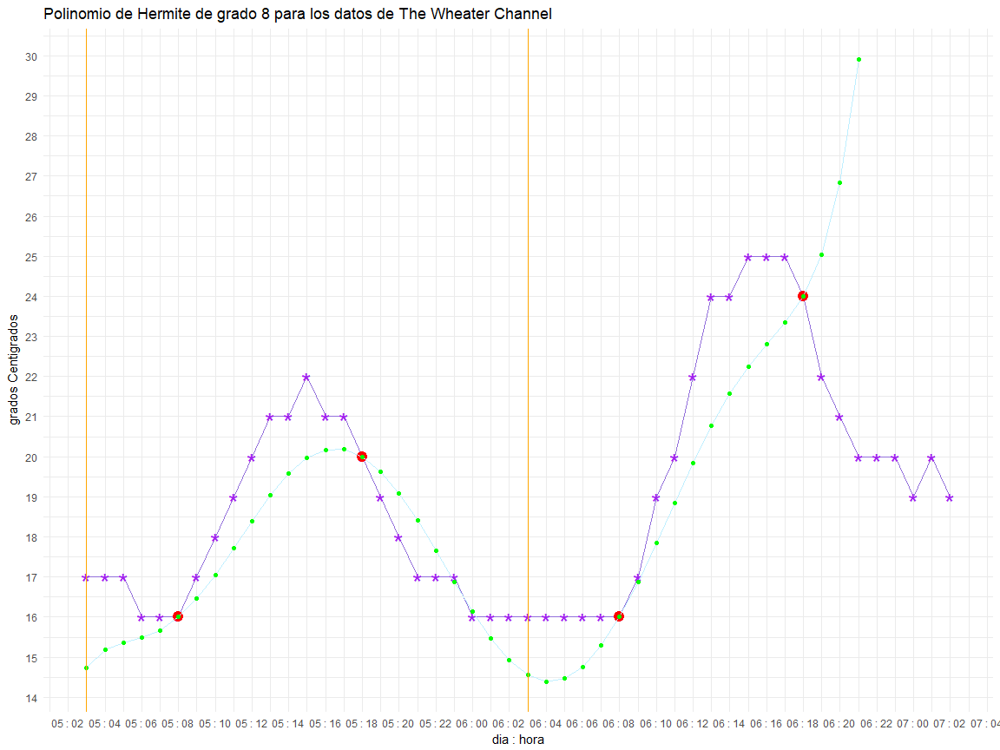

### Anexo

Datos con los que se trabajó. En la
[web](https://github.com/fou-foo/MCE/blob/master/Second/AnalisisNumericoYOptimizacion/Pron%C3%B3stico%20del%20tiempo%20por%20hora%20para%20Monterrey%2C%20M%C3%A9xico_%20The%20Weather%20Channel%20__%20Weather.pdf)
(capturado y guardado en un pdf) y capturados a
[mano](https://github.com/fou-foo/MCE/blob/master/Second/AnalisisNumericoYOptimizacion/clima.csv)
