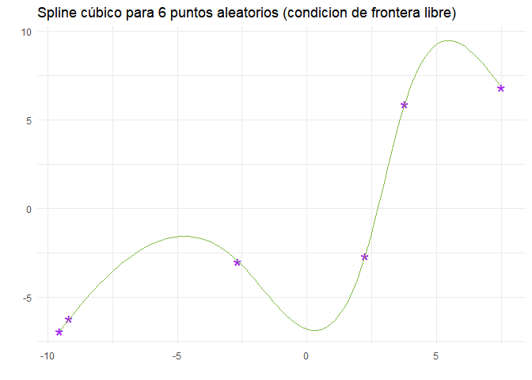
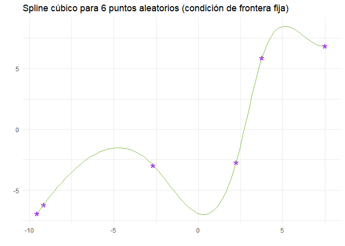
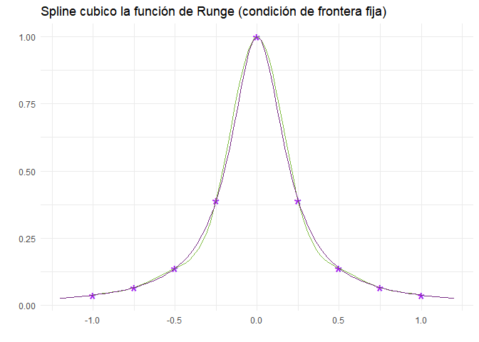
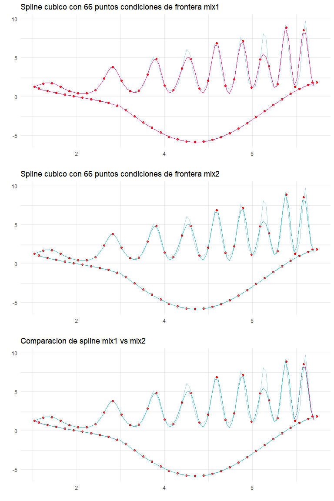

### Ejercicio 2.7. Implementación de splines cúbicos

*Implemente un código para el cálculo del spline cúbico pasando por una
lista de* *n* *puntos de la forma* (*X*, *Y*) *usando condiciones de
frontera libre en ambos lados. Use preferentemente versiones vectoriales
para las evaluaciones de las operaciones que así lo permitan.*

La siguiente es la implementación que realice para el spline cúbico, el
parámetro *c**o**n**d**i**c**i**o**n*.*f**r**o**n**t**e**r**a* indica
que condición de frontera se usa, utilice un objeto de tipo
[closure](http://adv-r.had.co.nz/Functional-programming.html) que
regresa una función que tiene como objetivo inicializar los parámetros
*a**i*, *b**i*, *c**i*, *d**i*.

Considere cuatro casos:

-   condicion.frontera = 'libre' Cuando las condiciones de frontera
    son libres.
-   condicion.frontera = 'fija' Cuando las condiciones de frontera
    están fijas.
-   condicion.frontera = 'mix1' Cuando las condiciones de frontera son
    fijas en el primer punto y libres en el último.
-   condicion.frontera = 'mix2' Cuando las condiciones de frontera son
    fijas en el último punto y libres en el primero.

<!-- -->

    Spline <- function(punto, dataX, dataY, condicion.frontera, dfx1, dfxn )
    {
      # punto (numeric): vector a evaluar
      # dataX (numeric): dominio de los puntos a interpolar
      # dataY (numeric): valor de los puntos a interpolar
      # condicion.frontera (character): string indicando el tipo de condiciones de frontera a usar 
      # dfx1 (numeric): valor conocido de la derivadad en el primer punto
      # dfxn (numeric): valor conocido de la derivadad en el último punto
      # salida :ESTE OBJETO REGRESA UNA FUNCION CON PARAMETROS FIJOS (los vectores) a,b,c,d
      x <- dataX
      y <- dataY
      n <- length(dataX) #obtenemos el numero de datos 
      h <- x[2:n] - x[1:(n-1)]   # calculamos las diferencias entre puntos
      a <- y                    #calculamos el vector a
      t <-rep(0,n)              #reservamos espacio para el lado derecho del sistema 
                                #de ecuaciones que se formara y para los vectores d y c
      b <- matrix( rep(0, n), nrow = 1)
      d <- matrix( rep(0, n), nrow = 1)
      for (i in 2:length(h))
      {
                  #calculamos las entradas del lado derecho del sistema de ecuaciones
        t[i]<-(3 / h[i])*(a[i+1]-a[i]) - (3/h[i-1])*(a[i]-a[i-1])
      }
      M <- matrix( rep(0, (n-2)*(n)), nrow = n-2) #reservamos espacio para la matriz que
                                                    #define el sistema de ecuaciones
      for (i in 1:(n-2))
      {
                          #inicializamos la matriz tridiagonalmente
        M[i, c(i, i+1 , i+2 ) ] <-  c(h[i], 2*(h[i]+h[i+1]), h[i+1])
      }
      if(condicion.frontera == 'libre')
      {
        M1 <- matrix( c(1, rep(0, n-1)), nrow = 1)#primer reglon de la matriz para la condicion libre
        Mn <- matrix( c(rep(0, n-1), 1), nrow = 1)#ultimo reglon de la matriz para la condicion libre
        M <- rbind(M1, M, Mn) #concadenamos las matricez y los vectores que dependen de la condicion
        c <- solve(M, t) #obtenemos los coeficientes c_i
      }
      if(condicion.frontera == 'fija')
      {
        M1 <- matrix( c(2*h[1], h[1], rep(0, n-2)), nrow = 1)#primer reglon de la matriz para la condicion fija
        Mn <- matrix( c(rep(0, n-2), h[n-1], 2*h[n-1]   ), nrow = 1)#ultimo reglon de la matriz para la condicion fija
        M <- rbind(M1, M, Mn)#concadenamos las matricez y los vectores que dependen de la condicion
        t[1] <- (3/h[1])*(a[2]-a[1]) - 3*dfx1 # cambiamos el primer valor para la condicion fija
        t[n] <- 3*dfxn-(3/h[n-1])*(a[n]-a[n-1] )#cambiamos el primer valor para la condicion fija 
        c <- solve(M, t)
      }
      ######
      if(condicion.frontera == 'mix1')
      {
        M1 <- matrix( c(2*h[1], h[1], rep(0, n-2)), nrow = 1)#primer reglon de la matriz para la condicion fija
        Mn <- matrix( c(rep(0, n-1), 1), nrow = 1)#ultimo reglon de la matriz para la condicion libre
        M <- rbind(M1, M, Mn)
            #cambiamos valores para la condicion fija en el primer valor y libre en el segundo 
        t[1] <- (3/h[1])*(a[2]-a[1]) - 3*dfx1
        t[n] <- 0 
        c <- solve(M, t)
      }
      if(condicion.frontera == 'mix2')
      {
        M1 <- matrix( c(1, rep(0, n-1)), nrow = 1)#primer reglon de la matriz para la condicion libre
        Mn <- matrix( c(rep(0, n-2), h[n-1], 2*h[n-1]   ), nrow = 1)#ultimo reglon de la matriz para la condicion fija
        M <- rbind(M1, M, Mn)
            #cambiamos valores para la condicion libre en el primer valor y fija en el segundo 
        t[1] <- 0
        t[n] <- 3*dfxn-(3/h[n-1])*(a[n]-a[n-1] ) 
        c <- solve(M, t)
      }
      for(i in 1:(n-1))
      {
        # calculamos los vectores d y b 
        b[i] <- (1 / h[i])*(a[i+1]-a[i])-(h[i]/3)*(c[i+1]+2*c[i])
        d[i] <- (1 / (3*h[i]))*(c[i+1]-c[i])
      }
      function(punto)       #regresamos una funcion que ya fijo los vectores a,b,c y d 
      {
        # punto (numeric): punto a evaluar
        indice <- which( (punto < x) )[1] - 1 #buscamos el numero de spline que le corresponde al punto
        res <- a[indice] + b[indice]*(punto - x[indice])+ c[indice]*(punto - x[indice])**2 + 
          d[indice]*(punto - x[indice])**3 #evaluamos el spline con los coeficientes conocidos
        return(res)
      }
    }

Pruebo el spline cúbico para 6 puntos generados uniformemente en −10, 10

    n <- 6
    dataX <- sort(runif(n , min=-10, max= 10 ))
    dataY <- sort(runif(n , min=-10, max=10 ))
    Spline.Cubico.Libre <- Spline(dataX=dataX, dataY = dataY, condicion.frontera = 'libre') #inicializo
                                  #los parametros del spline con condiciones de frontera libres 
    #vetorizamos la funcion
    Spline.Cubico.LibreV <- function(x)
    {
        mapply(FUN=Spline.Cubico.Libre, x)
    }
    n <- 100
        #construyo un dataframe para realizar una visualizacion 
    puntos <- data.frame(X= dataX, Y = dataY)
    library(ggplot2) 
    ggplot(data = puntos, aes(x=X, y=Y)) + geom_point(aes( colour=I('purple')), shape = "*", size = 7) +
      theme_minimal() + ggtitle('Spline cúbico para 6 puntos aleatorios (condicion de frontera libre)') +
      xlab('') + ylab('') +
    stat_function(fun = Spline.Cubico.LibreV,  colour = '#7FBC41', xlim=c(min(dataX), max(dataX)+.1 ))

### Ejercicio 2.8. Splines cúbicos con frontera fija

*Modifique el código del ejercicio anterior para generar un programa que
permita el uso de condiciones de frontera fija.*

La función *S**p**l**i**n**e* que implemente ya considera este caso, lo
pruebo con los mismos 6 puntos generados aleatoriamente de la figura
anterior

            #aproximamos las derivadas de los puntos
    derivadas <- diff(dataY)/diff(dataX)
    dfx1 <- derivadas[1]
    dfxn <- derivadas[5]
    Spline.Cubico.Fijo <- Spline(dataX=dataX, dataY = dataY, condicion.frontera = 'fija',
                                 dfx1=dfx1, dfxn=dfxn) #inicializo los parametros del spline con
                                                        #condiciones de frontera libres 
    #vetorizamos la funcion
    Spline.Cubico.FijoV <- function(x)
    {
        mapply(FUN=Spline.Cubico.Fijo, x)
    }
    library(ggplot2) 
    ggplot(data = puntos, aes(x=X, y=Y)) + geom_point(aes( colour=I('purple')), shape = "*", size = 7) +
      theme_minimal() + ggtitle('Spline cúbico para 6 puntos aleatorios (condición de frontera fija)') +
      xlab('') + ylab('') +
    stat_function(fun = Spline.Cubico.FijoV,  colour = '#7FBC41', xlim=c(min(dataX), max(dataX)+.1 ))

Donde efectivamente logramos ver algunas diferencias en los splines
primero y quinto (con respecto a la gráfica anterior).

### Ejercicio 2.9.Spline para la fución de Runge

*Use alguno de los códigos implementados para el cálculo de splines y
construya una aproximación a la función de Runge*
$f(x)= \\frac{1}{1+25\*x^2}$ con *x* ∈ \[ − 1, 1\].

*Realice esta aproximación usando puntos igualmente espaciados y comente
sobre la cantidad de puntos que, según su criterio, son suficientes para
lograr buenas aproximaciones.*

Como se conoce la función podemos conocer su derivada, aunque la
aproxime con diferencias finitas, decidí emplear el spline cúbico con
condiciones de frontera fijas. En la siguiente gráfica la función de
Runge se presenta en color morado y el spline en verde.

    #defino la funcion de Runge 
    Runge <- function(x) { (1/(1+25*x^2)) }
    n <- 9      #fijo el número de puntos 
    dataX <- seq(-1, 1, length = n) #puntos igualmente espaciados
    dataY <- Runge(dataX)
            #aproximamos las derivadas de los puntos
    derivadas <- diff(dataY)/diff(dataX)
    dfx1 <- derivadas[1]
    dfxn <- derivadas[n-1]
    Spline.Cubico.Fijo <- Spline(dataX=dataX, dataY = dataY, condicion.frontera = 'fija',
                                 dfx1=dfx1, dfxn=dfxn) #inicializo los parametros del spline con
                                                        #condiciones de frontera libres 
    #vetorizamos la funcion
    Spline.Cubico.FijoV <- function(x)
    {
        mapply(FUN=Spline.Cubico.Fijo, x)
    }
    puntos <- data.frame(X = dataX, Y = dataY)
    ggplot(data = puntos, aes(x=X, y=Y)) + geom_point(aes( colour=I('purple')), shape = "*", size = 7) +
      theme_minimal() + ggtitle('Spline cubico la función de Runge (condición de frontera fija)') +
      xlab('') + ylab('') +
    stat_function(fun = Spline.Cubico.FijoV,  colour = '#7FBC41', xlim=c(min(dataX), max(dataX)+.1 )) +
    stat_function(fun = Runge,  colour = '#762A83', xlim=c(-1.2, 1.2 ), show.legend = TRUE) 

Con solo 9 puntos considero que obtuve una buena aproximación visual, al
usar 10 puntos el spline se construye sin considerar al cero y eso
empeora la aproximación alrededor del cero. Al usar 9 puntos igualmente
espaciados sí contemplamos al cero.

### Ejercicio 2.10. Utilizando los Splines cúbicos

*Diseñe alguna silueta utilizando splines cúbicos. Trate de combinar
ambas versiones para las condiciones de frontera.*

Decidí utilizar la segunda silueta de mi tarea anterior.

    #funciones para dibujar la silueta
    f3 <- function(x)
    {
      y <- mapply(FUN= function(x){.5*exp(sin(x**2))*x}, x)
      return(y)
    }
    f4 <- function(x)
    {
      return(asin(2-x))
    }
    f5 <- function(x)
    {
      return(4*sin(x)-1.843606)
    }
    n <- 66 # numero de puntos a evaluar
    # en la siguiente lineas aproxime la interseccion de las funciones para generar 
    #contornos cerrados 
    x <- seq(1, 7.460007, length = 100)
    x2 <- uniroot(function(x){ f3(x)-f4(x)}, interval = c(1, 2))$root
    x3 <- tail(x[!is.na(f4(x))],1)
    dataX <- seq( x2, 7.460007 , length=n )
        #evaluo los puntos en las funciones que corresponden a cada seccion de la silueta
    inpares <- (1:(n/2))*2 -1
    dataY <- vector(mode='numeric', length=n)
    dataY[inpares] <- f3(dataX[inpares])
    index <- which(dataX <= x3)
    index1 <- index[!(index %in% inpares)]
    dataY[index1] <- f4(dataX[index1])
    index <- which(dataX > x3)
    index2 <- index[!(index %in% inpares)]
    dataY[index2] <- f5(dataX[index2])
    puntos <- data.frame(X = dataX, Y = dataY)
    ###
    derivadasf3 <- diff(dataY[inpares])/diff(dataX[inpares]) #aproximo las derivadas 
    derivadasf4 <- diff(dataY[index1])/diff(dataX[index1]) #aproximo las derivadas 
    derivadasf5 <- diff(dataY[index2])/diff(dataX[index2]) #aproximo las derivadas 
    #spline del tipo mix 1 para cada seccion
    Spline.Cubico.Mix.f3 <- Spline(dataX=c(dataX[inpares],7.460007),
                                   dataY = c(dataY[inpares],f3(7.460007)),
                                condicion.frontera = 'mix1',dfx1=derivadasf3[1], dfxn=0)
    #inicializo los parametros del spline con condiciones de frontera mezcladas 
    #vetorizamos la funcion
    Spline.Cubico.Mix.f3V <- function(x) { mapply(FUN=Spline.Cubico.Mix.f3, x) }
    Spline.Cubico.Mix.f4 <- Spline(dataX=c(1.045050,dataX[index1]),dataY=c(f4(1.045050),dataY[index1]),
                                condicion.frontera = 'mix1',dfx1=derivadasf4[1], dfxn=0) #inicializo los parametros del spline con condiciones de frontera mezcladas 
    #vetorizamos la funcion
    Spline.Cubico.Mix.f4V <- function(x) { mapply(FUN=Spline.Cubico.Mix.f4, x) }
    #Spline.Cubico.Mix.f4V(dataX[index1])
    Spline.Cubico.Mix.f5 <- Spline(dataX=c(2.920191,dataX[index2]),
                                   dataY=c(f5(2.920191), dataY[index2]),
                                condicion.frontera = 'mix1',dfx1=derivadasf5[1], dfxn=0) #inicializo los parametros del spline con condiciones de frontera mezcladas 
    #vetorizamos la funcion
    Spline.Cubico.Mix.f5V <- function(x) { mapply(FUN=Spline.Cubico.Mix.f5, x) }
    #################
    #spline del tipo mix 2 para cada seccion
    Spline.Cubico.Mix2.f3 <- Spline(dataX=c(dataX[inpares],7.460007),
                                   dataY = c(dataY[inpares],f3(7.460007)),
                                    condicion.frontera = 'mix2',dfx1=0, dfxn=derivadasf3[32]) #inicializo los parametros
    #del spline con condiciones de frontera mezcladas 
    #vetorizamos la funcion
    Spline.Cubico.Mix2.f3V <- function(x) { mapply(FUN=Spline.Cubico.Mix2.f3, x) }
    Spline.Cubico.Mix2.f4 <- Spline(dataX=c(1.045050,dataX[index1]),
                                    dataY=c(f4(1.045050),dataY[index1]),
                                    condicion.frontera = 'mix2',dfx1=0, dfxn=derivadasf4[9]) #inicializo los parametros
    #del spline con condiciones de frontera mezcladas 
    #vetorizamos la funcion
    Spline.Cubico.Mix2.f4V <- function(x) { mapply(FUN=Spline.Cubico.Mix2.f4, x) }
    Spline.Cubico.Mix2.f5 <- Spline(dataX=c(2.920191,dataX[index2]),
                                   dataY=c(f5(2.920191), dataY[index2]),
                                    condicion.frontera = 'mix2',dfx1=0, dfxn=derivadasf5[22]) #inicializo los parametros
    #del spline con condiciones de frontera mezcladas 
    #vetorizamos la funcion
    Spline.Cubico.Mix2.f5V <- function(x) { mapply(FUN=Spline.Cubico.Mix2.f5, x) }

    p1 <- ggplot(puntos, aes(x = X , y = Y)) + theme_minimal() + geom_point(aes(colour = 'puntos conocidos')) +
    stat_function(fun = f3, colour ='lightblue', xlim = c(x2,7.460007)) +
    stat_function(fun = f4, colour = 'lightblue', xlim = c(x2,x3)) +
    stat_function(fun = f5, colour = 'lightblue', xlim = c(x3,7.460007)) +
    stat_function(fun = Spline.Cubico.Mix.f3V, colour = '#E7298A', 
                  xlim = c(1.045050,7.460007)) +
    stat_function(fun = Spline.Cubico.Mix.f4V, colour ='#E7298A', xlim = c(1.045050,3)) +
    stat_function(fun = Spline.Cubico.Mix.f5V, colour = '#E7298A', xlim =
                    c(2.920191,7.460007)) +
      scale_color_manual(values='red', guide=FALSE) +
    ggtitle("Spline cubico con 66 puntos condiciones de frontera mix1") +xlab('')+ylab('')
    p2 <- ggplot(puntos, aes(x = X , y = Y)) + theme_minimal() + geom_point(aes(colour = 'puntos conocidos')) +
    stat_function(fun = f3, colour ='lightblue', xlim = c(x2,7.460007)) +
    stat_function(fun = f4, colour = 'lightblue', xlim = c(x2,x3)) +
    stat_function(fun = f5, colour = 'lightblue', xlim = c(x3,7.460007)) +
    stat_function(fun = Spline.Cubico.Mix2.f3V, colour = '#41B6C4', xlim = c(x2,7.460007))+
    stat_function(fun = Spline.Cubico.Mix2.f4V, colour ='#41B6C4', xlim = c(1.143742,3)) +
    stat_function(fun = Spline.Cubico.Mix2.f5V, colour = '#41B6C4', xlim =
                    c(2.920191,7.460007)) +
    scale_color_manual(values='red', guide=FALSE) +
    ggtitle("Spline cubico con 66 puntos condiciones de frontera mix2")+xlab('')+ylab('')
    p3 <- ggplot(puntos, aes(x = X , y = Y)) + theme_minimal() + geom_point(aes(colour = 'puntos conocidos')) +
    stat_function(fun = f3, colour ='lightblue', xlim = c(x2,7.460007) ) +
    stat_function(fun = f4, colour = 'lightblue', xlim = c(x2,x3)) +
    stat_function(fun = f5, colour = 'lightblue', xlim = c(x3,7.460007)) +
    stat_function(fun = Spline.Cubico.Mix.f3V, colour = '#E7298A', 
                  xlim = c(1.045050,7.460007)) +
    stat_function(fun = Spline.Cubico.Mix.f4V, colour ='#E7298A', xlim = c(1.045050,3)) +
    stat_function(fun = Spline.Cubico.Mix.f5V, colour = '#E7298A', xlim =
                    c(2.920191,7.460007)) +
    stat_function(fun = Spline.Cubico.Mix2.f3V, colour = '#41B6C4', xlim = c(x2,7.460007))+
    stat_function(fun = Spline.Cubico.Mix2.f4V, colour ='#41B6C4', xlim = c(1.143742,3)) +
    stat_function(fun = Spline.Cubico.Mix2.f5V, colour = '#41B6C4', xlim =
                    c(2.920191,7.460007)) +
      scale_color_manual(values='red', guide=FALSE) +
      ggtitle("Comparacion de spline mix1 vs mix2")+xlab('')+ylab('')

    ggpubr::ggarrange(p1, p2,p3,  nrow = 3)

En todas las graficas la silueta se presenta con color azul claro.

El spline cúbico con la combinación ‘mix1’ que fija la condición de
frontera en el primer punto y deja libre la condición en el último
punto, se ilustra en la gráfica superior.

Mientras que la combinación ‘mix2’ se encuentra en la parte de en medio.

Al sobreponer ambos splines (en la última gráfica) vemos que la
diferencia se aprecia más en el último spline porque el spline en azul
que corresponde al que fija la condición de frontera en el último punto
es diferente a la del spline rosa que corresponde al spline con frontera
libre en el último punto, fuera de esto los splines coinciden y
aproximan bien (visualmente) a la silueta 2, hecho que los
interpoladores anteriores no lograron. Y por el buen comportamiento de
la derivada de la silueta en el primer spline las diferencias entre
ambos splines 'mix1', y 'mix2' (aunado a el elevado número de puntos)
son demasiado pequeñas confundiendose de hecho en la última gráfica.
