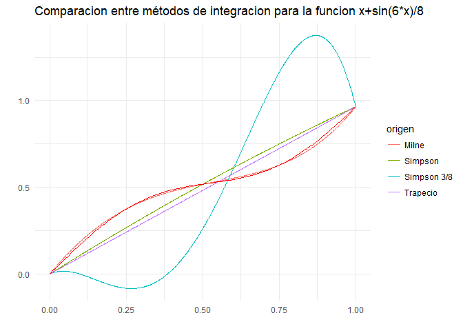
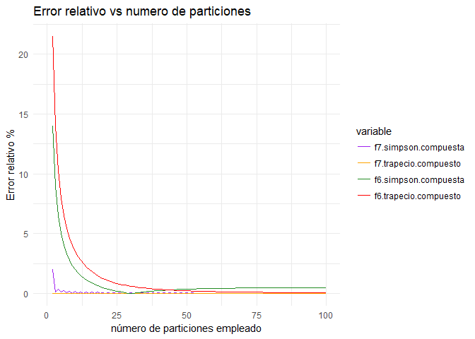
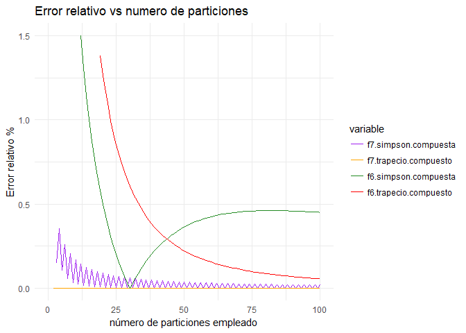
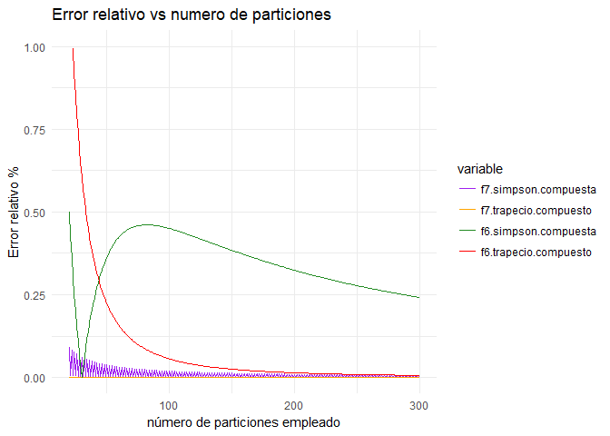
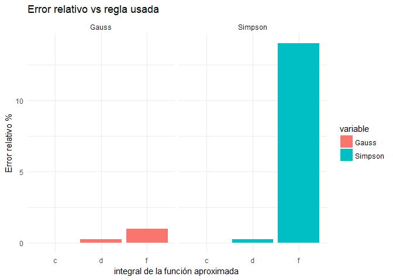
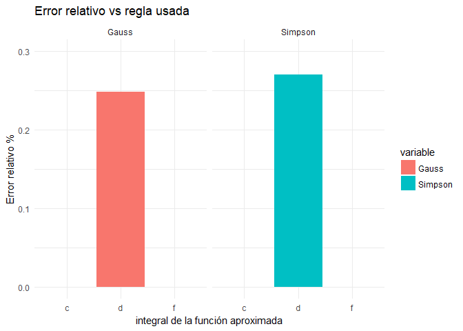

### Ejercicio 3.1. Regla de Simpson 3/8

*Realice los desarrollos para encontrar la fórmula de la Regla de
Simpson 3/8 para aproximaciones a la integral con polinomios en*
*P*3.

Partamos de la base para los polinomios cubicos, definida por Lagrange:

$l\_0^{(3)}(x) = (\\frac{x-1/3}{0-1/3})(\\frac{x-2/3}{0-2/3})(\\frac{x-1}{0-1})=-\\frac{9}{2}x^3+9x^2 -\\frac{11}{2}x+1$

$l\_1^{(3)}(x) = (\\frac{x-0}{1/3-0})(\\frac{x-2/3}{1/3-2/3})(\\frac{x-1}{1/3-1})=\\frac{27}{2}x^3 -\\frac{45}{2}x^2+ 9x$

$l\_2^{(3)}(x) = (\\frac{x-0}{2/3-0})(\\frac{x-1/3}{2/3-1/3})(\\frac{x-1}{2/3-1})=-\\frac{27}{2}x^3 + 18x^2 -\\frac{9}{2}x$

$l\_3^{(3)}(x) = (\\frac{x-0}{1-0})(\\frac{x-1/3}{1-1/3})(\\frac{x-2/3}{1-2/3})=\\frac{9}{2}x^3 -\\frac{9}{2}x^2 +x$

Entonces ahora sí podemos aproximar la integral y deducir los
coeficientes de la regla de Simpson 3/8:
$$
\\begin{split}
\\int\_0^1 f(x) & \\approx p\_3(x) = \\\\
& =f(0)\\int\_0^1(-\\frac{9}{2}x^3+9x^2 -\\frac{11}{2}x+1) +
f(1/3)\\int\_0^1(\\frac{27}{2}x^3 -\\frac{45}{2}x^2+ 9x)\\\\
& +f(2/3)\\int\_0^1(-\\frac{27}{2}x^3 + 18x^2 -\\frac{9}{2}x)+ f(1)\\int\_0^1(\\frac{9}{2}x^3 -\\frac{9}{2}x^2 +x) \\\\
& =f(0)(-\\frac{9}{2}\\frac{x^4}{4}+9\\frac{x^3}{3} -\\frac{11}{2}\\frac{x^2}{2}+ x)|\_0^1 + f(1/3)(\\frac{27}{2}\\frac{x^4}{4} -\\frac{45}{2}\\frac{x^3}{3}+ 9\\frac{x^2}{2})|\_0^1\\\\
& +f(2/3)(-\\frac{27}{2}\\frac{x^4}{4} + 18\\frac{x^3}{3} -\\frac{9}{2}\\frac{x^2}{2})|\_0^1+ f(1)(\\frac{9}{2}\\frac{x^4}{4} -\\frac{9}{2}\\frac{x^3}{3} -\\frac{x^2}{2})|\_0^1 \\\\
& =f(0)(-\\frac{9}{8}+\\frac{9}{3} -\\frac{11}{4}+1) + f(1/3)(\\frac{27}{8}-\\frac{45}{6}+\\frac{9}{2}  )\\\\
& +f(2/3)(\\frac{27}{8} + \\frac{18}{3} -\\frac{9}{4}+
f(1)(\\frac{9}{8} -\\frac{9}{6} +\\frac{1}{2}) \\\\
& =f(0)(\\frac{1}{8}) + f(1/3)(\\frac{3}{8}) +
 + f(2/3)(\\frac{3}{8} ) +f(1)(\\frac{1}{8}) \\\\
\\end{split}
$$

Cuyos coeficientes coinciden con los vistos en clase.

### Ejercicio 3.2. Regla de Milne

*Realice los desarrollos para encontrar la fórmula de la Regla de Milne
para aproximaciones a la integral con polinomios en* *P*4.

De manera análoga al ejercicio anterior partamos de la base para los
polinomios de grado cuatro, definida por Lagrange:

$l\_0^{(4)}(x) = (\\frac{x-1/4}{0-1/4})(\\frac{x-1/2}{0-1/2})(\\frac{x-3/4}{0-3/4})(\\frac{x-1}{0-1})=\\frac{32}{3}x^4-\\frac{80}{3}x^3 -\\frac{70}{3}x^2 -\\frac{25}{3}x+1$

$l\_1^{(4)}(x) = (\\frac{x-0}{1/4-0})(\\frac{x-1/2}{1/4-2/4})(\\frac{x-3/4}{1/4-3/4})(\\frac{x-1}{1/4-1})=-\\frac{128}{3}x^4+96x^3 -\\frac{208}{3}x^2 +16x$

$l\_2^{(4)}(x) = (\\frac{x-0}{1/2-0})(\\frac{x-1/4}{1/2-1/4})(\\frac{x-3/4}{1/2-3/4})(\\frac{x-1}{1/2-1})= 64x^4 - 128x^3 + 76x^2 -12x$

$l\_3^{(4)}(x) = (\\frac{x-0}{3/4-0})(\\frac{x-1/4}{3/4-1/4})(\\frac{x-1/2}{3/4-1/2})(\\frac{x-1}{3/4-1})= -\\frac{128}{3}x^4 +\\frac{224}{3}x^3 -\\frac{112}{3}x^2 +\\frac{16}{3}x$

$l\_4^{(4)}(x) = (\\frac{x-0}{1-0})(\\frac{x-1/4}{1-1/4})(\\frac{x-1/2}{1-1/2})(\\frac{x-3/4}{1-3/4})= +\\frac{32}{3}x^4 -16x^3 +\\frac{22}{3}x^2 -x$

Entonces ahora sí podemos aproximar la integral y deducir los
coeficientes de la regla de Milne:

$$
\\begin{split}
\\int\_0^1 f(x) & \\approx p\_4(x) = \\\\
& =f(0)\\int\_0^1(\\frac{32}{3}x^4-\\frac{80}{3}x^3 -\\frac{70}{3}x^2 -\\frac{25}{3}x+1) +
f(1/4)\\int\_0^1(-\\frac{128}{3}x^4+96x^3 -\\frac{208}{3}x^2 +16x)\\\\
& +f(1/2)\\int\_0^1(64x^4 - 128x^3 + 76x^2 -12x)   +f(3/4)\\int\_0^1(-\\frac{128}{3}x^4 +\\frac{224}{3}x^3 -\\frac{112}{3}x^2 +\\frac{16}{3}x) \\\\
& +f(1)\\int\_0^1(\\frac{32}{3}x^4 -16x^3 +\\frac{22}{3}x^2 -x) \\\\
%
& =f(0)(\\frac{32}{3}\\frac{1}{5}-\\frac{80}{3}\\frac{1}{4} -\\frac{70}{3}\\frac{1}{3} -\\frac{25}{3}\\frac{1}{2}+1) +
f(1/4)(-\\frac{128}{3}\\frac{1}{5}+96\\frac{1}{4} -\\frac{208}{3}\\frac{1}{3} +16\\frac{1}{2})\\\\
& +f(1/2)(64\\frac{1}{5} - 128\\frac{1}{4} + 76\\frac{1}{3} -12\\frac{1}{2})   +f(3/4)(-\\frac{128}{3}\\frac{1}{5} +\\frac{224}{3}\\frac{1}{4} -\\frac{112}{3}\\frac{1}{3} +\\frac{16}{3}\\frac{1}{2}) \\\\
& +f(1)(\\frac{32}{3}\\frac{1}{5} -16\\frac{1}{4} +\\frac{22}{3}\\frac{1}{3} -\\frac{1}{2}) \\\\
& = f(0)(\\frac{32}{15} - \\frac{80}{12} +\\frac{70}{9} - \\frac{25}{6} +1) +
f(1/4)(-\\frac{128}{15} + \\frac{96}{4} -\\frac{208}{9} - 8)\\\\
& +f(1/2)(\\frac{64}{5} - \\frac{128}{4} +\\frac{76}{3} -6) +f(3/4)(-\\frac{128}{15} +\\frac{224}{9} -\\frac{96}{6} ) +f(1)(\\frac{32}{15} - 4 +\\frac{22}{9} - \\frac{1}{2})\\\\
& = \\frac{7}{90}f(0)+\\frac{32}{90}f(1/4) + \\frac{12}{90}f(1/2)+\\frac{32}{90}f(3/4) + \\frac{7}{90}f(1)
\\end{split}
$$

Cuyos coeficientes coinciden con los vistos en clase para la regla de
Milne

### Ejercicio 3.3. Implementación de aproximaciones de orden 0 y 1

*Implemente un programa que aproxime*
∫*a**b**f*(*x*) *utitlizando las aproximaciones
polinomiales en* *P*0, *y* *P*1 *a través de las
reglas del punto medio y del trapecio.*

La implementación que realice para la regla del punto medio es la
siguiente:

    f <- function(x)
    {
        #construyo la funcion que se quiere integrar 
      return(sin(x))
    }
    integra.punto.medio.compuesta <- function(f, a, b, n)
    {
      # f (funcion): funcion que se desea integrar
      # a (numeric): limite inferior del intervalo a integrar
      # b (numeric): limite superior del intervalo a integrar
      # n (numeric): numero de puntos a evaluar 
      m <- n  
      h <- (b-a)/m
      alturas  <- f(a + (1:m)*h - h/2)
      integral <- h*sum(alturas)
      return(integral)
    }
    integra.punto.medio <- function(f, a, b)
    {
      # f (funcion): funcion que se desea integrar
      # a (numeric): limite inferior del intervalo a integrar
      # b (numeric): limite superior del intervalo a integrar
      # n (numeric): numero de puntos a evaluar 
      integral <- (b-a)*f((a+b)/2)
      return(integral)
    }

Verifico mi implementación contrastándola con la función
<code>integrate</code> de *R*

    integra.punto.medio(f, -1,10)

    ## [1] -10.75283

    integra.punto.medio.compuesta(f, -1,10,1000)

    ## [1] 1.379381

    integrate(f, -1, 10 )

    ## 1.379374 with absolute error < 1.8e-10

La implementación que realice para la regla del trapecio es la
siguiente:

    integra.trapecio.compuesta <- function(f, a, b, n)
    {
      # f (funcion): funcion que se desea integrar
      # a (numeric): limite inferior del intervalo a integrar
      # b (numeric): limite superior del intervalo a integrar
      # n (numeric): numero de puntos a evaluar 
      m <- n  
      h <- (b-a)/m
      alturas <- (.5)*(f(a)+f(b))+sum( f(a+1:(m-1)*h))
      integral <- h*alturas
      return(integral)
    }
    integra.trapecio <- function(f, a, b)
    {
      # f (funcion): funcion que se desea integrar
      # a (numeric): limite inferior del intervalo a integrar
      # b (numeric): limite superior del intervalo a integrar
      integral <- ((b-a)/2)*(f(a)+f(b))
      return(integral)
    }

Y testeo mi implementación contrastándola con la función
<code>integrate</code> de *R*

    integra.trapecio(f, -1,10)

    ## [1] -7.620207

    integra.trapecio.compuesta(f, -1,10, 1000)

    ## [1] 1.37936

    integrate(f, -1, 10 )

    ## 1.379374 with absolute error < 1.8e-10

### Ejercicio 3.4. Implementación de aproximaciones de orden 2, 3 y 4

*Similar al programa del ejercicio anterior, implemente un programa que
aproxime* ∫*a**b**f*(*x*)*d**x* *utilizando las
aproximaciones polinomiales en* *P*2, *P*3 y
*P*4 *a través de las reglas de Simpson, de Simpson 3/8 y de
Milne.*

La implementación que realice para la regla de Simpson es la siguiente:

    integra.Simpson.compuesta <- function(f, a, b, n)
    {
      # f (funcion): funcion que se desea integrar
      # a (numeric): limite inferior del intervalo a integrar
      # b (numeric): limite superior del intervalo a integrar
      # n (numeric): numero de puntos a evaluar 
      m <- n  
      h <- (b-a)/m
      pares <- a + (1:(m/2))*2*h
      impares <- a + (1:((m/2)-1)*2 + 1)*h
      alturas  <- f(a) + 4*sum(f(pares)) + 2*sum(f(impares)) + f(b)
      integral <- h*alturas/3
      return(integral)
    }
    integra.Simpson <- function(f, a, b)
    {
      # f (funcion): funcion que se desea integrar
      # a (numeric): limite inferior del intervalo a integrar
      # b (numeric): limite superior del intervalo a integrar
      integral <- ((b-a)/6)*(f(a)+4*f((a+b)/2)+f(b))
      return(integral)
    }

Y testeo mi implementación contra la función <code>integrate</code> de
*R*

    integra.Simpson(f, -1,10)

    ## [1] -9.708623

    integra.Simpson.compuesta(f, -1,10, 50000)

    ## [1] 1.379439

    integrate(f, -1, 10 )

    ## 1.379374 with absolute error < 1.8e-10

La implementación que realice para la regla del Simpson 3/8 es la
siguiente:

    integra.Simpson38.compuesta <- function(f, a, b, n)
    {
      # f (funcion): funcion que se desea integrar
      # a (numeric): limite inferior del intervalo a integrar
      # b (numeric): limite superior del intervalo a integrar
      # n (numeric): numero de puntos a evaluar 
      m <- n  
      h <- (b-a)/m
      tres <- a + 1:(m/3)*3*h
      t <- 1:(m-1)
      todos <- a + t[-(1:(m/3)*3)]*h
      alturas  <- f(a) + 3*sum(f(todos)) + 2*sum(f(tres)) + f(b)
      integral <- (3/8)*h*alturas
      return(integral)
    }
    integra.Simpson38 <- function(f, a, b)
    {
      # f (funcion): funcion que se desea integrar
      # a (numeric): limite inferior del intervalo a integrar
      # b (numeric): limite superior del intervalo a integrar
      integral <- ((b-a)/8)*(f(a)+3*f((2*a+b)/3)+3*f((a+2*b)/3)+f(b))
      return(integral)
    }

Y testeo mi implementación

    integra.Simpson38(f, -1,10)

    ## [1] 0.1879719

    integra.Simpson38.compuesta(f, -1,10, 100000)

    ## [1] 1.379389

    integrate(f, -1, 10 )

    ## 1.379374 with absolute error < 1.8e-10

La implementación que realice para la regla de Milne es la siguiente:

    integra.Milne.compuesta <- function(f, a, b, n)
    {
      # f (funcion): funcion que se desea integrar
      # a (numeric): limite inferior del intervalo a integrar
      # b (numeric): limite superior del intervalo a integrar
      # n (numeric): numero de puntos a evaluar 
      m <- n  
      h <- (b-a)/m
      tres <- a + seq(1,m-1,2)*h
      dos <- a + (2+0:(m/4-1)*4)*h
      cuatros <- a + ((1:(m/4-1))*4)*h
      alturas  <- 7*(f(a)+f(b)) + 32*sum(f(tres)) + 12*sum(f(dos)) + 14*sum(f(cuatros))
      integral <- (2/45)*h*alturas
      return(integral)
    }
    integra.Milne <- function(f, a, b)
    {
      # f (funcion): funcion que se desea integrar
      # a (numeric): limite inferior del intervalo a integrar
      # b (numeric): limite superior del intervalo a integrar
      integral <- ((b-a)/90)*(7*f(a)+32*f(a+(b-a)/4)+12*f(a+(b-a)/2)+32*f(a+3*(b-a)/4)+7*f(b))
      return(integral)
    }

Y testeo mi implementación

    integra.Milne(f, -1,10)

    ## [1] 4.448563

    integra.Milne.compuesta(f, -1,10, 100)

    ## [1] 1.379374

    integrate(f, -1, 10 )

    ## 1.379374 with absolute error < 1.8e-10

### Ejercicio 3.5. Cálculo de las integrales numéricas

*Use el programa del ejercicio anterior para calcular las siguientes
integrales, calcule las integrales exactas analíticamente y compare los
errores relativos entre el resultado obtenido computacionalmente y el
resultado exacto obtenido de la fórmula analítica* :

-   ∫15(3*x* − 4)*d**x*

El resultado analítico de esta integral es 20, para todos los casos fijo
a 1000 el número de particiones del intervalo \[1,5\]. A continuación,
evaluó la función con los métodos de Simpson, Simpson 3/8 y el de Milne.

    f1 <- function(x)
    {
      return(3*x-4)
    }
    abs(20-integra.Simpson(f1, 1, 5 ))/20

    ## [1] 0

    abs(20-integra.Simpson38(f1, 1, 5))/20

    ## [1] 0

    (20-integra.Milne(f1, 1, 5))/20

    ## [1] 0

En los tres casos tenemos que la aproximación es exacta lo que era de
esperarse porque la funcion es de grado menor al orden de los métodos

-   ∫−21(*x*2 − 2*x* + 3)*d**x*

El resultado analítico de esta integral es 15, para todos los casos fijo
a 1000 el número de particiones del intervalo \[-2,1\]. A continuación,
evaluó la función con los métodos de Simpson, Simpson 3/8 y el de Milne.

    f2 <- function(x)
    {
      return(x**2-2*x+3)
    }
    abs(15-integra.Simpson(f2, -2, 1 ))/15

    ## [1] 0

    abs(15-integra.Simpson38(f2, -2, 1))/15

    ## [1] 0

    (15-integra.Milne(f2, -2, 1))/15

    ## [1] 0

Como la función a integrar es una parábola es de esperar que los métodos
de integración mejoren en este caso, pues la funcion es de grado menor
al orden de los métodos

-   ∫79(*x*3 − 5*x*2 + 2*x*)

El resultado analítico de esta integral es $\\frac{1286}{3}$, para todos
los casos fijo a 1000 el número de particiones del intervalo \[7,9\]. A
continuación, evaluó la función con los métodos de Simpson, Simpson 3/8
y el de Milne.

    f3 <- function(x)
    {
      return(x^3-5*x^2+2*x)
    }
    abs((1286/3)-integra.Simpson(f3, 7, 9 ))/(1286/3)

    ## [1] 1.326052e-16

    abs((1283/3)-integra.Simpson38(f3, 7, 9 ))/(1286/3)

    ## [1] 0.002332815

    abs((1286/3)-integra.Milne(f3, 7, 9 ))/(1286/3)

    ## [1] 0

En este caso se tienen errores relativos menores a 1% . Esto era de
esperarse porque la función que queremos integrar es de grado menor a el
orden de los métodos.

-   ∫02(2*x*4 − *x*2 + 7)*d**x*

El resultado analítico de esta integral es $\\frac{362}{15}$, para todos
los casos fijo a 100000 el número de particiones del intervalo \[0,2\].
A continuación, evaluó la función con los métodos de Simpson, Simpson
3/8 y el de Milne.

    f4 <- function(x)
    {
      return(2*x**4-x**2+7+3)
    }
    abs((362/15)-integra.Simpson(f4, 0, 2 ))/(362/15)

    ## [1] 0.2707182

    abs((362/15)-integra.Simpson38(f4, 0, 2))/(362/15)

    ## [1] 0.2584408

    abs((362/15)-integra.Milne(f4, 0, 2))/(362/15)

    ## [1] 0.2486188

En este caso se tienen errores relativos mayores a 24%, porque la
función es del mismo grado que el orden de los métodos.

-   ∫03(*s**i**n*(*π**x*))*d**x*

El resultado analítico de esta integral es $\\frac{2}{\\pi}$, para todos
los casos fijo a 1000 el número de particiones del intervalo \[0,3\]. A
continuación, evaluó la función con los métodos de Simpson, Simpson 3/8
y el de Milne.

    f5 <- function(x)
    {
      return(sin(pi*x))
    }
    abs((2/pi)-integra.Simpson(f5, 0, 3 ))/(2/pi)

    ## [1] 4.141593

    abs((2/pi)-integra.Simpson38(f5, 0, 3))/(2/pi)

    ## [1] 1

    abs((2/pi)-integra.Milne(f5, 0, 3))/(2/pi)

    ## [1] 0.741219

En este caso se tienen errores relativos entre 74% y 400%. Justamente
porque la función que queremos integrar no es lineal.

-   ∫0156(*x* + 1)*e*−3(*x* + 1)2*d**x*

El resultado analítico de esta integral es 0.0497871, para todos los
casos fijo a 1000 el número de particiones del intervalo \[0,15\]. A
continuación, evaluó la función con los métodos de Simpson, Simpson 3/8
y el de Milne.

    f6 <- function(x)
    {
      return(6*(x+1)*exp(-3*(x+1)^2))
    }
    abs((0.0497871)-integra.Simpson(f6, 0, 15 ))/(0.0497871)

    ## [1] 13.99999

    abs((0.0497871)-integra.Simpson38(f6, 0, 15))/(0.0497871)

    ## [1] 10.24999

    abs((0.0497871)-integra.Milne(f6, 0, 15))/(0.0497871)

    ## [1] 5.999996

En este caso se tienen errores relativos mayores a 500%. Justamente
porque la función que queremos integrar no es lineal.

-   ∫01*x* + *s**i**n*(6*x*)/8*d**x*

El resultado analítico de esta integral es aproximadamente 0.50083, para
todos los casos fijo a 1000 el número de particiones del intervalo
\[0,1\]. A continuación, evaluó la función con los métodos de Simpson,
Simpson 3/8 y el de Milne.

    f7 <- function(x)
    {
      return(x+sin(6*x)/8  )
    }
    abs((0.50083)-integra.Simpson(f7, 0, 1 ))/(0.50083)

    ## [1] 0.01020076

    abs((0.50083)-integra.Simpson38(f7, 0, 1))/(0.50083)

    ## [1] 0.003898195

    abs((0.50083)-integra.Milne(f7, 0, 1))/(0.50083)

    ## [1] 0.0006134056

    abs((0.50083)-integra.trapecio(f7, 0, 1))/(0.50083)

    ## [1] 0.0365263

En este caso se tienen errores relativos menores a 3% en los cuatro
casos.En la siguiente gráfica muestro las aproximaciones con los
polinomios de grado 1 al 4 que realizan los métodos del trapecio, de
Simpson, de Simpson 3/8 y el de Milne, la función en rojo es la
auténtica y es $ x+sin(6\*x)/8$

    a <- 0
    b <- 1
    n <- 1000
    m <- 4
    h <- (b-a)/m
    x <- seq(a,b, length=n)
    trapecio <- data.frame( y=f7(a)*(1-x) + f7(b)*x)
    trapecio$origen <- 'Trapecio'
    simpson <-data.frame(y = f7(a)*((2)*x**2-(3)*x+1)+f7(1/2)*(-(4)*x**2+4*x)+
      f7(1)*((2)*x**2-x))
    simpson$origen <- 'Simpson'
    simpson38 <-  data.frame(y=f7(0)*(64*x^4 - 128*x^3 + 76*x^2 -12*x) +
      f7(1/3)*(-(128/3)*x**4 +(224/3)*x**3 -(112/3)*x**2 +(16/3)*x)+
      f7(2/3)*(-(27/2)*(x**3)  + 18*(x**2) -(9/2)*x)+
      f7(1)*((9/2)*(x**3) -(9/2)*((x**2)) +x))
    simpson38$origen <- 'Simpson 3/8'
    milne <- data.frame(y = f7(0)*((32/3)*x**4-(80/3)*x**3 -(70/3)*(x**2) -(25/3)*x +1) +
      f7(1/4)*(-(128/3)*x**4+96*x**3 -(208/3)*x**2 + 16*x) +
     +f7(1/2)*(64*x**4- 128*x**3 + 76*x**2 -12*x)+
    f7(3/4)*(-(128/3)*x**4+ (224/3)*x**3 -(112/3)*x**2+ (16/3)*x )+
    +f7(1)*((32/3)*x**4 -16*x**3 +(22/3)*x**2 -x))
    milne$origen <- 'Milne'
    data <- rbind(trapecio, simpson, simpson38, milne)
    data$x <- x
    library(ggplot2)
    ggplot(data, aes(x=x, y=y, color=origen))+geom_line() +stat_function(fun = f7, colour ='red')+
      ggtitle("Comparacion entre métodos de integracion para la funcion x+sin(6*x)/8")+xlab('')+
      ylab('') +theme_minimal()

### Ejercicio 3.6. Reglas compuestas

*Implemente las reglas compuestas del trapecio y de Simpson y evalúe las
integrales correspondientes a los ejercicios (f) y (g) anteriores,
utilizando* 2, 3, 4… *subintervalos. Analice los resultados.*

Como estaba confundido, implemente todas las reglas que vimos en clase
en su forma compuesta, en lo siguiente solo hago uso de lo que
implemente en los dos incisos anteriores, y para analizar los resultados
prestare atención a los errores relativos de ambos métodos (pues conozco
el resultado análitico en ambos casos).

    particiones <- data.frame(n = 2:300)
    particiones$f7.simpson.compuesta <- mapply(FUN = function(x){
                      abs((0.50083)-integra.Simpson.compuesta(f7, 0, 1,  x))/(0.50083) 
                                      },particiones$n) 
    particiones$f7.trapecio.compuesto<- mapply(FUN=function(x){
                     abs((0.50083)-integra.trapecio.compuesta(f7, 0, 1, x))/(0.50083)},
                     particiones$n)
    particiones$f6.simpson.compuesta <- mapply(FUN = function(x){
                      abs((0.0497871)-integra.Simpson.compuesta(f6, 0, 15,  x))/(0.0497871) 
                                      },particiones$n) 
    particiones$f6.trapecio.compuesto<- mapply(FUN=function(x){
                     abs((0.0497871)-integra.trapecio.compuesta(f6, 0, 15, x))/(0.0497871)},
                     particiones$n)

A continuación, realizo un grafico que muestra el error de cada regla
compuesta vs el número de particiones usada en la cual podemos notar que
la función del inciso (g) es más sencilla de aproximar pues desde *n*
pequeñas el error relativo de aproximación es mucho menor en comparación
a la del inciso (f), la siguiente grafica hace un zoom para mostrar el
detalle para errores relativos menores al 1.5%.

    library(reshape)
    vis <- melt(particiones, id = 'n')
    ggplot(vis, aes(x=n, y = value, color = variable)) + geom_line() +
      theme_minimal() + ylab('Error relativo %') + xlab('número de particiones empleado') +
      ggtitle('Error relativo vs numero de particiones') + xlim(c(0, 100))+
      scale_color_manual(values=c('purple','orange',
                                        'forestgreen', 'red')) 

    ggplot(vis, aes(x=n, y = value, color = variable)) + geom_line() +
      theme_minimal() + ylab('Error relativo %') + xlab('número de particiones empleado') +
      ggtitle('Error relativo vs numero de particiones') + ylim(c(0,1.5)) +xlim(c(0, 100))+
     scale_color_manual(values=c('purple','orange',
                                        'forestgreen', 'red')) 

De esta ultima grafica es interesante notar que como es de esperarse
mientras más números se utilicen para evaluar la integral el error de
aproximación disminuye. Además, la regla del trapecio compuesta aproxima
exactamente a la función del inciso (g) desde cualquier *n* mientras que
para la función del inciso (f) también esta regla se comporta como
esperamos, pero tarda en disminuir su error. En contrapunto la regla de
Simpson compuesta se disminuye su error en ambos casis cosa extraña que,
a partir de cierto número de particiones, aproximadamente 31, su error
tiende a subir ¡, para su comportamiento a largo plazo es decir cuando
*n* &gt; 100 repetimos la grafica con un soporte diferente.

    ggplot(vis, aes(x=n, y = value, color = variable)) + geom_line() +
      theme_minimal() + ylab('Error relativo %') + xlab('número de particiones empleado') +
      ggtitle('Error relativo vs numero de particiones') + ylim(c(0,1)) +xlim(c(20, 300))+
     scale_color_manual(values=c('purple','orange',
                                        'forestgreen', 'red')) 

Y sí el error para la regla de Simpson en el caso de la función (f)
tiende a disminuir. En conclusión podemos decir que no hay método
definitivo para integrar, siempre vale la pena probar con otros.

### Ejercicio 3.7. Cuadratura de Gauss

*Implemente la integración numérica por medio de cuadraturas de Gauss y
compare los resultados de integrar con tres nodos usando puntos
igualmente espaciados (Regla de Simpson) y puntos espaciados según los
cálculos de Gauss.*

*Considere las integrales de los incisos (c), (d) y (f) y compare los
errores relativos en el cálculo de cada una de estas integrales.*

La implementación que realice de la cuadratura de Gauss con tres nodos
es la siguiente:

    integra.Gauss.3 <- function(f, a, b)
    {
      #f (function): funcion a integrar
      # a (numeric): limite inferior del intervalo a evaluar
      # b (numeric): limite superior del intervalo a evaluar
      w <- c(5/9, 8/9, 5/9) #pesos magicos calculados por gausz
      x <- c(-sqrt(3/5), 0, sqrt(3/5)) #nodos magicos calculados por Gausz
      eval <- (b-a)*x/2 + (a+b)/2
      eval.f <- f(eval)
      integral <- ((b-a)/2)*sum(w*eval.f)
      return(integral)
    }

Y de manera análoga al inciso anterior realizo un grafico para
visualizar el error de integración contra la regla de Simpson en las
funciones ( c), (d) y (f).

    contraste <- data.frame(funcion = c('c', 'd', 'f' ))
    contraste$Gauss <- abs(1286/3 - integra.Gauss.3(f3, 7, 9  ))/(1286/3)
    contraste$Gauss[2] <- abs(362/15 - integra.Gauss.3(f4, 0, 2  ))/(362/15) 
    contraste$Gauss[3] <- abs(0.0497871 - integra.Gauss.3(f6, 0, 15  ))/(0.0497871) 
    contraste$Simpson <- abs(1286/3 - integra.Simpson(f3, 7, 9  ))/(1286/3)
    contraste$Simpson[2] <- abs(362/15 - integra.Simpson(f4, 0, 2  ))/(362/15) 
    contraste$Simpson[3] <- abs(0.0497871 - integra.Simpson(f6, 0, 15  ))/(0.0497871) 
    vis <- melt(contraste, id = 'funcion')
    ggplot(vis, aes(x=factor(funcion), fill = variable)) + geom_bar(aes(weight = as.numeric(value))) +
      facet_grid(~variable)+ theme_minimal() + ylab('Error relativo %') + 
      xlab('integral de la función aproximada')+ 
      ggtitle('Error relativo vs regla usada') 

 Y como
era de esperarse en el caso de la función ( c) que corresponde a un
polinomio cubico ambas reglas poseen orden 4, por lo que la aproximación
por ambas reglas es exacta, en contraste con la función (d) que es un
polinomio de orden 4 sale de las capacidades de aproximación exacta para
la regla de Simpson y más aun la función (f) que es composición de una
función trascendente el error relativo de la regla de Simpson es mayor
al 10%.

    ggplot(vis, aes(x=factor(funcion), fill = variable)) + geom_bar(aes(weight = as.numeric(value))) +
      facet_grid(~variable)+ theme_minimal() + ylab('Error relativo %') + 
      xlab('integral de la función aproximada')+ ylim(0,.3) +
      ggtitle('Error relativo vs regla usada') 

En la grafica final realizamos un zoom para mostrar solo errores
relativos pequeños. Donde se reitera que la aproximación de Gauss con
tres nodos es mejor a la regla de Simpson.
