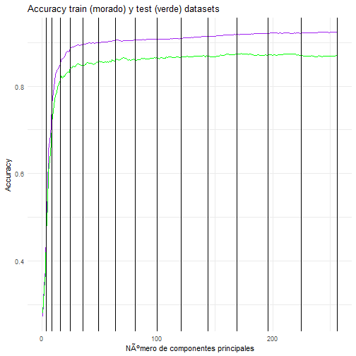

Con el siguiente código implemente un constructor, para no evaluar para cada valor de $p$ el PCA sino hacerlo una sola vez fijándolo como parámetro y guardo en un data.frame los resultados de precisión (para comparar el error de clasificación) para ambos conjuntos de datos.


```r
test <- read.table('oef.test')
train <- read.table('oef.train')
library(caret)
library(ripa)
Constructor.evaluar.p <- function(p, train, test)
{
  #construyo un 'closure' para no recalcular la matriz de componentes principales
  #p  (int): numero de componentes a utilizar
  #train (dataframe): conjunto de entrenamiento 
  #test (dataframe): conjunto de test
  #ESTA FUNCION REGRESA UNA FUNCION, pero calcula la matriz de componentes principales
  y_train <- train[,1]
  train$V1 <- NULL
  y_train <- factor(y_train)
  Y_train <- model.matrix(~y_train-1)
  pca <- princomp(train) #como los datos ya estan escalados en [-1, 1] uso la matriz de varianzas y covarianzas
  y_test <- test[,1]
  test$V1 <- NULL
  function(p)
  {
    z <- pca$loadings[,1:p]
    Z <- as.matrix(train) %*%z
    b <- lm(Y_train ~ . -1, data=as.data.frame(Z))
    B <- b$coefficients
    Y.train.hat <- Z%*%B
    res <- apply(Y.train.hat, 1, which.max)
    res <- res - 1
    Matrix.C.train <- caret::confusionMatrix( res, y_train)
    Y.test.hat <- (as.matrix(test)%*%z)%*%B
    res2 <- apply(Y.test.hat, 1, which.max)
    res2 <- res2 - 1
    Matrix.C.test <- caret::confusionMatrix( res2, y_test)
    acc.train <- Matrix.C.train$overall['Accuracy']
    acc.test <-  Matrix.C.test$overall['Accuracy']
    return( c(acc.train,acc.test,p) )
  }
}
Constructor.evaluar <- Constructor.evaluar.p(train=train, test=test) #se calcula el PCA
todos <- lapply(1:256, FUN = Constructor.evaluar )  #si usara linux esto podria correrlo en multicore
resumen <- as.data.frame(todos)  
resumen2 <- as.data.frame(t(resumen))
colnames(resumen2) <- c('Accuracy.train', 'Accuracy.test', 'p')
row.names(resumen2) <- NULL
resumen2$erro.train <- 1 - resumen2$Accuracy.train
resumen2$erro.test <- 1 - resumen2$Accuracy.test
resumen2$diferencia <- resumen2$Accuracy.train -resumen2$Accuracy.test
saveRDS(resumen2,'resumen.rds')
```

Y con el siguiente código genere una grafica que me permite visualizar los errores.


```r
library(ggplot2)
resumen2 <- readRDS('resumen.rds')
p1 <- ggplot(resumen2, aes(x = p, y =Accuracy.train, color= p )) +geom_line(aes(colour=I('Purple') )) +
  geom_line(aes(x = p, y =Accuracy.test, colour =I('green'))) +
  theme_minimal() + ggtitle('Accuracy train (morado) y test (verde) datasets')+
  ylab('Accuracy') + xlab('Número de componentes principales')+
  geom_vline(xintercept=2**2) + 
  geom_vline(xintercept=3**2) +
  geom_vline(xintercept=4**2) +
  geom_vline(xintercept=5**2) +
  geom_vline(xintercept=6**2) +
  geom_vline(xintercept=7**2) +
  geom_vline(xintercept=8**2) +
  geom_vline(xintercept=9**2) +
  geom_vline(xintercept=10**2) +
  geom_vline(xintercept=11**2) +
  geom_vline(xintercept=12**2) +
  geom_vline(xintercept=13**2) +
  geom_vline(xintercept=14**2) +
  geom_vline(xintercept=15**2) +
  geom_vline(xintercept=16**2) 
print(p1)
```




Realizando un zoom en la parte inicial de la figura anterior se nota que un valor de 50 componentes principales parece correcto para predecir, desde el 25 se ve bien pero aun 50 componentes es una gran ganancia sobre las 256 variables originales.


```r
resumen2 <- readRDS('resumen.rds')
ggplot(resumen2, aes(x = p, y =Accuracy.train, color= p )) +geom_line(aes(colour=I('Purple') )) +
  geom_line(aes(x = p, y =Accuracy.test, colour =I('green'))) +
  theme_minimal() + ggtitle('Accuracy train (morado) y test (verde) datasets')+
  ylab('Accuracy') + xlab('Número de componentes principales')+
  geom_vline(xintercept=2**2) + 
  geom_vline(xintercept=3**2) +
  geom_vline(xintercept=4**2) +
  geom_vline(xintercept=5**2) +
  geom_vline(xintercept=6**2) +
  geom_vline(xintercept=7**2) +
  geom_vline(xintercept=8**2) +
  geom_vline(xintercept=9**2) +
  geom_vline(xintercept=10**2) +
  geom_vline(xintercept=11**2) +
  geom_vline(xintercept=12**2) +
  geom_vline(xintercept=13**2) +
  geom_vline(xintercept=14**2) +
  geom_vline(xintercept=15**2) +
  geom_vline(xintercept=16**2) 
```


Así que solo utilizó las primeras 50 componentes principales y las guarda junto con los coeficientes de la regresión para poder evaluar, en la aplicación de shiny.


```r
p <- 50
y_train <- train[,1]
y_train <- factor(y_train)
Y_train <- model.matrix(~y_train-1)
train$V1 <- NULL
pca <- princomp(train) #como los datos ya estan escalados en [-1, 1] uso la matriz de varianzas y covarianzas
z <- pca$loadings[,1:p]
Z <- as.matrix(train) %*%z
b <- lm(Y_train ~ . -1, data=as.data.frame(Z))
B <- b$coefficients
entrada <- runif(256, -1, 1)
Y.test.hat <-  entrada%*%z%*%B
which.max(Y.test.hat)
```

```
## [1] 9
```

```r
saveRDS(z,'componentes.rds')
saveRDS(B,'coeficientes.rds')
```
