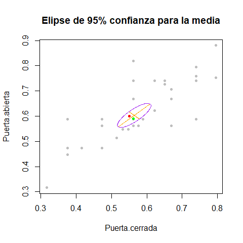
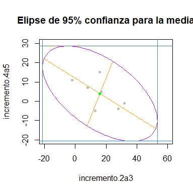
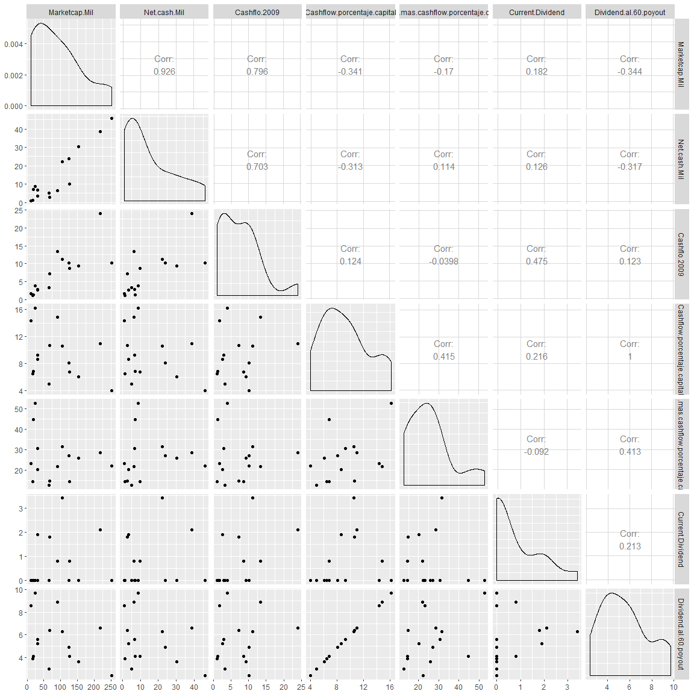

Ejercicio 1
-----------

El departamento de control de calidad de un fabricante de hornos de
microondas es requerido por el gobierno federal para monitorear la
cantidad de radiación emitida por los hornos que fabrican. Se realizaron
mediciones de la radiación emitida por 42 hornos seleccionados al azar
con las puertas cerradas y abiertas. Los datos están en el archivo
*datosradiacion*

### a) Construye un elipse de confianza del 95% para *μ*, considerando la transformación de las variables:

$$
x\_1 = \\sqrt\[4\]{radiacion\\\_con\\\_puerta\\\_cerrada}
$$

$$
x\_2 = \\sqrt\[4\]{radiacion\\\_con\\\_puerta\\\_abierta}
$$

Primero exporte los datos a formato .csv para que el código sea más
portable y no dependa de la configuración de Java de la máquina, que
involucra leer con archivos .xlsx con el package xlsx.

Luego leemos los datos y realizamos la transformación sugerida sobre las
variables posteriormente realizamos los test de Shapiro-Wilks para
descartar la no normalidad univariada de cada variable (aunque se cuenta
con 42 observaciones y podríamos emplear los resultados asintóticos para
las hipótesis de media y el TLC para el caso multivariado).

    setwd('C:\\Users\\fou-f\\Desktop\\MCE\\Second\\EstadisticaMultivariada\\Tarea4')
    radiacion <- read.csv('datos_radiacion.csv')
    colnames(radiacion) <- c('Puerta.cerrada', 'Puerta.abierta') #cambio de nombres de columnas
                                                            #para agilizar el tipeo de codigo 
    radiacion.sqrt <-apply(radiacion, 2, function(x){ x**(1/4) }) #realizo la transformación
    radiacion.sqrt <- as.data.frame(radiacion.sqrt)
    shapiro.test(radiacion.sqrt$Puerta.cerrada)

    ## 
    ##  Shapiro-Wilk normality test
    ## 
    ## data:  radiacion.sqrt$Puerta.cerrada
    ## W = 0.96481, p-value = 0.2188

    shapiro.test(radiacion.sqrt$Puerta.abierta)

    ## 
    ##  Shapiro-Wilk normality test
    ## 
    ## data:  radiacion.sqrt$Puerta.abierta
    ## W = 0.94282, p-value = 0.03589

Por los resultados de la prueba podemos ver que la variable transformada
que mide el nivel de radiación con la puerta cerrada pasa la prueba de
normalidad, sin embargo la otra variable tiene un p-value menor a 0.05,
sin embargo al realizar un test de Kolmogorov sobre la variable
transformada que mide el nivel de radiación con la puerta abierta sí se
tiene evidencia para no descartar su normalidad.

    ks.test(radiacion.sqrt$Puerta.abierta, "pnorm", mean(radiacion.sqrt$Puerta.abierta),
            sd(radiacion.sqrt$Puerta.abierta ))

    ## 
    ##  One-sample Kolmogorov-Smirnov test
    ## 
    ## data:  radiacion.sqrt$Puerta.abierta
    ## D = 0.19043, p-value = 0.09508
    ## alternative hypothesis: two-sided

Posteriormente calculamos el vector de medias y la matriz de
covarianzas, esta última para invertirla y dar una expresión del
elipsoide de confianza.

    alpha <- 1-.95
    p <- dim(radiacion.sqrt)[2]
    n <- dim(radiacion.sqrt)[1]
          #se calcula la media y la matriz de covarianza 
    media <- apply(radiacion.sqrt, 2, mean)
    (media <- matrix(media, ncol = 1))

    ##           [,1]
    ## [1,] 0.5642575
    ## [2,] 0.6029812

    S <- cov(radiacion.sqrt)
    (solve(S))

    ##                Puerta.cerrada Puerta.abierta
    ## Puerta.cerrada       203.4981      -163.9069
    ## Puerta.abierta      -163.9069       200.7691

Sabemos que el elipsoide de confianza esta dado por:
$$
n(\\bar{x}-\\mu)^tS^{-1}(\\bar{x}-\\mu)\\le \\frac{p(n-1)}{n-p}F\_{p,n-p}(\\alpha)
$$
 Y en nuestro caso queda (redondeando las operaciones a tres decimales):
$$
\\begin{split}
42(0.564-\\mu\_1,0.6029-\\mu\_2) \\begin{pmatrix}203.018 &-163.906\\\\ -163.906 & 200.77 \\end{pmatrix}\\begin{pmatrix}0.564-\\mu\_1\\\\0.6029-\\mu\_2\\end{pmatrix}\\le \\frac{2\*41}{40}\*3.232 \\\\
\\Leftrightarrow42(0.564-\\mu\_1,0.6029-\\mu\_2) \\begin{pmatrix}15.667  -203.018x\_1+163.906x\_2\\\\22.229+163.9 6x\_1-200.77x\_2 \\end{pmatrix}\\le  6.625\\\\
\\Leftrightarrow 42(22.24-31.334x\_1-50.85x\_2-327.812x\_1x\_2+200.77x\_2^2+203.018x\_1^2)\\le .158
\\end{split}
$$
 Entonces la elipse de confianza al 95% está dada por la forma
cuadrática:

\begin{equation}
203.018x_1^2-31.334x_1-327.812x_1x_2-50.85x_2+200.77x_2^2 +22.083=0 
\end{equation}
b) Prueba si *μ* = (.562, .589) está en la region de confianza.
---------------------------------------------------------------

Calculamos el estadistico basado en la muestra

    mu <- matrix(c(.562,.589), byrow = TRUE, ncol = 1)
    (nivel <- qf(1-alpha, df1=p, df2=n-p)*(p*(n-1)/(n-p)))

    ## [1] 6.62504

    (T.hotelling <- n*t(media-mu)%*%solve(S)%*%(media-mu))

    ##        [,1]
    ## [1,] 1.2573

Como el estadistico calculado *T*2= 1.2573005 es menor al
cuantil teórico 6.6250403, aceptamos la hipótesis nula de la prueba, por
lo que es factible que la media poblacional sea 0.562, 0.589.

### c) Calcula los valores y vectores propios de S y obten la gráfica del elipsoide de confianza.

Defino una función que construye la elipse y dibuja los datos y la
utilizo, posteriormente dibujo el punto propuesto en el inciso anterior
con color verde y la media propuesta en el inciso siguiente en color
rojo.

Para lo anterior, en lugar de despejar de (1) una variable en función de
la otra, lo cual es posible rotando la cónica con una matriz pertinente
que resulta ser la de los vectores propios de la matriz de covarianzas,
el procedimiento con el que grafico es generar los ejes y la elipse
considerando su forma canónica (con centro en el origen y sin rotación)
posteriormente roto usando la matriz de vectores propios (la
ortogonalidad de los ejes se preserva bajo rotaciones, además es un
resultado que los vectores propios que definen los ejes de la elipse,
son ortogonales) y por último translado los puntos con el vector de
media muestral.

    dibuja.elipse <- function(alpha, n, p, media, S, xlim, ylim)
    {
      #alpha (numeric): nivel de signiificancia
      #n (numeric): numero de observaciones
      #p (numeric): numero de variables 
      #media (vector): vector-columna de medias 
      #S (matrix): matriz de covarianzas
      ejes <- eigen(S)
      eje_x <- ejes$vectors[,1]
      eje_y <- ejes$vectors[,2]
      nivel <- qf(1-alpha, df1 = p, df2 = n-p ) #cuantil de la distribucion f con confianza 1-alpha
      c <- ((p*(n-1))/(n*(n-p)) )*nivel #cuantil de la T de Hotelling
      longitud_x <- ejes$values[1]**.5*( c)**.5 #formulas vistas en clase
      longitud_y <- ejes$values[2]**.5*( c)**.5 #formulas vistas en clase
          #se dibujan los ejes
      g <- 100 #numero de puntos a dibujar, primero los genero centrados en el origen y 
                #luego roto y translado
      x <- seq(-longitud_x, longitud_x, length=g)
      y <- seq(-longitud_y, longitud_y, length=g)
      ejes.puntos <- matrix(c(x, rep(0,g )), byrow = TRUE, nrow = 2) 
      ejes.puntos <- (ejes$vectors)%*%ejes.puntos + matrix(rep(media, g), nrow = 2)
      plot(ejes.puntos[1,], ejes.puntos[2,], type='l', col='orange', 
           main='Elipse de 95% confianza para la media', 
           xlab=colnames(S)[1], ylab = colnames(S)[2], xlim=xlim, ylim=ylim)
      ejes.puntos <- matrix(c(rep(0,g ), y), byrow = TRUE, nrow = 2) 
      ejes.puntos <- (ejes$vectors)%*%ejes.puntos + matrix(rep(media, g), nrow = 2)
      points(ejes.puntos[1,], ejes.puntos[2,], type='l', col='orange')
          #se genera el perimetro, primero centrado y luego se rota y translada
      y <- ((c-x**2/ejes$values[1])*ejes$values[2])**.5 #funcion inversa de elipse con 
                                                          #centro en elorigen 
      elipse.puntos <- matrix(c(x,y), ncol = g, byrow = TRUE)
      elipse.puntos <- ejes$vectors%*%(elipse.puntos) + matrix(rep(media, g), nrow = 2)
      points(elipse.puntos[1,], elipse.puntos[2,], col='purple', type='l')
      y <- -((c-x**2/ejes$values[1])*ejes$values[2])**.5 
      elipse.puntos <- matrix(c(x,y), ncol = g, byrow = TRUE)
      elipse.puntos <- ejes$vectors%*%(elipse.puntos) + matrix(rep(media, g), nrow = 2)
      points(elipse.puntos[1,], elipse.puntos[2,], col='purple', type='l')
    }
    dibuja.elipse(S=cov(radiacion.sqrt), alpha=alpha, n = dim(radiacion.sqrt)[1],
                  p=dim(radiacion.sqrt)[2], 
                  media=matrix(apply(radiacion.sqrt,2, mean), ncol = 1),
                  xlim=range(radiacion.sqrt[,1]), ylim=range(radiacion.sqrt[,2]))
    points(radiacion.sqrt[,1], radiacion.sqrt[,2], col='gray', pch=20)
    points(c(mu[1],.55),c(mu[2],.6), col=c('green','red'), pch=20)

### d) Realiza una prueba para la hipótesis *H*0 : *μ*′=(.55, .60) en un nivel de significancia de *α* = .05. Es consistente el resultado con la gráfica de la elipse de confianza del 95% para *μ* obtenida en el inciso anterior? Explica.

Realizamos la prueba para *μ*′, calculamos el estadistico:

    mu <- matrix(c(.55,.6), byrow = TRUE, ncol = 1)
    (nivel <- qf(1-alpha, df1=p, df2=n-p)*(p*(n-1)/(n-p)))

    ## [1] 6.62504

    (T.hotelling <- n*t(media-mu)%*%solve(S)%*%(media-mu))

    ##          [,1]
    ## [1,] 1.227116

Al igual que en el inciso anterior el estadistico calculado
*T*2= 1.2271163 es menor al cuantil teórico 6.6250403,
aceptamos la hipótesis nula de la prueba, por lo que es factible que la
media poblacional sea 0.55, 0.6.

Éste resultado es consistente con la gráfica anterior pues este nuevo
punto de media propuesto también esta dentro de la región de confianza,
de hecho cualquier punto dentro de la región es un candidato plausible
de ser la media poblacional.

### Ejercicio 2

Sabemos que *T*2 es igual al *t*-valor cuadrado univariado
más grande construido a partir de la combinación lineal
*a**t**x**j* con $a = S^{-1}(\\bar{x}-\\mu\_0)$
(ver notas de la semana6 2).

### a) Usando los resultados del ejercicio anterior y la misma hipotesis nula *H*0 del inciso (d), evalua *a* para los datos transformados de radiaciones de los hornos.

Evaluamos *a*:

    mu <- matrix(c(.55,.6), byrow = TRUE, ncol = 1)
    (a <- solve(S)%*%(media-mu))

    ##                     [,1]
    ## Puerta.cerrada  2.412731
    ## Puerta.abierta -1.738364

### b) Verifica que el valor *t*2 calculado con esta *a* es igual a la *T*2 del ejercicio anterior.

Entonces estamos interesados en la media de la combinación lineal dada
por:
*z* = *a**t**x* = *a*1*x*1 + *a*2*x*2 = 2.412731*x*1 − 1.738364*x*2

Es decir que nuestra hipótesis nula
*H*0 : *μ**x* = (.55, .6) es quivalente a
*H*0 : *μ**z* = *a**t**μ**x* = *a*1*μ**x*1 + *a*2*μ**x*2 = 2.412731*μ**x*1 − 1.738364*μ**x*2 = (2.412731)(.55)−(1.738364)(.6)=0.2839837

Con una significancia de *α* = 0.05, calculamos *t*2 para
*H*0 : *μ**z* = *a**t**μ**x* = 0.2839837,
calculamos el estadístico
$t^2=(\\frac{\\sqrt{n}(\\bar{z}-\\mu\_z)}{S\_z})^2=n\\frac{(\\bar{z}-\\mu\_z)^2}{S^2\_z}$,
donde sabemos que
*S**z* = *a**t**S**x**a* pero no es
nesesario evaluarla de esa manera (por ello en el codígo siguiente la
calculo como la varianza de las observaciones *z**i*).

    z <- t(a)%*%t(as.matrix(radiacion.sqrt))
    media.z <- mean(z)
    (t2 <- n*(media.z-t(a)%*%mu)^2/var(t(z)))

    ##          [,1]
    ## [1,] 1.227116

Y sí efectivamente el estadístico *T*2 que vale 1.2271163 es
identico al estadístico *t*2 que vale 1.2271163. Es
importante destacar que ésta igualdad solo se da por la construcción de
*a* que se da en el ejercicio y que justamente esta construcción de *a*
es la que maximiza al estadístico *t*2 igualándolo al
estadistico *T*2

Ejercicio 3
-----------

Los datos en el archivo **datososos** representan las longitudes en
centímetros de siete osos hembras a los 2, 3, 4 y 5 años de edad.

### a) Obtener los intervalos de confianza simultaneos *T*2 del 95% para las cuatro medias poblacionales de la longitud por año.

Al igual que en el ejercicio 1 exporte los datos a un formato .csv por
las mismas razones, portabilidad y agilidad en el código.

Como se esta volviendo repetitivo (y tal vez me sirva en el examen)
construyo una función que evalue el estadistico *T*2 sobre
una muestra, otra que lo calcule teoricamente para contrastarlo con el
muestral y otra que estime los *T*2-intervalos simultaneos.

    T.hotelling <- function(data, alpha)
    {
      #data (data.frame): Conjunto de datos cuyas observaciones son una m.a con distribucion
      #                   normal multivariada
      #alpha (numeric): Nivel de significancia requerido
      n <- dim(data)[1]
      p <- dim(data)[2]
      T.hotelling.escalar <- ((p*(n-1)) / (n-p))*qf(1-alpha, df1=p, df2=n-p)
      return(T.hotelling.escalar)
    }
    T.hotelling.muestral <- function(data, mu)
    {
      #data (data.frame): Conjunto de datos cuyas observaciones son una m.a con distribucion
      #                   normal multivariada
      # mu (vector numeric): vector columna de dimension p con la media a testear 
      n <- dim(data)[1]
      p <- dim(data)[2]
      medias <- matrix(apply(data, 2, mean), byrow = TRUE, ncol = 1)
      S <- cov(data)
      T.muestral <- n*t(medias-mu)%*%solve(S)%*%(medias-mu)
      return(T.muestral)
    }
    T2.intervalos <- function(S,media, alpha, a, n, p)
    {
      #alpha (numeric): nivel de signiificancia
      #n (numeric): numero de observaciones
      #p (numeric): numero de variables 
      #media (vector): vector-columna de medias 
      #S (matrix): matriz de covarianzas
      nivel <- sqrt(((p*(n-1)/(n*(n-p))))*(qf(1-alpha, df1 = p, df2=n-p)))
      errores <- nivel*sqrt(t(a)%*%S%*%a)
      #errores <- nivel*sqrt(ss) #es importante el orden 
      inf.intervalos <- media - errores
      sup.intervalos <- media + errores
      intervalos <- as.data.frame(cbind(inf.intervalos,media, sup.intervalos))
      colnames(intervalos) <- paste0(c('lim.inferior.T2intervalo.media.al',
                                       'media.muestral',
                                       'lim.superior.T2intervalo.media.al'),
                                     c(as.character(1-alpha), '',as.character(1-alpha)  )) 
      #row.names(intervalos) <- colnames(data)
      return(intervalos)
    }

Aunque la muestra es pequeña probamos la normalidad univariada de cada
variable, con el test de Shapiro-Wilks.

    osos <- read.csv('datos_osos.csv')
    colnames(osos) <- paste0(rep("Longitud", 4), 2:5)
    apply(osos, 2, shapiro.test)

    ## $Longitud2
    ## 
    ##  Shapiro-Wilk normality test
    ## 
    ## data:  newX[, i]
    ## W = 0.93317, p-value = 0.5782
    ## 
    ## 
    ## $Longitud3
    ## 
    ##  Shapiro-Wilk normality test
    ## 
    ## data:  newX[, i]
    ## W = 0.89901, p-value = 0.325
    ## 
    ## 
    ## $Longitud4
    ## 
    ##  Shapiro-Wilk normality test
    ## 
    ## data:  newX[, i]
    ## W = 0.89612, p-value = 0.3081
    ## 
    ## 
    ## $Longitud5
    ## 
    ##  Shapiro-Wilk normality test
    ## 
    ## data:  newX[, i]
    ## W = 0.91, p-value = 0.3959

Por los resultados del test no rechazamos la hipótesis de que los
variables provengan de una normal univariada.

Por lo que asumimos normalidad y podemos usar el estadistico
*T*2, para calcular los intervalos simultáneos para las
medias (a.k.a. *T*2-intervalos). Los cuales se presentan en
la siguiente tabla:

    media <- matrix(apply(osos, 2, mean), ncol = 1)
    n <- dim(osos)[1]
    p <- dim(osos)[2]
    a <- matrix(c(1,0,0,0), ncol=1 )
    media1 <- t(a)%*%media
    intervalos.osos1 <- T2.intervalos(S=cov(osos), media= media1, alpha=0.05,
                                      a = a, n=n, p=p)
    a <- matrix(c(0,1,0,0), ncol=1 )
    media2 <- t(a)%*%media
    intervalos.osos2 <- T2.intervalos(S=cov(osos), media= media2, alpha=0.05,
                                      a = a, n=n, p=p)
    a <- matrix(c(0,0,1,0), ncol=1 )
    media3 <- t(a)%*%media
    intervalos.osos3 <- T2.intervalos(S=cov(osos), media= media3, alpha=0.05,
                                      a = a, n=n, p=p)
    a <- matrix(c(0,0,0,1), ncol=1 )
    media4 <- t(a)%*%media
    intervalos.osos4 <- T2.intervalos(S=cov(osos), media= media4, alpha=0.05,
                                      a = a, n=n, p=p)

    intervalos.osos <- rbind(intervalos.osos1,intervalos.osos2, intervalos.osos3,
                             intervalos.osos4) 
    #library(xtable)
    #xtable(intervalos.osos)

\begin{table}[ht]
\centering
\begin{tabular}{rrrr}
  \hline
 & lim.inferior.T2intervalo.media.al0.95 & media.muestral & lim.superior.T2intervalo.media.al0.95 \\ 
  \hline
Longitud2 & 130.69 & 143.29 & 155.89 \\ 
  Longitud3 & 127.02 & 159.29 & 191.55 \\ 
  Longitud4 & 160.31 & 173.14 & 185.98 \\ 
  Longitud5 & 155.37 & 177.14 & 198.91 \\ 
   \hline
\end{tabular}
\end{table}
### b) Respecto al inciso (a), obtener los intervalos de confianza simultaneos *T*2 del 95% para los tres aumentos anuales sucesivos en la longitud media.

Notemos que podemos utilizar los vectores
*a*1\* = (0, 0, −1, 1),
*a*2\* = (0, −1, 1, 0) y
*a*3\* = ( − 1, 1, 0, 0) para obtener los
incrementos entre los años 4 a 5, 3 a 4 y de 2 a 3. Reutilizando la
función que tengo para los *T*2-intervalos.

    a <- matrix(c(0,0,-1,1), ncol = 1 )
    media1 <- t(a)%*%media
    intervalos.incremento.osos.4a5 <- T2.intervalos(S=cov(osos), media= media1, alpha=0.05,
                                      a = a, n=n, p=p)
    a <- matrix(c(0,-1,1,0), ncol = 1 )
    media2 <- t(a)%*%media
    intervalos.incremento.osos.3a4 <- T2.intervalos(S=cov(osos), media= media2, alpha=0.05,
                                      a = a, n=n, p=p)
    a <- matrix(c(-1,1,0,0), ncol = 1 )
    media3 <- t(a)%*%media
    intervalos.incremento.osos.2a3 <- T2.intervalos(S=cov(osos), media= media3, alpha=0.05,
                                      a = a, n=n, p=p)
    incrementos <- rbind(intervalos.incremento.osos.2a3, intervalos.incremento.osos.3a4,
                         intervalos.incremento.osos.4a5)
    row.names(incrementos) <- c('incremento.osos.2a3', 'incremento.osos.3a4', 
                                     'incremento.osos.4a5')
    #xtable(incrementos)

Los intervalos de confianza de 95% para la media de los incrementos
anuales sucesivos, son reportados en la siguiente tabla:

\begin{table}[ht]
\centering
\begin{tabular}{rrrr}
  \hline
 & lim.inferior.T2intervalo.media.al0.95 & media.muestral & lim.superior.T2intervalo.media.al0.95 \\ 
  \hline
incremento.osos.2a3 & -21.23 & 16.00 & 53.23 \\ 
  incremento.osos.3a4 & -22.73 & 13.86 & 50.45 \\ 
  incremento.osos.4a5 & -20.65 & 4.00 & 28.65 \\ 
   \hline
\end{tabular}
\end{table}
Nótese que los tres intervalos contienen al cero, así que se podría
concluir que en promedio los osos no crecen año con año, suponemos que
esto se debe al pequeño tamaño de muestra.

### c) Obtener la elipse de confianza *T*2 del 95% para el aumento medio de la longitud de 2 a 3 años y el aumento medio de la longitud de 4 a 5 años.

Reutilizo la función que implemente en el ejercicio 1 para dibujar las
elipses de confianza de medias. La media muestral de los incrementos se
muestra en verde en la siguiente gráfica.

    a <- t(matrix(c(-1,1,0,0, 0,0,-1,1), ncol = 4, byrow = TRUE ))
    incrementos.osos <-  as.matrix(osos)%*%a
    incrementos.osos <- as.data.frame(incrementos.osos)
    colnames(incrementos.osos) <- c('incremento.2a3', 'incremento.4a5')
    S_z <- t(a)%*%cov(osos)%*%a
    colnames(S_z) <- c('incremento.2a3', 'incremento.4a5')
    media.z <- matrix(apply(incrementos.osos, 2, mean))
    dibuja.elipse(S=S_z, alpha=0.05, n=dim(osos)[1], p=dim(osos)[2], 
                  media=media.z, xlim=c(-20,60),
                  ylim=c(-20,30))
    points(incrementos.osos[,1], incrementos.osos[,2], col='gray', pch=20)
    points(media.z[1], media.z[2], col ='green', pch=20)
    abline(v = incrementos$lim.inferior.T2intervalo.media.al0.95[1], col ='steelblue' )
    abline(v = incrementos$lim.superior.T2intervalo.media.al0.95[1], col ='steelblue' )
    abline(h = incrementos$lim.inferior.T2intervalo.media.al0.95[3], col ='steelblue' )
    abline(h = incrementos$lim.superior.T2intervalo.media.al0.95[3], col ='steelblue' )

Podemos apreciar el gran tamaño de esta elipse ello es consecuencia de
la gran varianza en el incremento del año 2 al 3, lo que induce altos
valores propios en la matriz de covarianzas, por lo que es natural ver
una elipse tan grande (aunado al bajo número de observaciones).

Nótese también que la proyección de la elipse en los ejes cartesianos
corresponde a los *T*2-intervalos simultáneos para las
*a**i* propuestas.

### d) Construir los intervalos de confianza de 95% de Bonferroni para el conjunto formado por las cuatro longitudes medias y los tres aumentos anuales sucesivos en la longitud media, compara los resultados con los obtenidos en (a) y (b).

Implemento una función que estime los intervalos de Bonferroni

    Bonferroni.intervalos <- function(S,media, alpha, n, p, a)
    {
      #alpha (numeric): nivel de significancia conjunto
      #n (numeric): numero de observaciones
      #p (numeric): numero de variables OJO DEBE DE SER LA DIMENSION DEL VECTOR ALEATORIO NORMAL MULTIVARIADO
      #media (vector): vector-columna de medias ORIGINALES MUESTRALES 
      #S (matrix): matriz de covarianzas ORIGINAL MUEsTRAL
      #a (vector): vector columna que expresa combinacion lineal
      media <- t(media)%*%a
      ss <- t(a)%*%S%*%a
      nivel <- qt(1-(alpha/(2*p)), df = n-1, lower.tail =TRUE)
      errores <- nivel*sqrt(ss/n)
      inf.intervalos <- media - rep(errores, length(media))
      sup.intervalos <- media + rep(errores, length(media))
      alpha_ <- alpha/(2*p)
      a <- round(1-alpha_,3)
      a <- as.character(a)
      intervalos <- as.data.frame(cbind(inf.intervalos,media, sup.intervalos))
      colnames(intervalos) <- paste0(c('lim.inferior.Bonferri.media.al',
                                       'media.muestral',
                                       'lim.superior.Bonferri.media.al'),
                                     c(a,'',a  )) 
      return(intervalos)
    }

Y la utilizo para estimar los intervalos de Bonferri para las 4
longitudes medias

    medias.osos.len <- matrix(apply(osos, 2, mean)) 
    S <- cov(osos) 
    n <- dim(osos)[1]
    p <- dim(osos)[2]
    alpha <- 0.05
    a <- as.matrix(c(1,0,0,0), ncol=1)
    intervalos.bonferri.len1 <- Bonferroni.intervalos(S,medias.osos.len, alpha=alpha,n=n,p=p, a=a  )
    a <- as.matrix(c(0,1,0,0), ncol=1)
    intervalos.bonferri.len2 <- Bonferroni.intervalos(S,medias.osos.len, alpha=alpha,n=n,p=p, a=a  )
    a <- as.matrix(c(0,0,1,0), ncol=1)
    intervalos.bonferri.len3 <- Bonferroni.intervalos(S,medias.osos.len, alpha=alpha,n=n,p=p, a=a  )
    a <- as.matrix(c(0,0,0,1), ncol=1)
    intervalos.bonferri.len4 <- Bonferroni.intervalos(S,medias.osos.len, alpha=alpha,n=n,p=p, a=a  )
    intervalos.bonferri.len <- rbind(intervalos.bonferri.len1, intervalos.bonferri.len2, 
                                     intervalos.bonferri.len3, intervalos.bonferri.len4)
    row.names(intervalos.bonferri.len) <- colnames(osos)
    #xtable(intervalos.bonferri.len)

En la siguiente tabla se reportan los intervalos de Bonferroni para las
longitudes medias, notemos en este caso que efectivamente los de
Bonferroni son más estrechos.

\begin{table}[ht]
\centering
\begin{tabular}{rrrr}
  \hline
 & lim.inferior.Bonferri.media.al0.994 & media.muestral & lim.superior.Bonferri.media.al0.994 \\ 
  \hline
Longitud2 & 138.09 & 143.29 & 148.48 \\ 
  Longitud3 & 145.98 & 159.29 & 172.59 \\ 
  Longitud4 & 167.85 & 173.14 & 178.43 \\ 
  Longitud5 & 168.17 & 177.14 & 186.12 \\ 
   \hline
\end{tabular}
\end{table}
Y realizamos lo análogo para los tres aumentos anuales sucesivos en la
longitud media

    a <- t(matrix(c(-1,1,0,0), ncol = 4, byrow = TRUE ))
    intervalos.bonferri.incremento1 <- Bonferroni.intervalos(S,medias.osos.len, alpha=alpha,n=n,p=3, a=a  )
    a <- as.matrix(c(0,-1,1,0), ncol=1)
    intervalos.bonferri.incremento2 <- Bonferroni.intervalos(S,medias.osos.len, alpha=alpha,n=n,p=3, a=a  )
    a <- as.matrix(c(0,0,-1,1), ncol=1)
    intervalos.bonferri.incremento3 <- Bonferroni.intervalos(S,medias.osos.len, alpha=alpha,n=n,p=3, a=a  )
    intervalos.bonferri.incremento <-rbind(intervalos.bonferri.incremento1,
            intervalos.bonferri.incremento2,
            intervalos.bonferri.incremento3)
    row.names(intervalos.bonferri.incremento) <- c('incremento.2a3',
                                                   'incremento.3a4',
                                                   'incremento.4a5')
    #xtable(intervalos.bonferri.incremento)

En la siguiente tabla se reportan los intervalos de Bonferroni para los
incrementos anuales, notemos también que estos intervalos son más
estrechos que los *T*2-intervalos correspondientes y a pesar
de que dos de ellos contienen al cero podemos ver que estan más
orientados hacia el lado positivo, además por ser intervalos de menor
significancia tienen mayor confianza por lo que habría evidencia para
pensar que el crecimiento anual es positivo en promedio, sobre todo en
el primer incremento de 2 a 3 años.

\begin{table}[ht]
\centering
\begin{tabular}{rrrr}
  \hline
 & lim.inferior.Bonferri.media.al0.992 & media.muestral & lim.superior.Bonferri.media.al0.992 \\ 
  \hline
incremento.2a3 & 1.67 & 16.00 & 30.33 \\ 
  incremento.3a4 & -0.23 & 13.86 & 27.94 \\ 
  incremento.4a5 & -5.49 & 4.00 & 13.49 \\ 
   \hline
\end{tabular}
\end{table}
### Ejercicio 4

Los datos del archivo **costofliving.txt** enumeran algunas estadísticas
del costo de vida para cada uno de los 50 estados de los USA. Los tres
costos son: alquileres de apartamentos, costo de casas y el índice de
costo de vida.

a) Realiza una regresión lineal multivariada para explicar estas tres métricas en términos de las poblaciones estatales e ingresos medios. ¿Son útiles estas variables independientes para explicar conjuntamente las variables de costo?
-----------------------------------------------------------------------------------------------------------------------------------------------------------------------------------------------------------------------------------------

Primero realizo un ajuste de regresión múltiple multivariado con ambas
variables explicativas y las tres variables de respuestas. Y estimo los
errores para poder estimar a su vez las varianzas muestrales, para
realizar las posteriores pruebas de hipótesis usando la prueba de máxima
verosimilitud ajustada. \#En vista de que la muestra es de 51
observaciones supongo normalidad para la media.

    costos <- read.table(file='costofliving.txt', header = TRUE )
    Z <- costos[, c('pop', 'income') ]
    Z <- as.matrix(Z)
    n <- dim(costos)[1]
    Z <- cbind(matrix(rep(1, n)), Z)
    r <- dim(Z)[2]
    Y <- costos[, c('rent', 'house', 'COL') ]
    Y <- as.matrix(Y)
    B_hat <- solve(t(Z)%*%Z)%*%t(Z)%*%Y #primer ajuste usando todas 
                                        #las variables
    errores <- Y - Z%*%B_hat 
    sigma <- (t(errores)%*%errores)/(n) #el estimador MLE entre 'n'

Ahora construyo la matriz de diseño, y realizo el ajuste de mínimos
cuadrados para la hipótesis nula:
$$
H\_0: \\hat{\\beta}\_{pop}=0 
$$

    Z <- costos[, c('income') ]
    Z <- as.matrix(Z)
    n <- dim(costos)[1]
    Z <- cbind(matrix(rep(1, n)), Z)
    r <- dim(Z)[2]
    Y <- costos[, c('rent', 'house', 'COL') ]
    Y <- as.matrix(Y)
    B_hat <- solve(t(Z)%*%Z)%*%t(Z)%*%Y #primer ajuste usando solo 
                                        #la variable 'income'
    errores <- Y - Z%*%B_hat 
    sigma_pop <- (t(errores)%*%errores)/(n) #el MLE divido entre 'n'

Ya que calcule las matrices de covarianza de máxima verosimilitud
calculo el estadístico que utiliza la prueba de razón de verosimilitud
ajustado:
$$
-(n-r-\\frac{1}{2}(m-r+q+1))\\ln \\left(\\frac{|\\hat{\\Sigma}|\_{MLE}}{|\\hat{\\Sigma}|\_{-pop}}\\right) \\sim \\chi^2\_{m(r-q)(\\alpha)}
$$

    q <- 1
    m <- dim(Y)[2] #numero de varibles respuesta en el modelo completo
    LRT.ajustado.pop  <- log(det(sigma)/det(sigma_pop))*(-1)*(n-r-.5*(m-r+q+1))
    test1 <- qchisq(1-.05, df=m*(r-q))

Entonces el estadistico del test de máxima verosimilitud ajustado tiene
un valor de 11.9469954 mientras que su valor crítico es 7.8147279
entonces el estadistico calculado es menor que el valor critico con
confianza de 95% por lo que no rechazamos *H*0 es decir que
la variable 'pop' no es significativa en el modelo con ambas variables
explicando las variables de costo.

Luego construyo la matriz de diseño, y realizo el ajuste de mínimos
cuadrados para la hipótesis nula:
$$
H\_0: \\hat{\\beta}\_{income}=0 
$$

    Z <- costos[, c('pop') ]
    Z <- as.matrix(Z)
    n <- dim(costos)[1]
    Z <- cbind(matrix(rep(1, n)), Z)
    r <- dim(Z)[2]
    Y <- costos[, c('rent', 'house', 'COL') ]
    Y <- as.matrix(Y)
    B_hat <- solve(t(Z)%*%Z)%*%t(Z)%*%Y #primer ajuste usando 
                                        #solo la variable 'pop'
    errores <- Y - Z%*%B_hat 
    sigma.income<-(t(errores)%*%errores)/(n) #el MLE divido entre 'n'

Luego calculo el estadístico que utiliza la prueba de razón de
verosimilitud ajustado:

    q <- 1 #numero de variables que utiliza la hipotesis nula
    m <- dim(Y)[2] #numero de varibles respuesta en el modelo completo
    LRT.ajustado.income  <- log(det(sigma)/det(sigma.income))*
                            (-1)*(n-r-.5*(m-r+q+1))
    test2 <- qchisq(1-.05, df=m*(r-q))

Entonces el estadistico del test de máxima verosimilitud ajustado tiene
un valor de 19.5646745 mientras que su valor crítico es 7.8147279
entonces el estadistico calculado es menor que el valor critico con
confianza de 95% por lo que no rechazamos la hipótesis nula, por lo que
la importancia de la variable 'income' en el modelo con ambas variables
no es significativa para explicar las otras tres variables.

Hasta aquí hemos determinado que ambas variables no son significativas
(una a una) para el modelo conjunto, que considera las tres variables de
costos.

### b) Ajusta tres modelos de regresión lineal de manera separada y verifica la utilidad de las variables independientes en cada uno ellos. Compara los resultados con los obtenidos en el inciso (a)

En vista de que el método *l**m* implementado en el kernel base de R
utiliza la función *l**m*.*f**i**t* la cual estima modelos lineales
múltiples y multivariados por medio de mínimos cuadrados, la uso para
este inciso (en vista que la implementación propia sería sencilla para
este conjunto de datos de baja dimensión y un número de registros
pequeño en comparación de los que se encuentra uno en la práctica).

Además, sabemos que la regresión multivariada se realiza con regresiones
múltiples.

    Z <- costos[, c('pop','income') ]
    Z <- as.matrix(Z)
    Y <- costos[, c('rent', 'house', 'COL') ]
    modelo.uni <- lm(rent~Z, data =Y)
    summary(modelo.uni)

    ## 
    ## Call:
    ## lm(formula = rent ~ Z, data = Y)
    ## 
    ## Residuals:
    ##     Min      1Q  Median      3Q     Max 
    ## -206.10  -95.66  -49.76   89.30  548.41 
    ## 
    ## Coefficients:
    ##              Estimate Std. Error t value Pr(>|t|)    
    ## (Intercept) 5.440e+02  6.211e+01   8.759 1.61e-11 ***
    ## Zpop        8.236e-03  3.122e-03   2.638  0.01121 *  
    ## Zincome     3.954e+00  1.142e+00   3.462  0.00114 ** 
    ## ---
    ## Signif. codes:  0 '***' 0.001 '**' 0.01 '*' 0.05 '.' 0.1 ' ' 1
    ## 
    ## Residual standard error: 149.4 on 48 degrees of freedom
    ## Multiple R-squared:  0.2711, Adjusted R-squared:  0.2407 
    ## F-statistic: 8.924 on 2 and 48 DF,  p-value: 0.0005065

De la salida de la función podemos ver que la regresión para la variable
‘rent’ considera de manera aislada como significativas con una confianza
al menos de 95%, al intercepto y las otras variables ‘income’ y ’pop’
por lo que las consideramos significativas.

La probabilidad de cometer un error (de tipo 1) al rechazar la hipótesis
nula (que consiste en que las dos variables y el intercepto no son
significativos, es decir diferentes a cero) dado que es cierta es baja,
así que rechazamos la hipótesis de que en las variables y el intercepto
no son significativos de manera conjunta en esta regresión (Eso se ve en
el valor reportado para el estadistico *F*) a pesar del bajo valor del
coeficiente *R*2 ajustado.

Solo por curiosidad calculamos los intervalos de confianza al 95% de los
parámetros que estimamos (estos son calculados de manera aislada es
decir no son intervalos conjuntos) usando el estadistico *t*

    confint(modelo.uni)

    ##                    2.5 %       97.5 %
    ## (Intercept) 4.191231e+02 668.88088698
    ## Zpop        1.958206e-03   0.01451324
    ## Zincome     1.657398e+00   6.25022929

Y efectivamente ningún intervalo de los coeficientes contiene al cero,
lo que explica porque son significativos.

Procedemos con la regresión para la variable ‘house’.

    Z <- costos[, c('pop','income') ]
    Z <- as.matrix(Z)
    Y <- costos[, c('rent', 'house', 'COL') ]
    modelo.uni <- lm(house~Z, data =Y)
    summary(modelo.uni)

    ## 
    ## Call:
    ## lm(formula = house ~ Z, data = Y)
    ## 
    ## Residuals:
    ##     Min      1Q  Median      3Q     Max 
    ## -158.30  -58.89  -22.76   43.04  359.10 
    ## 
    ## Coefficients:
    ##              Estimate Std. Error t value Pr(>|t|)    
    ## (Intercept) 46.721108  35.721748   1.308   0.1971    
    ## Zpop         0.003567   0.001796   1.987   0.0527 .  
    ## Zincome      3.037709   0.656892   4.624 2.86e-05 ***
    ## ---
    ## Signif. codes:  0 '***' 0.001 '**' 0.01 '*' 0.05 '.' 0.1 ' ' 1
    ## 
    ## Residual standard error: 85.92 on 48 degrees of freedom
    ## Multiple R-squared:  0.3357, Adjusted R-squared:  0.308 
    ## F-statistic: 12.13 on 2 and 48 DF,  p-value: 5.453e-05

Nuevamente, de la salida de la función podemos ver que la regresión para
la variable ‘house’ considera de manera aislada como significativas con
una confianza al menos de 95% solo a la variable ‘income’ y la variable
‘pop’ y el intercepto tienen un *p*-value del estadistico *t* mayor a
0.05 por lo que no son suficientemente significativos. La prueba *F*
para significancia conjunta reporta un *p*- valor muy cercano a cero por
lo que no rechazamos la hipótesis de que de manera conjunta no son
significativos los coeficientes. (Eso también se ve reflejado bajo valor
del coeficiente *R*2 ajustado.

Solo por curiosidad calculamos los intervalos de confianza al 95% de los
parámetros que estimamos, con los mismo detalles que mencionete en el
punto anterior.

    confint(modelo.uni)

    ##                     2.5 %       97.5 %
    ## (Intercept) -2.510228e+01 1.185445e+02
    ## Zpop        -4.330736e-05 7.177647e-03
    ## Zincome      1.716939e+00 4.358480e+00

Y efectivamente el coeficiente relacionado a la variable ‘income’ es el
único que tiene un intervalo que no contiene al cero, lo que explica
porque es significativo de manera aislada.

Para concluir este incisos procedemos con la regresión para la variable
‘COL’.

    Z <- costos[, c('pop','income') ]
    Z <- as.matrix(Z)
    Y <- costos[, c('rent', 'house', 'COL') ]
    modelo.uni <- lm(COL~Z, data =Y)
    summary(modelo.uni)

    ## 
    ## Call:
    ## lm(formula = COL ~ Z, data = Y)
    ## 
    ## Residuals:
    ##     Min      1Q  Median      3Q     Max 
    ## -17.964  -9.202  -4.365   6.258  62.750 
    ## 
    ## Coefficients:
    ##              Estimate Std. Error t value Pr(>|t|)    
    ## (Intercept) 8.340e+01  6.022e+00  13.850  < 2e-16 ***
    ## Zpop        1.526e-04  3.027e-04   0.504 0.616599    
    ## Zincome     4.351e-01  1.107e-01   3.929 0.000273 ***
    ## ---
    ## Signif. codes:  0 '***' 0.001 '**' 0.01 '*' 0.05 '.' 0.1 ' ' 1
    ## 
    ## Residual standard error: 14.48 on 48 degrees of freedom
    ## Multiple R-squared:  0.2441, Adjusted R-squared:  0.2126 
    ## F-statistic: 7.751 on 2 and 48 DF,  p-value: 0.00121

Nuevamente, de la salida de la función podemos ver que la regresión para
la variable ‘COL’ considera de manera aislada como significativas con
una confianza al menos de 95% solo a la variable ‘income’ y al
intercepto sin embargo la variable'pop' tiene un *p*-value del
estadistico *t* mayor a 0.05 por lo que no es suficientemente
significativa.

La prueba *F* para significancia conjunta reporta un *p*- valor muy
cercano a cero por lo que no rechazamos la hipótesis de que de manera
conjunta no son significativos los coeficientes, pese a que de manera
individual no son significativos todos, notemos que el valor del
coeficiente *R*2 es mayor al del ejercicio anterior.

Solo por curiosidad calculamos los intervalos de confianza al 95% de los
parámetros que estimamos, con los mismo detalles que mencionete en el
punto anterior.

    confint(modelo.uni)

    ##                     2.5 %       97.5 %
    ## (Intercept) 71.2942676625 9.550993e+01
    ## Zpop        -0.0004560928 7.612001e-04
    ## Zincome      0.2124468072 6.577521e-01

Y efectivamente el coeficiente relacionado a la variable ‘pop’ es el
único que tiene un intervalo que contiene al cero, lo que explica porque
no es significativo de manera aislada.

En conclusión, si ni siquiera tenemos significancia conjunta en los
parámetros estimados por regresión múltiple es igualmente probable no
tenerla en la regresión multivariada. Sin embargo podemos tener
significancia conjunta sin tener significancia univariada (debido a los
diferentes estadísticos que definene esta decisión, pues unos consideran
la covarianza entre variables y otros no).

Ejercicio 5
-----------

Muchos inversionistas están buscando dividendos que se pagarán de los
beneficios futuros. Los datos del archivos **cash hi tech.txt** enumeran
una serie de características sobre su situación financiera, hasta
septiembre del 2010, de varias empresas de tecnologías e información.
Las variables resultado a explicar son los dividendos actuales y futuros
(current y 60% payout).

### a) Desarrolla un modelo de regresión multivariada partir de la capitalización de mercado (market cap), efectivo neto (net cash) y flujo de efectivo (cash floow) y analiza el efecto que tienen conjuntamente respecto a los dividendos.

Después de leer correctamente los datos, y renombrar las variables, para
agilizar el código (sin cambiar su significado) al igual que en el
ejercicio anterior utilizare el test de máxima verosimilitud para
comparar los modelo, en este primer caso considero la hipótesis nula de
que los tres vectores de coeficientes de las tres variables son cero y
para ello estimo este modelo cuya varianza generalizada denoto por
$|\\hat{\\Sigma}\_{MLE}|$ y para ser congruentes con la notación que
empleamos llamo $|\\hat{\\Sigma}\_1|$ a la varianza generalizada del
modelo “nulo” es decir que solo considera al intercepto, así pues el
estadístico que calculo es:

$$
-(n-r-\\frac{1}{2}(m-r+q+1))\\ln \\left(\\frac{|\\hat{\\Sigma}|\_{MLE}}{|\\hat{\\Sigma}|\_{1}}\\right) \\sim \\chi^2\_{m(r-q)(\\alpha)}
$$

    inversiones <- read.table('cash hi tech.txt', header =FALSE, 
                              sep ='\t', skip = 2, dec=c(',','.'))
    colnames(inversiones) <- c('Company', 'Marketcap.Mil', 'Net.cash.Mil',
                               'Cashflo.2009',
                               'Cashflow.porcentaje.capital',
                               'Cash.mas.cashflow.porcentaje.capital',
                               'Current.Dividend',
                               'Dividend.al.60.poyout')
    inversiones.limpio <- apply(inversiones[, 2:dim(inversiones)[2]], 2,
                      function(x)
                      {
                        as.numeric(as.character(x))
                        })
    inversiones.limpio <- as.data.frame(inversiones.limpio)
    inversiones.limpio <- cbind(inversiones[,1], inversiones.limpio)
    colnames(inversiones.limpio)[1] <- 'Company'
    Z <- inversiones.limpio[, c('Marketcap.Mil', 'Net.cash.Mil', 'Cashflo.2009')]
    r <- dim(Z)[2]+1
    Y <- inversiones.limpio[, c('Current.Dividend',
                                'Dividend.al.60.poyout')]
    modelo1 <- lm(as.matrix(Y)~as.matrix(Z))
    n <- dim(inversiones.limpio)[1]
    Sigma <- (t(modelo1$residuals)%*%modelo1$residuals)/n #estimador MLE
    modelo.nulo <- lm(as.matrix(Y) ~ 1)
    Sigma.nulo <- t(modelo.nulo$residuals)%*%modelo.nulo$residuals/n
    q <- 3 #numero de vectores que utiliza la hipotesis nula
    m <- dim(Y)[2] #numero de varibles respuesta en el modelo completo
    LRT.ajustado  <- log(det(Sigma)/det(Sigma.nulo))*(-1)*(n-r-.5*(m-r+q+1))
    test2 <- qchisq(1-.05, df=m*(r-q))

Entonces el estadistico del test de máxima verosimilitud ajustado tiene
un valor de 11.9214373 mientras que su valor crítico es 5.9914645
entonces el estadístico calculado no es menor que el valor critico con
confianza de 95% por lo que no rechazamos la hipótesis nula, por lo que
no existe evidencia para la significancia conjunta de las variables en
el modelo.

En la siguiente salida podemos ver que de para ambas regresiones
múltiples, en particular para la variable ‘Curent.Dividend’ ningún
coeficiente es significativo univariadamente y tampoco se tiene
significancia conjunta en las tres variables. Lo que podría explicar la
no significancia conjunta en el caso multivariado.

    summary(modelo1)

    ## Response Current.Dividend :
    ## 
    ## Call:
    ## lm(formula = Current.Dividend ~ as.matrix(Z))
    ## 
    ## Residuals:
    ##     Min      1Q  Median      3Q     Max 
    ## -0.9046 -0.4708 -0.2848  0.1002  2.2458 
    ## 
    ## Coefficients:
    ##                            Estimate Std. Error t value Pr(>|t|)  
    ## (Intercept)                0.229346   0.427962   0.536   0.6027  
    ## as.matrix(Z)Marketcap.Mil -0.006406   0.011164  -0.574   0.5776  
    ## as.matrix(Z)Net.cash.Mil  -0.006747   0.049795  -0.135   0.8947  
    ## as.matrix(Z)Cashflo.2009   0.156719   0.072278   2.168   0.0529 .
    ## ---
    ## Signif. codes:  0 '***' 0.001 '**' 0.01 '*' 0.05 '.' 0.1 ' ' 1
    ## 
    ## Residual standard error: 0.9958 on 11 degrees of freedom
    ## Multiple R-squared:  0.3318, Adjusted R-squared:  0.1496 
    ## F-statistic: 1.821 on 3 and 11 DF,  p-value: 0.2016
    ## 
    ## 
    ## Response Dividend.al.60.poyout :
    ## 
    ## Call:
    ## lm(formula = Dividend.al.60.poyout ~ as.matrix(Z))
    ## 
    ## Residuals:
    ##     Min      1Q  Median      3Q     Max 
    ## -1.7960 -0.7866 -0.3777  0.8996  2.9271 
    ## 
    ## Coefficients:
    ##                           Estimate Std. Error t value Pr(>|t|)    
    ## (Intercept)                5.90231    0.71007   8.312 4.53e-06 ***
    ## as.matrix(Z)Marketcap.Mil -0.04337    0.01852  -2.341  0.03909 *  
    ## as.matrix(Z)Net.cash.Mil   0.04209    0.08262   0.509  0.62052    
    ## as.matrix(Z)Cashflo.2009   0.39621    0.11992   3.304  0.00703 ** 
    ## ---
    ## Signif. codes:  0 '***' 0.001 '**' 0.01 '*' 0.05 '.' 0.1 ' ' 1
    ## 
    ## Residual standard error: 1.652 on 11 degrees of freedom
    ## Multiple R-squared:  0.5574, Adjusted R-squared:  0.4367 
    ## F-statistic: 4.617 on 3 and 11 DF,  p-value: 0.0252

### b) También verifica el uso de otras variables explicativas basadas en funciones no lineales tales como la proporción entre el flujo de efectivo y la capitalización.

De manera análoga a los incisos anteriores, considerare introducir las
variables 'Cashflow.porcentaje.capital' y
'Cash.mas.cashflow.porcentaje.capital'. En este caso considero la
hipótesis nula de que los dos vectores de coeficientes de las dos
variables son cero y para ello estimo este modelo cuya varianza
generalizada denoto por $|\\hat{\\Sigma}\_{MLE}|$ y para ser congruentes
con la notación que empleamos llamo
$|\\hat{\\Sigma}\_{sin.proporciones}|$ a la varianza generalizada del
modelo del inciso anterior (que ya vimos que sus coeficientes no son
significativos), así pues el estadístico que calculo es:

$$
-(n-r-\\frac{1}{2}(m-r+q+1))\\ln \\left(\\frac{|\\hat{\\Sigma}|\_{MLE}}{|\\hat{\\Sigma}|\_{sin.proporciones}}\\right) \\sim \\chi^2\_{m(r-q)(\\alpha)}
$$

    Z2 <- inversiones.limpio[, c('Marketcap.Mil', 'Net.cash.Mil',
                                 'Cashflo.2009',
                               'Cashflow.porcentaje.capital',
                               'Cash.mas.cashflow.porcentaje.capital' )]
    r <- dim(Z2)[2]+1
    modelo.saturado <- lm(as.matrix(Y)~as.matrix(Z2))
    n <- dim(inversiones.limpio)[1]
    Sigma.saturado <- (t(modelo.saturado$residuals)%*%
                  modelo.saturado$residuals)/n #estimador MLE
    q <- 3 #numero de variables que utiliza la hipotesis nula
    m <- dim(Y)[2] #numero de varibles respuesta en el modelo completo
    LRT.ajustado  <- log(det(Sigma.saturado)/det(Sigma))*(-1)*(n-r-.5*(m-r+q+1))
    test2 <- qchisq(1-.05, df=m*(r-q))

Entonces el estadistico del test de máxima verosimilitud ajustado tiene
un valor de 78.5048636 mientras que su valor crítico es 12.5915872
entonces el estadístico calculado no es menor que el valor critico con
confianza de 95% por lo que no rechazamos la hipótesis nula, por lo que
no existe evidencia para la significancia conjunta de las variables que
representan proporciones en el modelo.

En la siguiente salida podemos ver que para ambas regresiones múltiples,
en particular para la variable ‘Curent.Dividend’ ningún coeficiente es
significativo univariadamente y tampoco se tiene significancia conjunta
en las tres variables. Lo que podría explicar la no significancia
conjunta en el caso multivariado.

    summary(modelo.saturado)

    ## Response Current.Dividend :
    ## 
    ## Call:
    ## lm(formula = Current.Dividend ~ as.matrix(Z2))
    ## 
    ## Residuals:
    ##     Min      1Q  Median      3Q     Max 
    ## -0.9642 -0.5588 -0.3364  0.2757  2.1261 
    ## 
    ## Coefficients:
    ##                                                   Estimate Std. Error
    ## (Intercept)                                        1.21431    1.46939
    ## as.matrix(Z2)Marketcap.Mil                        -0.01775    0.01917
    ## as.matrix(Z2)Net.cash.Mil                          0.03965    0.08683
    ## as.matrix(Z2)Cashflo.2009                          0.18994    0.10916
    ## as.matrix(Z2)Cashflow.porcentaje.capital          -0.01490    0.12853
    ## as.matrix(Z2)Cash.mas.cashflow.porcentaje.capital -0.02875    0.04565
    ##                                                   t value Pr(>|t|)
    ## (Intercept)                                         0.826    0.430
    ## as.matrix(Z2)Marketcap.Mil                         -0.926    0.379
    ## as.matrix(Z2)Net.cash.Mil                           0.457    0.659
    ## as.matrix(Z2)Cashflo.2009                           1.740    0.116
    ## as.matrix(Z2)Cashflow.porcentaje.capital           -0.116    0.910
    ## as.matrix(Z2)Cash.mas.cashflow.porcentaje.capital  -0.630    0.545
    ## 
    ## Residual standard error: 1.067 on 9 degrees of freedom
    ## Multiple R-squared:  0.3719, Adjusted R-squared:  0.02293 
    ## F-statistic: 1.066 on 5 and 9 DF,  p-value: 0.4386
    ## 
    ## 
    ## Response Dividend.al.60.poyout :
    ## 
    ## Call:
    ## lm(formula = Dividend.al.60.poyout ~ as.matrix(Z2))
    ## 
    ## Residuals:
    ##       Min        1Q    Median        3Q       Max 
    ## -0.038424 -0.007904  0.004278  0.009095  0.036928 
    ## 
    ## Coefficients:
    ##                                                     Estimate Std. Error
    ## (Intercept)                                        0.0141731  0.0363713
    ## as.matrix(Z2)Marketcap.Mil                         0.0002828  0.0004746
    ## as.matrix(Z2)Net.cash.Mil                         -0.0026589  0.0021492
    ## as.matrix(Z2)Cashflo.2009                          0.0014732  0.0027021
    ## as.matrix(Z2)Cashflow.porcentaje.capital           0.5974618  0.0031813
    ## as.matrix(Z2)Cash.mas.cashflow.porcentaje.capital  0.0004932  0.0011300
    ##                                                   t value Pr(>|t|)    
    ## (Intercept)                                         0.390    0.706    
    ## as.matrix(Z2)Marketcap.Mil                          0.596    0.566    
    ## as.matrix(Z2)Net.cash.Mil                          -1.237    0.247    
    ## as.matrix(Z2)Cashflo.2009                           0.545    0.599    
    ## as.matrix(Z2)Cashflow.porcentaje.capital          187.802   <2e-16 ***
    ## as.matrix(Z2)Cash.mas.cashflow.porcentaje.capital   0.436    0.673    
    ## ---
    ## Signif. codes:  0 '***' 0.001 '**' 0.01 '*' 0.05 '.' 0.1 ' ' 1
    ## 
    ## Residual standard error: 0.02642 on 9 degrees of freedom
    ## Multiple R-squared:  0.9999, Adjusted R-squared:  0.9999 
    ## F-statistic: 1.944e+04 on 5 and 9 DF,  p-value: < 2.2e-16

Para la regresión múltiple para la variable ‘Dividend.al.60.payout’ la
variable que mide el porcentaje de capital ‘Cashflow.porcentaje.capital’
es muy significativa y que en esta regresión múltiple se tiene un buen
ajuste pues el coeficiente *R*2 ajustado mayor a 0.99, lo que
siguiere la idea de considerar un modelo con solo las dos variables que
representan proporciones y ver si es significativo, para ello lo comparo
contra el modelo “nulo” definido y calculado en el primer inciso, es
decir el estadístico que calculare para contrastar la significancia
conjunta de estas dos variables es :
$$
-(n-r-\\frac{1}{2}(m-r+q+1))\\ln \\left(\\frac{|\\hat{\\Sigma}|\_{solo.proporciones}}{|\\hat{\\Sigma}|\_{1}}\\right)^{-1} \\sim \\chi^2\_{m(r-q)(\\alpha)}
$$

    Z3 <- inversiones.limpio[, c('Cashflow.porcentaje.capital',
                                 'Cash.mas.cashflow.porcentaje.capital' )]
    r <- dim(Z3)[2]+1
    modelo.aumentado <- lm(as.matrix(Y)~as.matrix(Z3))
    n <- dim(inversiones.limpio)[1]
    Sigma.umentado <- (t(modelo.aumentado$residuals)%*%
                         modelo.aumentado$residuals)/n #estimador MLE
    q <- 2 #numero de variables que utiliza la hipotesis nula
    m <- dim(Y)[2] #numero de varibles respuesta en el modelo completo
    LRT.ajustado  <- (log(det(Sigma.umentado)/det(Sigma.nulo)))**(-1)*(-1)*
                          (n-r-.5*(m-r+q+1))
    test2 <- qchisq(1-.05, df=m*(r-q))

Entonces el estadistico del test de máxima verosimilitud ajustado tiene
un valor de 1.1979203 mientras que su valor crítico es 5.9914645
entonces el estadístico calculado es menor que el valor critico con
confianza de 95% por lo que rechazamos la hipótesis nula, por lo que sí
existe evidencia para la significancia conjunta de las variables que
representan proporciones en el modelo.

Entonces sabemos que las proporciones son conjuntamente significativas
en el modelo para las tres variables de predicción, sin embargo en la
comparación anterior notamos comportamientos diferentes para los
parámetros estimados multivariadamente en ambas variables de proporción.
Con base en lo anterior consideramos un test donde la hiótesis nula
establezca que el vector de parámetros de la variable
‘Cashflow.porcentaje.capital’ no es significativo, es decir el
estadístico que calculare para contrastar la significancia conjunta de
esta variable es:
$$
-(n-r-\\frac{1}{2}(m-r+q+1))\\ln \\left(\\frac{|\\hat{\\Sigma}|\_{solo.proporciones}}{|\\hat{\\Sigma}|\_{Cashflow.porcentaje.capital}}\\right) \\sim \\chi^2\_{m(r-q)(\\alpha)}
$$

    Z4 <- inversiones.limpio[, c('Cashflow.porcentaje.capital')]
    r <- 1+1
    modelo.simple <- lm(as.matrix(Y)~as.matrix(Z4))
    n <- dim(inversiones.limpio)[1]
    Sigma.simple <- (t(modelo.simple$residuals)%*%
                         modelo.simple$residuals)/n #estimador MLE
    q <- 1 #numero de variables que utiliza la hipotesis nula
    m <- dim(Y)[2] #numero de varibles respuesta en el modelo completo
    LRT.ajustado  <- log(det(Sigma.umentado)/det(Sigma.simple))*(-1)*(n-r-.5*(m-r+q+1))
    test2 <- qchisq(1-.05, df=m*(r-q))

Entonces el estadistico del test de máxima verosimilitud ajustado tiene
un valor de 1.9887614 mientras que su valor crítico es 5.9914645
entonces el estadístico calculado es menor que el valor critico con
confianza de 95% por lo que rechazamos la hipótesis nula, así que la
variable 'Cashflow.porcentaje.capital' es significativa de manera
conjunta en la regresión multivariada mientras que al considerarla con
la otra variable de proporcion no se mantiene esta propiedad. Por ello
decidimos examinar los resultados de esta última regresión multivariada,
que se muestran a continuación:

    summary(modelo.simple)

    ## Response Current.Dividend :
    ## 
    ## Call:
    ## lm(formula = Current.Dividend ~ as.matrix(Z4))
    ## 
    ## Residuals:
    ##     Min      1Q  Median      3Q     Max 
    ## -1.1602 -0.6075 -0.4469  0.6136  2.5955 
    ## 
    ## Coefficients:
    ##               Estimate Std. Error t value Pr(>|t|)
    ## (Intercept)    0.13125    0.78934   0.166    0.870
    ## as.matrix(Z4)  0.06363    0.07966   0.799    0.439
    ## 
    ## Residual standard error: 1.094 on 13 degrees of freedom
    ## Multiple R-squared:  0.04678,    Adjusted R-squared:  -0.02654 
    ## F-statistic: 0.638 on 1 and 13 DF,  p-value: 0.4388
    ## 
    ## 
    ## Response Dividend.al.60.poyout :
    ## 
    ## Call:
    ## lm(formula = Dividend.al.60.poyout ~ as.matrix(Z4))
    ## 
    ## Residuals:
    ##       Min        1Q    Median        3Q       Max 
    ## -0.050799 -0.014015  0.008136  0.014145  0.036272 
    ## 
    ## Coefficients:
    ##               Estimate Std. Error t value Pr(>|t|)    
    ## (Intercept)   0.004841   0.018773   0.258    0.801    
    ## as.matrix(Z4) 0.599664   0.001895 316.516   <2e-16 ***
    ## ---
    ## Signif. codes:  0 '***' 0.001 '**' 0.01 '*' 0.05 '.' 0.1 ' ' 1
    ## 
    ## Residual standard error: 0.02602 on 13 degrees of freedom
    ## Multiple R-squared:  0.9999, Adjusted R-squared:  0.9999 
    ## F-statistic: 1.002e+05 on 1 and 13 DF,  p-value: < 2.2e-16

Es de notar el buen ajuste que se realiza para la variable
'Dividend.al.60.poyout', por lo que decidimos quedarnos con este modelo
por parsimonia. En la siguiente graficá es evidente la relación lineal
entre las variables que destacamos con este modelo final.

    library(GGally)
    ggpairs(data = inversiones.limpio[, 2:8])

Sabemos que el máximo de la verosimilitud se da en
$(2\\pi)^{-nm/2}|\\hat{\\Sigma}|^{-n/2}e^{-n\*m/2}$, por lo que la
decisión de quedarnos con el último modelo planteado se reduce a
comparar el termino
$(2\\pi)^{-n3/2}|\\hat{\\Sigma}\_{solo.proporciones}|^{-n/2}e^{-n3/2}$
contra
$(2\\pi)^{-n2/2}|\\hat{\\Sigma}\_{solo.proporciones}|^{-n/2}e^{-n2/2}$de
los modelos con coeficientes-vectores significativos simultaneamente,
pese a que el término anterior para el modelo con las dos variables de
proporción es

    (2*pi)^(-n*m/2)*exp(-n*m/2)*det(Sigma.umentado)^(-n/2)

    ## [1] 2418527

Y el valor del mismo término para el modelo final es

    (2*pi)^(-n*m/2)*exp(-n*m/2)*det(Sigma.simple)^(-n/2)

    ## [1] 697803.9

Y su cociente es

    (2*pi)^(-n*m/2)*exp(-n*m/2)*det(Sigma.simple)^(-n/2)/
    (2*pi)^(-n*m/2)*exp(-n*m/2)*det(Sigma.umentado)^(-n/2)

    ## [1] 1.488266e+36

Es decir que es miles de veces más probable que el modelo corresponda al
modelo final, para este tamaño de muestra pues si *n* aumenta esta
diferencia crece exponencialmente, debido a la elegancia de poder
explicar tres respuestas con la mitad de variables (es decir solo una) y
por su verosimilitud decidí quedarme con el último modelo.

Finalmente validaremos algunos supuestos de nuestro modelo:

Media cero en los errores para cada respuesta *E*(*ϵ*(*i*))=0

    errores <- modelo.simple$residuals
    round(apply(errores, 2, mean), 5)

    ##      Current.Dividend Dividend.al.60.poyout 
    ##                     0                     0

Los errores entre diferentes respuestas estan correlacionados:

    cov(errores)

    ##                       Current.Dividend Dividend.al.60.poyout
    ## Current.Dividend           1.111449663         -0.0066635041
    ## Dividend.al.60.poyout     -0.006663504          0.0006286898

Los errores se distribuyen normalmente multivariados:

    library(mvnormtest)
    mshapiro.test(t(errores))

    ## 
    ##  Shapiro-Wilk normality test
    ## 
    ## data:  Z
    ## W = 0.86284, p-value = 0.02653

Lo cual no se logró.

Como comentario final me gustaría decir que intente checar los supuestos
del modelo final, pero no me han quedado claro los conceptos, por
ejemplo me parece que hay que checar homocedasticidad o que la matriz de
covarianzas es constante y eso no se como hacerlo. Porque me queda claro
que verificar los supuestos para cada regresión múltiple (en mi caso de
las dos finales) no es suficiente.
