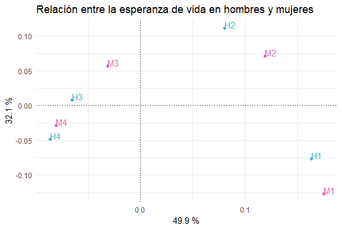
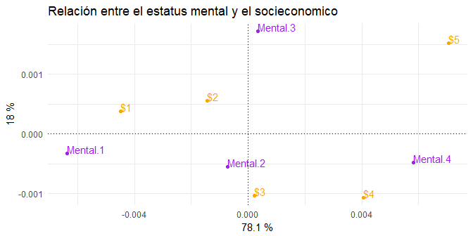
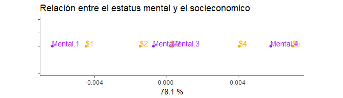

Ejercicio 1:
============

*El conjunto de datos **mundodes** representa 91 países en los que se
han observado 6 variables, Razón de natalidad, Razón de mortalidad,
mortalidad infantil, esperanza de vida en hombres, esperanza de vida en
mujeres y PNB per cápita. Del conjunto de datos se ha tomado la
esperanza de vida de hombres y de mujeres. Se han formadó cuatro
categorías tanto para la mujer como para el hombre. Se denotan por *M*1
y *H*1 a las esperanzas entre menos de 41 años a 50 años, *M*2 y *H*2,
de 51 a 60 años, *M*3 y *H*3, de 61 a 70 años, y *M*4 y *H*4, para entre
71 a más de 80 respectivamente.*

*La siguiente tabla de contingencia muestra las frecuencias de cada
grupo:*

<table>
<thead>
<tr class="header">
<th align="left">no. personas</th>
<th align="center"><em>H</em>1</th>
<th align="center"><em>H</em>2</th>
<th align="center"><em>H</em>3</th>
<th align="center"><em>H</em>4</th>
</tr>
</thead>
<tbody>
<tr class="odd">
<td align="left"><em>M</em>1</td>
<td align="center">10</td>
<td align="center">0</td>
<td align="center">0</td>
<td align="center">0</td>
</tr>
<tr class="even">
<td align="left"><em>M</em>2</td>
<td align="center">7</td>
<td align="center">12</td>
<td align="center">0</td>
<td align="center">0</td>
</tr>
<tr class="odd">
<td align="left"><em>M</em>3</td>
<td align="center">0</td>
<td align="center">5</td>
<td align="center">15</td>
<td align="center">0</td>
</tr>
<tr class="even">
<td align="left"><em>M</em>4</td>
<td align="center">0</td>
<td align="center">0</td>
<td align="center">23</td>
<td align="center">19</td>
</tr>
</tbody>
</table>

*Realiza proyecciones por filas, por columnas y conjuntas de filas y
columnas. Comprobar que en la proyección por filas las categorías están
claramente separadas y que en el caso del hombre, las dos últimas
categorías están muy cercanas. Comprobar en la proyección conjunta la
cercanía de las categorías *H*3 con *M*3 y *M*4.*

    ## [1] "Se rechaza H0"

Decidí codificar la proyección conjunta de las filas y las columnas, los
resultados se muestran en la siguiente gráfica, donde es fácil apreciar
que las categorías de mujeres en los diferentes de rangos estan
separados en contrapunto de las categorías de edades de los hombres pues
los puntos correspondientes a los rangos \[51,60\] y \[61,70\] años
estan cercanos. Nótese tambien que no hay independencia entre las
categorías de esperanza de vida entre hombres y mujeres pues pares de
puntos estan cercanos H1 con M1, M2 con H2 y en particular H3 esta
cercano a dos categorías M4 y M3 además de que M4 y H4 son los puntos
más cercanos. La inercia de la tabla sobrepasa al 80% por lo que podemos
considerar una interpretación adecuada, como notas adicionales
reportamos que se realizó un test *χ*2 con significancia de
0.05 y se descarta la hipótesis de independencia entre las categorías a
pesar de que el estadistico de prueba sobrepasa en gran medida el valor
crítico es importante considerar que las entradas con varios ceros de la
tabla pueden sugerir que los rangos de edad no son los apropiados.

Ejercicio 2:
============

*Una muestra de *n* = 1, 660 personas se clasifica en forma cruzada
según el estado de salud mental y la situación socioeconómica, la
clasificación se presenta en la Tabla. Realizar un análisis de
correspondencia de estos datos. Interpretar los resultados.*

*¿Pueden las asociaciones de los datos estar bien representadas en una
dimensión?*

<table>
<thead>
<tr class="header">
<th align="left"></th>
<th align="center">Estatus</th>
<th align="center">socieconomico</th>
<th align="center"></th>
<th align="center"></th>
<th align="center"></th>
</tr>
</thead>
<tbody>
<tr class="odd">
<td align="left">Estatus de salud mental</td>
<td align="center">A (alto)</td>
<td align="center">B</td>
<td align="center">C</td>
<td align="center">D</td>
<td align="center">E (bajo)</td>
</tr>
<tr class="even">
<td align="left">Bien</td>
<td align="center">121</td>
<td align="center">57</td>
<td align="center">72</td>
<td align="center">36</td>
<td align="center">21</td>
</tr>
<tr class="odd">
<td align="left">Formación de síntomas leves</td>
<td align="center">188</td>
<td align="center">105</td>
<td align="center">141</td>
<td align="center">97</td>
<td align="center">71</td>
</tr>
<tr class="even">
<td align="left">Formación de síntomas moderados</td>
<td align="center">112</td>
<td align="center">65</td>
<td align="center">77</td>
<td align="center">54</td>
<td align="center">54</td>
</tr>
<tr class="odd">
<td align="left">Dañado</td>
<td align="center">86</td>
<td align="center">60</td>
<td align="center">94</td>
<td align="center">78</td>
<td align="center">71</td>
</tr>
</tbody>
</table>

La proyección conjunta de las filas y las columnas en dos dimensiones se
muestra en la siguiente gráfica, donde es fácil apreciar de manera
particular que las categorías dos categorías de ingresos más altos
(puntos $1 y $2) estan cercanas al igual que las dos categorías de
ingresos más bajos (puntos $4 y $5) a diferencia de la categoría de
ingreso medio que se distingue de las otras (recordemos que esta
proyección está condicionada por las categorías de los estados mentales)
y de manera análoga la categoría de salud con formación de síntomas
moderados (punto Mental.3) se distingue de las otras tres. De manera
general las categorías muestran relación pues los pares de puntos
Mental.1 con $1, Mental.2 con $3, y Mental.4 con $4 se encuentran
cercanos por lo que podemos concluir (aunado a que el test de
independencia con confianza de 95% verifica) que no existe relación de
independencia entre las variables.

    ## [1] "Se rechaza H0"

La inercia de la tabla sobrepasa el 95% por lo que podemos considerar
una excelente interpretación en el espacio *fase* anterior.

Sin embargo la primer dimensión de la figura anterior contiene un 78% de
la información de la tabla**1 por lo que es posible
representar la tabla en una dimensión la cual mostramos en la siguiente
gráfica donde los mencionados patrones son más fáciles de identificar,
concluimos este ejercicio haciendo notar la importancia del siguiente
tema del curso el escalamiento multidimensional.

**1 En contraste de la implementación del package ca que
otorga un 94% de información a la primera dimensión, atribuimos esta
diferencia al método de estimación de los vectores propios y a la
estructura de la tabla

Ejercicio 3
===========

Sobre el ejercicio visto en clase relativo a los datos de mediciones de
cráneos y piernas de aves de corral.

$$
R = \\begin{pmatrix}
    R\_{11} &|&R\_{12}\\\\ \\hline 
    R\_{21} &|&R\_{22}\\\\
    \\end{pmatrix}
     = \\begin{pmatrix}
    1.0 & 0.505 & | &0.569 & 0.602\\\\
    0.505 &1& |&.422 & .467\\\\ \\hline
    0.569 & 0.422 &|&1& 0.926\\\\
    0.602 & 0.467 &|& 0.926 & 1.0
    \\end{pmatrix}
$$

Se tenían los pares canónicos, sin embargo en el script anexo los
recalcule, al usar matrices de aproximación utilizando solo un par
canónico las matrices de aproximación de *R*11 y
*R*22 explican el 72% y 93% de la varianza muestral, como el
estadistico de prueba para realizar el test de que la aproximación de
rango menor requiere de conocer el número de muestra (que desconocemos
en este caso) y crece linealmente con el podemos fijar n =1 (solo como
una alejada aproximación ) y aun en este caso la aproximación de
*R*12 utilizando solo un par canónico no pasa el test.

Utilizando ambos pares canónicos la aproximación de *R*11 es
la siguiente:

    (A[,i] %*% t(A[, i]))

    ##       [,1]  [,2]
    ## [1,] 1.000 0.505
    ## [2,] 0.505 1.000

Y la aproximación de *R*22 es la siguiente:

    (B[,i] %*% t(B[, i]))

    ##       [,1]  [,2]
    ## [1,] 1.000 0.926
    ## [2,] 0.926 1.000

Las matrices anteriores explican el 99.9% en ambos casos de las
varianzas muestrales de los grupos, pero aun acotando inferiormente el
estadístico de prueba se rechaza el test para la hipótesis de que la
aproximación con rango dos de *R*12 es adecuada, como se
anexa el cálculo en el script y vale cuando menos 23.0028475 (aun con
una muestra de *n* = 1) contra el valor crítico de 0.0827195
