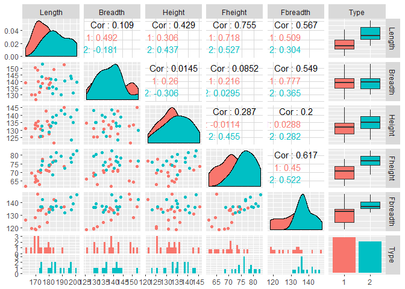

Como el número de variables de nuestro conjunto de datos es pequeño, y
además la muestra no se muy grande. Considere una primer exploración de
matrices de gráficos de dispersión que también muestre la distribución
marginal de cada variable y que distingue por ‘Type’ a las mediciones de
los cráneos. La cual es la siguiente visualización:

    setwd('C:\\Users\\fou-f\\Desktop\\MCE\\Second\\EstadisticaMultivariada\\labs\\lab4')
    craneos <- read.table(file ='Craneos.txt', header=TRUE) #se leen los datos
    library(ggplot2)
    library(GGally)
    names(craneos)

    ## [1] "Length"   "Breadth"  "Height"   "Fheight"  "Fbreadth" "Type"

    craneos$Type <- factor(craneos$Type)
    ggpairs(craneos, aes(color = Type), colums=1:7)

 Del grafico de
dispersión podemos ver que las variables ‘Length, ‘Fheight’ y ‘Fbreadth’
separan a los grupos, en particular las tres presentan medianas
diferentes para ambos grupos lo que nos induce a pensar que una prueba
de medias considerando a cada registro de nuestro conjunto de datos como
una muestra con distribución *N*(*μ*, *Σ*). Para ello, por lo menos
applicamos test de normalidad (Shapiro-Wilks) sobre las variables
univariadas.

    apply(craneos[,1:5], 2, shapiro.test)

    ## $Length
    ## 
    ##  Shapiro-Wilk normality test
    ## 
    ## data:  newX[, i]
    ## W = 0.96462, p-value = 0.3654
    ## 
    ## 
    ## $Breadth
    ## 
    ##  Shapiro-Wilk normality test
    ## 
    ## data:  newX[, i]
    ## W = 0.96847, p-value = 0.4583
    ## 
    ## 
    ## $Height
    ## 
    ##  Shapiro-Wilk normality test
    ## 
    ## data:  newX[, i]
    ## W = 0.97803, p-value = 0.7406
    ## 
    ## 
    ## $Fheight
    ## 
    ##  Shapiro-Wilk normality test
    ## 
    ## data:  newX[, i]
    ## W = 0.97875, p-value = 0.7626
    ## 
    ## 
    ## $Fbreadth
    ## 
    ##  Shapiro-Wilk normality test
    ## 
    ## data:  newX[, i]
    ## W = 0.93817, p-value = 0.06643

Los test indican que no hay indicios para descartar la normalidad
univariada, por lo que “bruscamente” asumiré normalidad 5-variada. Y
realizo una prueba de medias primero utilizando el estadístico
*T*2 suponiendo que la diferencia entre ‘Fbreadth’ y
‘Fheight’ es cero (es decir que la media de estos grupos es igual y por
lo que se pueden diferenciar sin ambos grupos).

*H*0 : *μ**F**b**r**e**a**d**t**h* − *μ**F**h**e**i**g**h**t* = 0

El objetivo planteado es rechazar *H*0 asi que calculo el
estadístico *T*2.

    medias <- as.matrix(apply(craneos[,1:5], 2, mean))

Lo que me llevo tiempo de pensar, basándome en que en la tarea 3
demostré que *T*2 es invariante bajo transformaciones lineales
invertibles, fue el construir una matriz *A* que segmentara los grupos y
tomara las medias, para mi sorpresa el ejemplo se encuentra en el libro
que estamos siguiendo de base. Así que solo replico lo que leí, lo
importante desde mi perspectiva es que no asumo que las poblaciones
tengan matrices de covarianzas diferentes (a diferencia de la prueba que
vimos en el laboratorio, la cual me parece no necesaria, además de que
induce un problema más complicado: el de comparar matrices de covarianza
de dos poblaciones diferentes que hasta donde se puede realizar con el
test de Levene, lo que justificado utilizar la versión ponderada).

El vector que lo efectua es el siguiente

    library(xtable)

    ## Warning: package 'xtable' was built under R version 3.4.3

    S <- cov(craneos[,1:5])
    p <- dim(craneos[,1:5])[2]
    n1 <- sum(craneos$Type==1)
    n2 <- sum(craneos$Type==2)
    n <- n1+n2
    A1 <- matrix(c(0,0,0,1,-1), byrow = TRUE, ncol=1)
    (A1)

    ##      [,1]
    ## [1,]    0
    ## [2,]    0
    ## [3,]    0
    ## [4,]    1
    ## [5,]   -1

Lo que induce una matriz de covarianzas $S%

    S_y <- t(A1)%*%S%*%(A1)

Entonces sabemos que *E*(*A**x*)=*A**E*(*x*)=*A**μ**x* y
*c**o**v*(*A**x*)=*A**Σ**x**A*, como no conocemos
*Σ**x* la estimó con la muestral *S* al igual que
$\\bar{\\mu}\_x$. Entonces tenemos el siguiente *T*2:

    medias <- mean(as.matrix(craneos[,1:5])%*%A1)

Y el estadístico *T*2 muestral esta dado por :

    n*(medias-0)*(S_y)^(-1)*(medias-0)

    ##          [,1]
    ## [1,] 3382.223

Mientras que el teorico con una confianza de 95% es de

    sqrt(((p*(n-1))/(n-p))*qf(.95, df1=p, df2=n-p ))

    ## [1] 3.842464

Por lo que rechazamos la hippotesis de que la media conjunta sea la
misma es decir que los grupos son identificables, por otro lado podemos
considerar la prueba como univariada y comparar las medias asi cambiamos
el estadístico *T*2 por *t**n* − 1 y lo
calculamos:

    qt(.95, df=n-1)

    ## [1] 1.695519

Por lo que concluimos que aun univariadamente los grupos son
identificables pues poseen medias diferentes.
