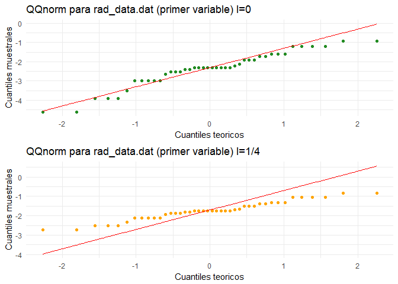

### Ejercicio 1:

*La matriz de datos para una muestra aleatoria de tamaño* *n* = 3 *de
una población normal con* *μ* = (*μ*1, *μ*2)
*bivariada está dada por* :

$$
A = \\begin{bmatrix}
6 & 9\\\\
10 & 6\\\\
8 & 3\\\\
\\end{bmatrix} 
$$

1.1 *Evalua* *T*2:

**Para esta parte no es necesario el supuesto de normalidad**

Después de algunas operaciones primitivas tenemos que $\\bar{x} = (8,6)$
y *s*11 = 4, *s*12 = −3 y *s*22 = 9 por
lo que la matriz de covarianza es:

$$
S = \\begin{bmatrix}
4 & -3\\\\
-3 & 9\\\\
\\end{bmatrix} 
$$

Cuya inversa es:

$$
S^{-1} =\\frac{1}{27}\\begin{bmatrix}
9 & 3\\\\
3 & 4\\\\
\\end{bmatrix} 
$$

Entonces tenemos

$$
\\begin{split}
T^2  &  = 3(8-\\mu\_1, 6-\\mu\_2)\\frac{1}{27}\\begin{bmatrix}
                                        9 & 3\\\\
                                        3 & 4\\\\
                                        \\end{bmatrix} (8-\\mu\_1, 6-,\\mu\_2)^t \\\\
 & = \\frac{3}{27}(8-\\mu\_1, 6-\\mu\_2) \\begin{bmatrix}
                                    9(8-\\mu\_1) &+3 (6-\\mu\_2)\\\\
                                    3(8-\\mu\_1) &+4 (6-\\mu\_2)\\\\
                                \\end{bmatrix}\\\\ 
 & = \\frac{1}{9}(1008-180\\mu\_1-96\\mu\_2+6\\mu\_1 \\mu\_2+ 9 \\mu\_1^2 +4\\mu\_2^2)
\\end{split}
$$

1.2 *Verifica que* *T*2 *permanece sin cambios si cada
observación bivariada es reemplaza por *C**x**j* donde*

$$
\\begin{split}
\\begin{bmatrix}
1 & -1\\\\
1 & 1\\\\
\\end{bmatrix}
\\end{split}
$$

Decidí hacerlo para el caso general (para no hacer “cuentitas”) y
aproveche el hecho de que *C* es invertible y que la combinación lineal
de normales se distribuye normal.

$$
\\begin{split}
(\\bar{y} - \\mu\_y )^t \\Sigma\_y^{-1} (\\bar{y} - \\mu\_y )
\\end{split}
$$

Como *x**i* es normal multivariado
*μ**y* = *C**μ**x* y
*Σ**y* = *C**Σ**x**C* entonces la expresión
anterior puede escribirse como:

Como *y**i* = *C**x**i*
$$
\\begin{split}
(C\\bar{x} - C\\mu\_x )^t C\\Sigma\_xC (C\\bar{x} - C\\mu\_x )& =C(\\bar{x} - \\mu\_x )^t (C^t\\Sigma\_xC)^-1 C(\\bar{x} - \\mu\_x )\\\\
& = C^t(\\bar{x} - \\mu\_x )^t (C^t)^{-1}\\Sigma\_x^{-1}C^{-1} C(\\bar{x} - \\mu\_x )\\\\
& = C^t(\\bar{x} - \\mu\_x )^t (C^t)^{-1}\\Sigma\_x^{-1}(C^{-1} C(\\bar{x}) - \\mu\_x )\\\\
& = C^t(\\bar{x} - \\mu\_x )^t (C^t)^{-1}\\Sigma\_x^{-1}(\\bar{x} - \\mu\_x )\\\\
& = C^t(\\bar{x} - \\mu\_x )^t (C^t)^{-1}\\Sigma\_x^{-1}(\\bar{x} - \\mu\_x )\\\\
& = (\\bar{x} - \\mu\_x )^t ((C^t)^t (C^t)^{-1})\\Sigma\_x^{-1}(\\bar{x} - \\mu\_x )\\\\
& = (\\bar{x} - \\mu\_x )^t \\Sigma\_x^{-1}(\\bar{x} - \\mu\_x )\\\\
\\end{split}
$$

Entonces el resultado es valido para cualquier matriz invertible. Lo
cual es cool pues *T*2 es invariante bajo transformaciones
lineales!

### Ejercicio 2:

*Dadas la siguiente muestra de observaciones bivariadas*
$$X=\\begin{pmatrix} 2&12\\\\8&9\\\\6&9\\\\8&10\\end{pmatrix}$$
 *Realiza lo siguiente:*

2.1 *Evaluar *T*2 para probar*
*H*0 : *μ*′=\[7, 11\], *usando los datos.*

Después de hacer unas cuentitas tenemos que:
$\\bar{x}=\\begin{pmatrix}6&10 \\end{pmatrix}$ y
$S=\\begin{pmatrix} 8&-\\frac{10}{3}\\\\ -\\frac{10}{3}&2 \\end{pmatrix}$

Invertimos la matriz de covarianza:

$$S^{-1}=\\frac{9}{44}\\begin{pmatrix} 2&10/3 \\\\ 10/3&8\\end{pmatrix}=\\frac{3}{44}\\begin{pmatrix} 6&10 \\\\ 10&24\\end{pmatrix}$$

Y aplicamos la definición del estadístico *T*2:

$$T^{2}=4\\frac{9}{44}\\begin{pmatrix}6-7 & 10-11\\end{pmatrix}\\begin{pmatrix} 6&10 \\\\ 10&24\\end{pmatrix}\\begin{pmatrix}6-7 \\\\ 10-11\\end{pmatrix}=4(75/22)=300/22\\approx 13.64$$

2.2 *Especifica la distribución de* *T*2 *(verificando la
normalidad de los datos).* El estadístico *T*2 no requiere
que la muestra provenga de una normal multivariada, de hecho, en ese
caso el resultado es una *χ**p*2. Pero en vista de
que se requiere, realizare el test de Shapiro-Wilks para una muestra de
tamaño tan pequeño como la que tenemos.

    muestra <- matrix(c(2,12,8,9,6,9,8,10), byrow = TRUE, nrow = 4)
    shapiro.test(muestra[,1])

    ## 
    ##  Shapiro-Wilk normality test
    ## 
    ## data:  muestra[, 1]
    ## W = 0.82743, p-value = 0.1612

    shapiro.test(muestra[,2])

    ## 
    ##  Shapiro-Wilk normality test
    ## 
    ## data:  muestra[, 2]
    ## W = 0.82743, p-value = 0.1612

En ambos casos tenemos p-values mayores a 0.05 por lo que hay evidencia
de que las variables provienen de una normal univariada.

Ahora bien en clase vimos que la distribución del estadístico
*T*2 se relaciona con la distribución de F de la siguiente
manera:
$$
T^2 \\sim \\frac{(n-1)p}{n-p}F\_{p, n-p}(x)
$$
 Por lo que en nuestro caso el estadistico se distribuira como una
transformación de *F*2, 2(*x*), en particular para nuestro
caso tenemos que *T*2 ∼ 3*F*2, 2(*x*).

2.3 *Usando los puntos anteriores, prueba* *H*0 *en*
*α* = 0.05. *Que conclusión se tiene?.*

Evaluamos el lado derecho de la relación
*T*2 ∼ 3*F*2, 2(.05)

    exacto <- 3*qf(1-0.05, df1=2, df2 = 2 )

Como nuestro valor de *T*2 ≈ 13.63636 &lt; 57 se tiene que
con una confianza del 95% de no rechazar la hipótesis nula de que la
media poblacional vale (7, 11).

Notemos tambien que lo anterior es un resultado asintótico, y nuestra
muestra es de tamaño pequeño.

2.4 *Evalue* *T*2 *utilizando la relación que tiene con la
lambda de Wilks.*

La *Λ* de Wilks se define como:
$$
  \\Lambda^{\\frac{2}{n}}=\\frac{|\\hat{\\Sigma|}}{|\\hat{\\Sigma\_0|}}
  $$
 Y sabemos que
$$T^2 = \\frac{(n-1)|\\hat{\\Sigma}\_0|}{|\\hat{\\Sigma}|}- (n-1)= (n-1)\\frac{\\left|\\sum\_{j=1}^n (x\_j-\\mu\_0)(x\_j-\\mu\_0)^t\\right|}{\\left|\\sum\_{j=1}^n (x\_j-\\bar{x})(x\_j-\\bar{x})^t\\right|}-(n-1)$$
 Que en nuestro caso queda como:

$$
\\begin{split}
T^2 &=  (3)\\frac{\\left|\\begin{pmatrix} -25& -5 \\\\                                            -5 &1 \\end{pmatrix}+
\\begin{pmatrix} 1& -2 \\\\                                            -2 &4 \\end{pmatrix}+
\\begin{pmatrix} 1& 2 \\\\                                            2 &4 \\end{pmatrix}+
\\begin{pmatrix} 1& -1 \\\\                                            -1 &1 \\end{pmatrix}
\\right|}{\\left|\\begin{pmatrix} 16& -8 \\\\                                            -8 &1 \\end{pmatrix}+
\\begin{pmatrix} 4& -2 \\\\                                            -2 &1 \\end{pmatrix}+
\\begin{pmatrix} 0& 0 \\\\                                            0 & 1 \\end{pmatrix}+
\\begin{pmatrix} 4& 0 \\\\                                            0 &0 \\end{pmatrix}+
\\right|}-(3)\\\\
& =3\\frac{\\left| \\begin{pmatrix} 28& -6 \\\\                                            -6 & 10\\end{pmatrix}                                     \\right|}{\\left| \\begin{pmatrix} 24& -10 \\\\                                            -10 & 6\\end{pmatrix}                                     \\right|} -3\\\\
& = 3\\frac{244}{44}-3 \\approx 13.63636\\\\
\\end{split}
$$

2.5 *Evalue* *Λ* *y la lambda de Wilks.*

En el inciso anterior calcule la *λ* de Wilks:

$$\\Lambda^{2/n} = \\frac{|\\hat{\\Sigma}|}{|\\hat{\\Sigma}\_0|}
$$
 Que en nuestro caso queda como:

$$\\Lambda^{1/2} = \\frac{44}{244}
$$

Entonces
$$\\Lambda = (\\frac{44}{244})^2\\approx 0.03251
$$

Y como −2ln*Λ* ≈ 6.851914 &gt; *χ*22(.05)≈5.9914
si recordamos que en nuestra clase de inferencia mostramos que el test
de máxima verosimilitud es uniformemente más potente para la familia
exponencial y que para muestras grandes se tiene el resultado de que
−2ln*Λ* *χ**n* − *p*2. Podríamos afirmar con una
confianza de 95% que la media propuesta *μ* es un buen estimador de la
media pues su razón de verosimilitud vs su estimador maximoverosimil es
pequeña (sin embargo hay que tener cuidado en esta afirmación pues el
tamaño de muestra es demasiado pequeño para utilizar el resultado
mencionado).

### Ejercicio 3

*Considerando los datos de radiación con la puerta cerrada (archivo.
raddata). Construye un QQ plot para los logaritmos naturales de estos
datos \[Notar que la transformación logaritmo natural corresponde al
valor\* *λ* = 0 \*en la transformaciones de Box-Cox\]. Los datos
transformados parecen ser normalmente distribuidos? Comparar los
resultados con los obtenidos si transformamos los datos con* *λ* = 1/4.
*Existe mucha diferencia al usar* *λ* = 0 ó *λ* = 1/4 *en este caso?.*

Primero implemento la función de Box-Cox, y una función para calcular
los cuantiles de un conjunto de datos

    setwd("C:\\Users\\fou-f\\Desktop\\MCE\\Second\\EstadisticaMultivariada\\tarea3\\Tarea 3")
    box.cox <- function(x, lambda)
    {
      # implementacion de la famosa transformacion de Box-Cox
      if(lambda==0)
      {
        return(log(x))
      }else{
        return( ( x**lambda-1)/lambda )
      }
    }
    QQ.plot.univariado.data <- function(datos, funcion, index, df )
    {
      #datos:(dataframe) con las variables para las que se van a calcular los cuantiles   
                                            #teoricos y muestrales
      # funcion (function): funcion a comparar (en quantiles)
      # index (int) : numero de columna a evaluar
      # df (int) parametro que indica los grados de libertad para evaluar a las funciones
                  #que requieren de el 
      muestrales <- sort(datos[, index])
      n <- length(datos[, index])
      teoricos <- (1:n -.5)/n
      if(df > 0)
      {
        teoricos <- funcion(teoricos, df)
      } else {
        teoricos <- funcion(teoricos)
      }
      out <- data.frame(muestrales = muestrales, teoricos = teoricos)
      names(out) <- c(paste0("muestral.",names(datos)[index]), 
                      paste0("teorico.",names(datos)[index])) 

      return(out)
    }

Posteriormente, con las funciones construidas en el inciso anterior
genero los cuantiles muestrales y los teóricos comparados con una
normal. Termino con una visualización de los qqplots.

    radiacion <- read.table("rad_data.dat")
    data.log <- apply(radiacion, 2, box.cox, 0)
    data.log <- as.data.frame(data.log)
    data.0.4 <- apply(radiacion, 2, box.cox, 1/4)
    data.0.4 <- as.data.frame(data.0.4)
    names(data.0.4) <- names(data.log) <- names(radiacion)
    a <- QQ.plot.univariado.data( data.log, qnorm, index = 1, 0) 
    b <- QQ.plot.univariado.data( data.0.4, qnorm, index = 1, 0)
    c <- QQ.plot.univariado.data( data.log, qnorm, index=2, 0) 
    d <- QQ.plot.univariado.data( data.0.4, qnorm, index = 2, 0)
    qq1 <- ggplot(a, aes(y = muestral.V1, x =teorico.V1, color = I('forestgreen'))) +
      geom_point() + stat_function(fun = function(x){x-2.3}, colour ='red') +
      ggtitle("QQnorm para rad_data.dat (primer variable) l=0") + 
      xlab('Cuantiles teoricos')+
      ylab('Cuantiles muestrales') + theme_minimal() 
    qq2 <- ggplot(b, aes(y = muestral.V1, x =teorico.V1, color = I('orange'))) +
      geom_point() + stat_function(fun = function(x){x-1.7}, colour ='red') +
      ggtitle("QQnorm para rad_data.dat (primer variable) l=1/4") + 
      xlab('Cuantiles teoricos')+
      ylab('Cuantiles muestrales') + theme_minimal() 
    qq3 <- ggplot(c, aes(y = muestral.V2, x =teorico.V2, color = I('purple'))) +
      geom_point() + stat_function(fun = function(x){x-1.7}, colour ='red') +
      ggtitle("QQnorm para rad_data.dat (segunda variable) l= 0") + 
      xlab('Cuantiles teoricos')+
      ylab('Cuantiles muestrales') + theme_minimal() 
    qq4 <- ggplot(d, aes(y = muestral.V2, x =teorico.V2, color = I('pink'))) +
      geom_point() + stat_function(fun = function(x){x-1.7}, colour ='red') +
      ggtitle("QQnorm para rad_data.dat (segunda variable) l= 1/4") + 
      xlab('Cuantiles teoricos')+
      ylab('Cuantiles muestrales') + theme_minimal() 
    ggarrange(qq1, qq2 , ncol = 1, nrow = 2)

    ggarrange(qq3, qq4 , ncol = 1, nrow = 2)

De las gráficas anteriores podemos concluir que para la primer variable
sí afecta el cambio del parámetro *λ* (sobre todo en las colas) mientras
que en la segunda variable la diferencia es más marcada en la cola
izquierda.

### Ejercicio 4

*Considera los datos sobre contaminación de aire (archivo:
datoscontaminacion)*:

4.1 *Construye un QQ plot para las mediciones de radiación solar y
realiza una prueba de normalidad basada en el coeficiente de
correlación* *r**Q*, *para* *α* = 0.05

Usando lo que implemente en el ejercicio 3, construyo el QQplot

    contaminacion <- read.csv("datos_contaminacion.csv") #guarde los datos como csv para 
                                                          #mayor portabilidad
    data.stand <- apply(contaminacion, 2, scale)
    data.stand <- as.data.frame(data.stand)
    names(data.stand) <- names(contaminacion) 
    a <- QQ.plot.univariado.data( data.stand, qnorm, index= 2, 0) 
    qq1 <- ggplot(a, aes(y = muestral.Solar.radiation, x = teorico.Solar.radiation,
                         color = I('forestgreen'))) +
      geom_point() + stat_function(fun = function(x){x+.1}, colour ='red') +
      ggtitle("QQnorm para la variable Solar.radiation") + 
      xlab('Cuantiles teoricos')+
      ylab('Cuantiles muestrales') + theme_minimal() 
    qq1

Para la prueba de normalidad ejecuto el siguiente código que utiliza la
salida de la función <code> QQ.plot.univariado.data </code>

    correlacion.solar <- cor(a$muestral.Solar.radiation, a$teorico.Solar.radiation)

Entonces la correlación de los puntos es 0.9693258 y nuestro tamaño de
muestra es de 42, usando las tablas de la presentación considerando un
tamaño de muestra de 40 podemos afirmar con un nivel de significancia de
*α* = 0.05 que los datos **no son normales**.

4.2 *Examina el par* *x*3 = *C**O* *y*
*X*4 = *N**O* *como una distribución bivariada. Construye un
diagrama Chi-cuadrado y aplica la prueba de normalidad basada en*
*r**Q**. Se puede concluir normalidad bivariada en este
conjunto de datos.*

Primero graficamos los datos con sus densidades univariadas

    contaminacion <- read.csv("datos_contaminacion.csv") #guarde los datos como csv para 
                                                             #mayor portabilidad
    hist_top <- ggplot(contaminacion, aes( NO, color = I('navy'))) + geom_density() + 
      xlab('') + ylab('') + theme_minimal() 
    empty <- ggplot()+geom_point(aes(1,1), colour="white")+
      theme(axis.ticks=element_blank(), 
            panel.background=element_blank(), 
            axis.text.x=element_blank(), axis.text.y=element_blank(),           
            axis.title.x=element_blank(), axis.title.y=element_blank())
    scatter <- ggplot(contaminacion, aes(x = CO, y = NO, color = I('purple'))) + 
      geom_point() + ggtitle("VDisperción de las variables CO y NO") + 
      xlab('CO') +  ylab('NO') + theme_minimal() 
    hist_right <- ggplot(contaminacion, aes( CO, color = I('navy'))) + geom_density() +
      xlab('') + ylab('') + theme_minimal() +coord_flip()
    grid.arrange(hist_top, empty, scatter, hist_right, ncol=2, nrow=2, widths=c(5, 2),
                 heights=c(2, 5))

Del grafico anterior podemos ver que individualmente las variables no se
distribuyen normal, por lo que la normalidad multivariada no se
conseguirá. Procedemos a calcular las distancias y construir el diagrama
ji cuadrado.

    dist.gen <- function(x) 
    {
      # funcion para calcular distancias generalizadas de una muestra
      # x: dataframe con la muestra
      media <- apply(x, 2, mean) #medias 
      s_1 <- solve(cov(x))   #varianzas
      centrados <- data.frame(x1= x[, 1]-media[1],x2= x[,2]- media[2]) #centro la muestra
      d.gen <- vector(mode='numeric' , length= dim(x)[1])
      for( i in 1:dim(x)[1])
      {
        d.gen[i] <- as.matrix(centrados[i, ])%*%s_1%*%t(centrados[i,])
      }
      return(d.gen)
    }
    data.co.no <- contaminacion[, c('CO', 'NO')]
    distancias <- dist.gen( data.co.no)
    distancias <- data.frame(distancia= distancias)
    data.diagrama <- QQ.plot.univariado.data(distancias, qchisq, index = 1, df =42)

Los diagramas *χ*2 son los siguientes:

    ggplot(data.diagrama, aes(y = muestral.distancia, x = teorico.distancia, color = I('orange'))) +
      geom_point() + stat_function(fun = function(x){.18*x-6}, colour ='red') +
      ggtitle("Diagrama jicuadrado para la variable CO") + 
      xlab('quantil ji cuadrado')+ xlim(c(24,66))+
      ylab('ditancia') + theme_minimal() 

Para la prueba de normalidad se ejecuto el siguiente código que utiliza
la salida de la función <code> QQ.plot.univariado.data </code>

    correlacion.co.no <- cor(data.diagrama$muestral.distancia, data.diagrama$teorico.distancia)

Entonces la correlación de los puntos es 0.9518209 y nuestro tamaño de
muestra es de 42, usando las tablas de la presentación (o del libro)
considerando un tamaño de muestra de 40 podemos afirmar con un nivel de
significancia de *α* = 0.05 que los datos **no son normales**.

\newpage 
### Ejercicio 5

*Examina la normalidad marginal y bivariada de las observaciones en las
variables* *x*1, *x*2, *x*3 *y*
*x*4 *para los datos del archivo datosrigidez*

Primero graficamos los datos con sus densidades univariadas primero para
(*X*1, *X*2)

    madera <- read.csv("datos_rigidez.csv") #guarde los datos como csv para 
                                                             #mayor portabilidad
    madera[, 6:8] <- NULL
    madera <- na.omit(madera) 
    hist_top <- ggplot(madera, aes( X1, color = I('navy'))) + geom_density() + 
      xlab('') + ylab('') + theme_minimal() 
    empty <- ggplot()+geom_point(aes(1,1), colour="white")+
      theme(axis.ticks=element_blank(), 
            panel.background=element_blank(), 
            axis.text.x=element_blank(), axis.text.y=element_blank(),           
            axis.title.x=element_blank(), axis.title.y=element_blank())
    scatter <- ggplot(madera, aes(x = X1, y = X2, color = I('purple'))) + 
      geom_point() + ggtitle("Disperción de las variables X1 y X2") + 
      xlab('X1') +  ylab('X2') + theme_minimal() 
    hist_right <- ggplot(madera, aes( X2, color = I('navy'))) + geom_density() + xlab('') +
      ylab('') + theme_minimal() +coord_flip()
    grid.arrange(hist_top, empty, scatter, hist_right, ncol=2, nrow=2, widths=c(5, 2),
                 heights=c(2, 5))

En el grafico anterior podemos ver que la variable *X*2 dista de tener
una distribución normal.

Ahora graficamos los datos con sus densidades univariadas para
(*X*3, *X*4)

    hist_top <- ggplot(madera, aes( X3, color = I('navy'))) + geom_density() + 
      xlab('') + ylab('') + theme_minimal() 
    empty <- ggplot()+geom_point(aes(1,1), colour="white")+
      theme(axis.ticks=element_blank(), 
            panel.background=element_blank(), 
            axis.text.x=element_blank(), axis.text.y=element_blank(),           
            axis.title.x=element_blank(), axis.title.y=element_blank())
    scatter <- ggplot(madera, aes(x = X3, y = X4, color = I('purple'))) + 
      geom_point() + ggtitle("Disperción de las variables X3 y X4") + 
      xlab('X3') +  ylab('X4') + theme_minimal() 
    hist_right <- ggplot(madera, aes( X4, color = I('navy'))) + geom_density() + xlab('') +
      ylab('') + theme_minimal() +coord_flip()
    grid.arrange(hist_top, empty, scatter, hist_right, ncol=2, nrow=2, widths=c(5, 2),
                 heights=c(2, 5))

Graficamos los datos con sus densidades univariadas para
(*X*2, *X*3)

    hist_top <- ggplot(madera, aes( X2, color = I('navy'))) + geom_density() + 
      xlab('') + ylab('') + theme_minimal() 
    empty <- ggplot()+geom_point(aes(1,1), colour="white")+
      theme(axis.ticks=element_blank(), 
            panel.background=element_blank(), 
            axis.text.x=element_blank(), axis.text.y=element_blank(),           
            axis.title.x=element_blank(), axis.title.y=element_blank())
    scatter <- ggplot(madera, aes(x = X2, y = X3, color = I('purple'))) + 
      geom_point() + ggtitle("Disperción de las variables X2 y X3") + 
      xlab('X2') +  ylab('X3') + theme_minimal() 
    hist_right <- ggplot(madera, aes( X3, color = I('navy'))) + geom_density() + xlab('') +
      ylab('') + theme_minimal() +coord_flip()
    grid.arrange(hist_top, empty, scatter, hist_right, ncol=2, nrow=2, widths=c(5, 2),
                 heights=c(2, 5))

Ahora graficamos los datos con sus densidades univariadas para
(*X*4, *X*1)

    hist_top <- ggplot(madera, aes( X4, color = I('navy'))) + geom_density() + 
      xlab('') + ylab('') + theme_minimal() 
    empty <- ggplot()+geom_point(aes(1,1), colour="white")+
      theme(axis.ticks=element_blank(), 
            panel.background=element_blank(), 
            axis.text.x=element_blank(), axis.text.y=element_blank(),           
            axis.title.x=element_blank(), axis.title.y=element_blank())
    scatter <- ggplot(madera, aes(x = X4, y = X1, color = I('purple'))) + 
      geom_point() + ggtitle("Disperción de las variables X4 y X1") + 
      xlab('X4') +  ylab('X1') + theme_minimal() 
    hist_right <- ggplot(madera, aes( X1, color = I('navy'))) + geom_density() + xlab('') +
      ylab('') + theme_minimal() +coord_flip()
    grid.arrange(hist_top, empty, scatter, hist_right, ncol=2, nrow=2, widths=c(5, 2),
                 heights=c(2, 5))

Hasta el momento hemos visto que las variables *X*1, *X*3 y *X*4 no son
simétricas, y en general las 4 variables tienen densidades que a simple
vista distan de ser normales, aunado al hecho de que, aunque las
variables parecen tener correlaciones positivas sus diagramas de
dispersión no evidencian normalidad bivariada; a continuación se realiza
una prueba de Shapiro-Wilks sobre cada variable para descartar que
marginalmente el conjunto de datos sea normal.

    shapiro.test(madera$X1)

    ## 
    ##  Shapiro-Wilk normality test
    ## 
    ## data:  madera$X1
    ## W = 0.93068, p-value = 0.05118

    shapiro.test(madera$X2)

    ## 
    ##  Shapiro-Wilk normality test
    ## 
    ## data:  madera$X2
    ## W = 0.91274, p-value = 0.01746

    shapiro.test(madera$X3)

    ## 
    ##  Shapiro-Wilk normality test
    ## 
    ## data:  madera$X3
    ## W = 0.93258, p-value = 0.05751

    shapiro.test(madera$X4)

    ## 
    ##  Shapiro-Wilk normality test
    ## 
    ## data:  madera$X4
    ## W = 0.96127, p-value = 0.3337

Con excepción de la variable *X*2 la prueba de Shapiro-Wilks nos dice
que hay evidencia para considerar que la variables tienen una
distribución normal (se obtienen p.values mayores a 0.05) asi que la
normalidad multivariada de la muestra se descarta si consideramos el
vector aleatoria con las 4 variables.

Por los resultados de las pruebas de Shapiro-Wilks se aplicara la prueba
que utiliza las distancias generalizadas sobre los pares bivariados
(*X*1, *X*3),(*X*3, *X*4) y
(*X*1, *X*4)

    data.check <- madera[, c('X1', 'X3')]
    distancias <- dist.gen( data.check)
    distancias <- data.frame(distancia= distancias)
    data.diagrama <- QQ.plot.univariado.data(distancias, qchisq, index = 1, df =42)
    correlacion.1_3 <- cor(data.diagrama$muestral.distancia, data.diagrama$teorico.distancia)
    data.check <- madera[, c('X3', 'X4')]
    distancias <- dist.gen( data.check)
    distancias <- data.frame(distancia= distancias)
    data.diagrama <- QQ.plot.univariado.data(distancias, qchisq, index = 1, df =42)
    correlacion.3_4 <- cor(data.diagrama$muestral.distancia, data.diagrama$teorico.distancia)
    data.check <- madera[, c('X1', 'X4')]
    distancias <- dist.gen( data.check)
    distancias <- data.frame(distancia= distancias)
    data.diagrama <- QQ.plot.univariado.data(distancias, qchisq, index = 1, df =42)
    correlacion.1_4 <- cor(data.diagrama$muestral.distancia, data.diagrama$teorico.distancia)

    correlacion.1_3

    ## [1] 0.8925613

    correlacion.3_4

    ## [1] 0.9147347

    correlacion.1_4

    ## [1] 0.8126285

Entonces por la correlación de las cuantiles de los diagramas
*χ*2 de los pares (*X*1, *X*3) y
(*X*3, *X*4) considerando un tamaño de muestra de
30, al utilizar las tablas de la presentación (o del libro), podemos
afirmar con un nivel de significancia de *α* = 0.05 que los datos
bivariados **son normales**.

Mostramos el diagrama de dispersión para el par
(*X*1, *X*3) que falta y que es binormal.

    hist_top <- ggplot(madera, aes( X1, color = I('navy'))) + geom_density() + 
      xlab('') + ylab('') + theme_minimal() 
    empty <- ggplot()+geom_point(aes(1,1), colour="white")+
      theme(axis.ticks=element_blank(), 
            panel.background=element_blank(), 
            axis.text.x=element_blank(), axis.text.y=element_blank(),           
            axis.title.x=element_blank(), axis.title.y=element_blank())
    scatter <- ggplot(madera, aes(x = X1, y = X3, color = I('purple'))) + 
      geom_point() + ggtitle("Disperción de las variables X3 y X1") + 
      xlab('X1') +  ylab('X3') + theme_minimal() 
    hist_right <- ggplot(madera, aes( X3, color = I('navy'))) + geom_density() + xlab('') +
      ylab('') + theme_minimal() +coord_flip()
    grid.arrange(hist_top, empty, scatter, hist_right, ncol=2, nrow=2, widths=c(5, 2),
                 heights=c(2, 5))

En conclusión, la prueba de ocupa las distancias generalizadas parecen
ser poco potente pues en este caso señalo binormalidad en pares de
variables que cuando los graficamos no parecen serlo, aunque valdría la
pena realizar el ejercicio con un tamaño de muestra mayor.

### Ejercicio 6

*Considere los datos sobre parques naciones datosparquesnac*

6.1 *Comenta sobre cualquier posible outlier construyendo scatter plot
para las variables originales*

    parques <- read.csv('datos_parques_nac.csv')
    box.cox.data <- parques
    ggplot(parques, aes(x = Tamano.acres., y = Visitantes.millones., color = I('green3'),
                        label = parques$ï..Parque.Nacional)) + 
      geom_point() + ggtitle("Popularidad de los parques naciones") + 
      xlab('Tamaño (acres)') +  ylab('Visitantes (millones)') + theme_minimal() + 
      geom_text(size = 2, aes(color='black'))

Como podemos notar en el anterior diagrama de dispersión el parque Great
Smoky es muy visitado en comparación de los demas parques siendo que su
tamaño no es tan grande, podemos decir que este parque es muy popular
(como nosotros en el bachillerato) y es un candidato a ser catalogado
como outlier.

6.2 *Determina la transformación de potencia* $\\hat{\\lambda\_1}$*, que
hace a los valores de la variable del tamaño del parque aproximadamente
normales. Construye un QQ-plot sobre los datos transformados*

En este apartado precalculo algunas constantes a partir de la muestra
para mejorar la eficiencia de la función a optimizar ademas de usar una
**closure** para fijar la función de verosimilitud:

    normal.likelihood <- function(muestra,x)
    {
      info <- sum(log(muestra))
      n <- length(muestra)
      function(x)
      {
        if(abs(x) <= .Machine$double.eps ) #consideramos el caso en que lambda vale cero
        {
          y <- log(muestra)
        } else
        {
          y <- (muestra**x-1)/x
        }
        media <- mean(y)
        derecha <- (1/n)*sum( (y - media)**2  )
        derecha2 <- -(n/2)*log(derecha)
        izquierda <- (x-1)*info
        l <- derecha2+izquierda
        return(l)
      }
    }
    Normal.tamano_ <- normal.likelihood(parques$Tamano.acres.) #inicializamos la funcion 
                                                               #a maximizar
    Normal.tamano <- function(x){mapply(FUN=Normal.tamano_,x)} # se vectoriza la funcion 

Como es un caso univariado podemos visualizar en donde se encuentra el
máximo

    puntitos <- data.frame(x = c(-.4,0,.5), y =c(-100, -85, -100))
    ggplot(puntitos, aes(x=x,y=y)) + geom_point(aes( color=I('white'))) +
      stat_function(fun=Normal.tamano, colour = 'purple') + theme_minimal() +
      ylab('likelihood') + xlab('lambda') +
      ggtitle("Verosimilitud de la variable:Tamaño del parque ")

Podemos apreciar que el máximo se alcanza en un valor positivo y menor a
0.25 por lo que procedemos a aproximar el valor que maximiza la
verosimilitud para el tamaño del parque. Posteriormente transformamos
los datos y construimos el QQplot para checar normalidad.

    epsilon <- .Machine$double.xmin
    tamano.max <- optimize(f = Normal.tamano, interval = c(epsilon, 1), maximum = TRUE)
    lambda.tamano1 <- tamano.max$maximum
    box.cox.data$Tamano.acres. <- box.cox(parques$Tamano.acres., lambda.tamano1)
    qq.tamano <- QQ.plot.univariado.data(box.cox.data, qnorm, 2, 0 )
     ggplot(qq.tamano, aes(y = muestral.Tamano.acres.,
                           x = teorico.Tamano.acres., color = I('forestgreen'))) +
      geom_point() + stat_function(fun = function(x){5.5*x+10}, colour ='red') +
      ggtitle("QQnorm para tamaño del parque") + 
      xlab('Cuantiles teoricos')+
      ylab('Cuantiles muestrales') + theme_minimal()

En este caso el valor *λ*1= 0.1949457 y el ajuste en el
QQplot parece ser bueno. Verificamos si se logró la meta de la
transformación de Box-Cox realizando un test Shapito-Wilks a los datos
transformados

    shapiro.test(box.cox.data$Tamano.acres.)

    ## 
    ##  Shapiro-Wilk normality test
    ## 
    ## data:  box.cox.data$Tamano.acres.
    ## W = 0.9749, p-value = 0.9229

Como el p-value de la prueba es mucho mayor a 0.05 tenemos elementos
para afirmar que la transformación logro que los datos sea distribuyan
normal.

6.3 *Determina la transformación de potencia* $\\hat{\\lambda\_2}$*, que
hace a los valores de* *x*2 *aproximadamente normales.
Contruye un QQ-plot sobre los datos transformados.*

Con la función construida en el inciso anterior todo es análogo

    Normal.tamano_ <- normal.likelihood(parques$Visitantes.millones.) #inicializamos la funcion 
                                                               #a maximizar
    Normal.tamano <- function(x){mapply(FUN=Normal.tamano_,x)} # se vectoriza la funcion 

Como también es un caso univariado podemos visualizar en donde se
encuentra el máximo

    puntitos <- data.frame(x = c(-1,0,1), y =c(-10, -4, -10))
    ggplot(puntitos, aes(x=x,y=y)) + geom_point(aes( color=I('white'))) +
      stat_function(fun=Normal.tamano, colour = 'purple') + theme_minimal() +
      ylab('likelihood') + xlab('lambda') +
      ggtitle("Verosimilitud de la variable: número de visitantes")

Podemos apreciar que el máximo se alcanza en un valor negativo y mayor a
-1 por lo que procedemos a aproximar el valor que maximiza la
verosimilitud para el número de visitantes. Posteriormente transformamos
los datos y construimos el QQplot para checar normalidad.

    tamano.max <- optimize(f = Normal.tamano, interval = c(-1, epsilon), maximum = TRUE)
    lambda.tamano2 <- tamano.max$maximum
    box.cox.data$Visitantes.millones. <- box.cox(parques$Visitantes.millones., lambda.tamano2)
    qq.tamano <- QQ.plot.univariado.data(box.cox.data, qnorm, 3, 0 )
     ggplot(qq.tamano, aes(y = muestral.Visitantes.millones.,
                           x = teorico.Visitantes.millones., color = I('orange'))) +
      geom_point() + stat_function(fun = function(x){.49*x+.58}, colour ='red') +
      ggtitle("QQnorm para el número de visitantes") + 
      xlab('Cuantiles teoricos')+
      ylab('Cuantiles muestrales') + theme_minimal() + ylim(c(0,1.7))

En este caso el valor *λ*2= -0.3456431 y el ajuste en el
QQplot también parece ser bueno. Verificamos si se logró la meta de la
transformación de Box-Cox realizando un test Shapito-Wilks a los datos
transformados

    shapiro.test(box.cox.data$Visitantes.millones.)

    ## 
    ##  Shapiro-Wilk normality test
    ## 
    ## data:  box.cox.data$Visitantes.millones.
    ## W = 0.93205, p-value = 0.2927

Como el p-value de la prueba es mucho mayor a 0.05 tenemos elementos
para afirmar que la transformación logro que los datos tengan una
distribución normal.

6.4 *Determina la transformación de potencia*
$\[\\hat{\\lambda\_1}, \\hat{\\lambda\_2}\]$ *que hacea los valores*
(*x*1, *x*2) *conjuntamente normales. Compara los
resultados con los obtenidos en los dos anteriores.*

Aunque mi implementacion dista de ser elegante y eficiente es facíl de
entender y es efectiva:

    multinormal.likelihood <- function(muestra,lambda)
    {
      
      info <- apply(muestra, 2, function(x){sum(log(x))})
      n <- dim(muestra)[1]
      p <- dim(muestra)[2]
      function(lambda)
      {
        for (i in 1:n)
        {
          for(j in 1:p)
          {
            if(abs(lambda[j]) <=.Machine$double.eps)
            {
              muestra[i, j] <- log(muestra[i, j])
            }
            else{
              muestra[i, j] <- (muestra[i, j]**lambda[j]-1)/lambda[j]
            }
            
          }
        }
        l <- -(n/2)*log( det( cov(muestra)))
        for (i in 1:p)
        {
          l <- l + (lambda[i]-1)*info[i]
        }
        return(l)
      }
    }
    Multinormal.tamano_ <- multinormal.likelihood(parques[,2:3]) #inicializamos la funcion 
                                                              #a maximizar
    a <- optim( fn =function(x){
      return(-1*Multinormal.tamano_(x))}, par = c(0.1949457, -0.3456431),
      method = "SANN", control = list(maxit = 10000, temp = 2000, trace = FALSE,
                               REPORT = 1000)) 
    nuevos <- a$par

Suponiendo que no se tiene información sobre los parámetros y comenzamos
con el vector cero obtenemos que los nuevos valores son 0.1949457 y
-0.3456431 respectivamente para *λ*1 y *λ*2.

    abs(nuevos[1]-lambda.tamano1)/abs(nuevos[1])

    ## [1] 9.828882e-08

    abs(nuevos[2]-lambda.tamano2)/abs(nuevos[2])

    ## [1] 7.348016e-08

Es decir que el consejo que vimos en clase se cumple pues los antiguos
valores eran 0.1949457 y -0.3456431 respectivamente. Podemos suponer que
el valor verdadero de los parámetros son los de la optimización
multidimensional y medir el error relativo de los estimadores
unidimensionales fue del 12% en el primer caso y de menos del 1% en el
segundo caso por lo que desde mi perspectiva no vale la pena la
optimización multivariada. Pues a pesar de mi pobre implementación tardo
más de dos horas la ejecución en un ambiente windows, pero bueno fue un
punto inicial bastante poco informativo.
